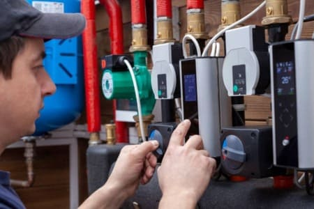

<section class="py-5 bg-light text-center border-bottom">
    

        

            

                <h1 class="display-5 fw-bold mb-3">Профессиональные услуги по ремонту котельного оборудования</h1>
                
Наш сервисный центр предлагает профессиональные услуги по ремонту котельного оборудования. Мы специализируемся на обслуживании и восстановлении работоспособности различных типов котлов, включая газовые, электрические и дизельные системы.

                <a class="btn btn-primary btn-lg" href="/uslugi/remont-kotlov">Ремонт котлов »</a>
            

        

    

</section>

<section class="py-5">
    

        

            

                

                    
                

            

            

                

                    
                

            

            

                

                    
                

            

        

    

</section>

<section class="py-5" style="background-color: #e9ecef;">
    

        

            <h2 class="fw-bold">Услуги сервисного центра</h2>
            

                
Наш сервисный центр предлагает широкий спектр услуг по ремонту котельного оборудования.

            

        

        

            

                

                    
                    <h4>Диагностика котлов и систем</h4>
                    
Мы проводим тщательную диагностику вашего котельного оборудования для выявления возможных неисправностей.

                

            

            

                

                    
                    <h4>Ремонт и замена запчастей</h4>
                    
Наша команда использует оригинальные запчасти от ведущих производителей для надежного восстановления.

                

            

            

                

                    
                    <h4>Консультации и рекомендации</h4>
                    
Поможем разобраться с любыми вопросами по эксплуатации и обслуживанию оборудования.

                

            

        

    

</section>

<section class="py-5">
    

        

            

                

                    
                

                

                    <h3 class="fw-bold text-center mb-4">Почему выбирают нас:</h3>
                    <ul class="list-unstyled">
                        <li class="mb-2"><i class="fas fa-check-circle text-success me-2"></i><strong>Опыт и экспертиза:</strong> Многолетний опыт ремонта котлов.</li>
                        <li class="mb-2"><i class="fas fa-check-circle text-success me-2"></i><strong>Качество работы:</strong> Тщательная проверка после ремонта.</li>
                        <li class="mb-2"><i class="fas fa-check-circle text-success me-2"></i><strong>Быстрое реагирование:</strong> Выезд в день обращения.</li>
                        <li class="mb-2"><i class="fas fa-check-circle text-success me-2"></i><strong>Профессиональный подход:</strong> Полный спектр услуг.</li>
                        <li class="mb-2"><i class="fas fa-check-circle text-success me-2"></i><strong>Конкурентные цены:</strong> Доступные цены при высоком качестве.</li>
                    </ul>
                    

                        Если у вас возникли проблемы с котлом – не откладывайте! Обращайтесь к нам.
                    

                

            

        

    

</section>

<section class="py-5">
    

        

            

                

                    <h4 class="fw-bold">Для вас бесплатно</h4>
                    
Выезд мастера Диагностика

                    
Подбор запчастей Гарантия до 1 года

                

            

            

                

                    <h4 class="fw-bold">Профессиональный ремонт</h4>
                    
Ремонт, установка и подключение котельной техники по стандартам качества производителя.

                

            

        

    

</section>

<section class="py-5 bg-gray-light">
    

        <h3 class="text-center fw-bold mb-5" style="color: #3c4858;">Как вызвать мастера на дом?</h3>
        

            

                

                    1.
                    
Позвоните нам:  <strong class="text-dark">+7 (926) 221-13-48</strong> или оставьте заявку.

                    

                        <a href="https://tlgg.ru/GazService04" target="_blank"><i class="fab fa-telegram"></i></a>
                        <a href="https://wa.me/79299053839" target="_blank"><i class="fab fa-whatsapp"></i></a>
                        <a href="https://vk.com/service_04" target="_blank"><i class="fab fa-vk"></i></a>
                    

                

            

            

                

                    2.
                    
Расскажите о поломке, назовите адрес и пришлите фото котла (для расчёта).

                

            

            

                

                    3.
                    
В течение 20–30 минут мастер свяжется с вами и согласует время.

                

            

            

                

                    4.
                    
Ремонт за 1 выезд. После ремонта — проверка и акт работ.

                

            

        

    

</section>

<section class="py-5">
    

        

            

                
            

            

                <h4 class="fw-bold mb-3">Собственный сервисный центр</h4>
                
<strong>Адрес:</strong> г. Москва, ул. 16-я Парковая, д. 36А

                
Вы можете привезти технику к нам или вызвать мастера на дом. Наши специалисты используют только качественные запчасти.

                
<strong>Мы предлагаем:</strong>

                <ul class="list-group list-group-flush">
                    <li class="list-group-item border-0 px-0 py-1"><i class="fas fa-check text-primary me-2"></i>Диагностику и ремонт неисправностей</li>
                    <li class="list-group-item border-0 px-0 py-1"><i class="fas fa-check text-primary me-2"></i>Замену деталей и компонентов</li>
                    <li class="list-group-item border-0 px-0 py-1"><i class="fas fa-check text-primary me-2"></i>Чистку и обслуживание системы</li>
                </ul>
            

        

    

</section>

<section class="py-5">
    

        

            <h5 class="fw-bold mb-3">Зона обслуживания котельного оборудования</h5>
            
Работаем по Москве и всем городам Московской области: <strong>Апрелевка, Балашиха, Видное, Домодедово, Красногорск, Люберцы, Мытищи, Одинцово, Подольск, Химки, Щелково и др.</strong>

            

                
СНИЖЕНИЕ ЦЕН НА РЕМОНТ КОТЛОВ.

                
ДИАГНОСТИКА + РЕМОНТ — 4600 руб.! Выезд — 50 руб/км!

            

            

                <a class="btn btn-primary btn-lg" href="/contact-us">Вызвать мастера</a>
            

        

    

</section>