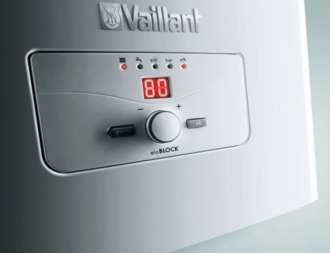

    
      

        
    

    

        
Выезжаем по Москве и Московской области.

        
Устраним неисправность в день обращения! +7(926) 221-13-48

        

        
Мы рады предложить вам услуги по ремонту электрических котлов Vaillant. Наши специалисты имеют большой опыт работы с электрическими котлами Vaillant и готовы выполнить любой ремонт или обслуживание, включая замену запчастей, настройку и регулировку. Мы используем только оригинальные запчасти и гарантируем высокое качество работы.

        <a class="btn btn-primary btn-lg align-self-start" href="#" role="button">Вызвать мастера</a>
    

    

        

            

                <h2 class="mt-4 fw-bold">Мы предлагаем следующие услуги по ремонту и обслуживанию электрических котлов Vaillant:</h2>
                

                    
Наши специалисты используют только оригинальные запчасти и высококачественное оборудование для ремонта. Мы гарантируем качество наших услуг и профессионализм наших специалистов.

                

            

        

        

            

                

                    
                    <h5 class="fw-bold">Диагностика неисправностей</h5>
                

            

            

                

                    
                    <h5 class="fw-bold">Ремонт котлов и техническое обслуживание котлов</h5>
                

            

            

                

                    
                    <h5 class="fw-bold">Замена запчастей</h5>
                

            

            

                

                    
                    <h5 class="fw-bold">Установка и настройка оборудования</h5>
                

            

        

    

    

    

        

            
        

        

            
        

        

            
        

    

    

    

        

            <h4 class="fw-bold">Почему выбирают нас для ремонта электрических котлов Vaillant:</h4>
            <ul class="list-group list-group-flush small">
                <li class="list-group-item p-3 mb-2 bg-light text-dark rounded shadow-sm">1. Опытные специалисты: Наша команда состоит из опытных и квалифицированных специалистов, обладающих глубокими знаниями о котлах Vaillant. Мы постоянно обновляем наши навыки и следим за последними технологическими разработками, чтобы предоставить вам наилучший сервис.</li>
                <li class="list-group-item p-3 mb-2 rounded shadow-sm">2. Диагностика и ремонт: При обращении к нам, наши специалисты проведут тщательную диагностику вашего котла Vaillant, чтобы определить причину поломки. Мы используем современное оборудование и инструменты, чтобы обеспечить точную и эффективную диагностику.</li>
                <li class="list-group-item p-3 mb-2 bg-light text-dark rounded shadow-sm">3. Оригинальные запчасти: Мы работаем непосредственно с производителями и поставщиками оригинальных запчастей для котлов Vaillant. Это гарантирует, что все используемые нами запчасти будут соответствовать высокому стандарту качества и обеспечат долговечность вашего котла после ремонта.</li>
                <li class="list-group-item p-3 mb-2 rounded shadow-sm">4. Гарантия качества: Мы стремимся предоставить нашим клиентам высокое качество услуг. Поэтому мы гарантируем качество всех выполненных работ и даем гарантию на использованные запчасти.</li>
            </ul>
            
Не откладывайте ремонт вашего электрического котла Vaillant на потом. Обратитесь к нам, и мы с удовольствием поможем вам вернуть его в идеальное рабочее состояние. Свяжитесь с нами сегодня, чтобы получить профессиональный ремонт и надежное обслуживание вашего котла Vaillant.

        

    

    

        

            <h4 class="fw-bold mb-3">Ниже перечислены некоторые частые проблемы, с которыми владельцы котлов Vaillant могут столкнуться:</h4>
            <ol class="small">
                <li>Отсутствие нагрева: Одной из типичных проблем может быть отсутствие или неравномерный нагрев воды. Это может быть вызвано неисправностью нагревательного элемента, термостата, датчиков температуры или электрических соединений.</li>
                <li>Проблемы с давлением: Недостаточное или, наоборот, избыточное давление в системе отопления может вызвать перебои в работе котла, аварии и даже повреждение оборудования.</li>
                <li>Засорение или накипь: Отложения накипи на нагревательных элементах и внутренних поверхностях котла могут снижать эффективность теплопередачи, приводить к перегреву и требовать ремонта.</li>
                <li>Проблемы с системой подачи воздуха и газа: Засорение воздушных и газовых путей может привести к неправильной смеси, что снижает эффективность сгорания и работу котла.</li>
                <li>Неисправности электроники: Проблемы с платой управления, сенсорами, датчиками или программным обеспечением могут вызвать ошибки в работе котла, а также некорректные отображения информации на дисплее.</li>
                <li>Потеки и утечки: Утечки воды могут возникнуть из-за износа уплотнительных элементов, проблем с соединениями или даже повреждений корпуса.</li>
                <li>Шумы и вибрации: Некорректная установка, износ или дефекты деталей могут вызвать шумы и вибрации во время работы котла.</li>
                <li>Проблемы с автоматикой и безопасностью: Ошибки в работе систем безопасности или автоматики могут привести к аварийным ситуациям или неработоспособности котла.</li>
            </ol>
            
В случае возникновения любых из этих проблем, рекомендуется обращаться к специалистам для диагностики и ремонта. Попытка самостоятельного решения проблемы может привести к ухудшению ситуации или повреждению оборудования.

        

    

    

        

            <h5 class="fw-bold">Ошибки котлов Вайлант</h5>
            
При обращении в нашу сервисную службу называйте, по возможности код ошибки (F.xx). Который горит на дисплее

            <ul class="small list-unstyled ms-3">
                <li><i class="fas fa-dot-circle me-2 text-danger"></i> F.00 Прерывание – датчик температуры подающей линии</li>
                <li><i class="fas fa-dot-circle me-2 text-danger"></i> F.10 Короткое замыкание датчика температуры подающей линии</li>
                <li><i class="fas fa-dot-circle me-2 text-danger"></i> F.13 Короткое замыкание на датчике температуры накопителя</li>
                <li><i class="fas fa-dot-circle me-2 text-danger"></i> F.20 — Перегрев аппарата — Перегорел предохранитель на электронной плате. Сработал тепловой предохранитель</li>
                <li><i class="fas fa-dot-circle me-2 text-danger"></i> F.22 Сухой режим</li>
                <li><i class="fas fa-dot-circle me-2 text-danger"></i> F.41 Заклинивание реле (HDO)</li>
                <li><i class="fas fa-dot-circle me-2 text-danger"></i> F.55 Заедающий контактор или реле</li>
                <li><i class="fas fa-dot-circle me-2 text-danger"></i> F.63 Неисправен EEPROM</li>
                <li><i class="fas fa-dot-circle me-2 text-danger"></i> F.85 Замерз накопитель настенного электрического котла</li>
                <li><i class="fas fa-dot-circle me-2 text-danger"></i> F.86 Замерзание внешнего водонагревателя</li>
                <li><i class="fas fa-dot-circle me-2 text-danger"></i> F.19 Короткое замыкание датчика NTC (датчика наружной температуры)</li>
            </ul>
        

        

            
        

    

    

        

            
        

        

            
Сервисное обслуживание котлов Vaillant — это залог надежности, безопасности и эффективности вашей системы отопления. Наша команда готова предоставить профессиональное и качественное обслуживание вашего котла, чтобы вы могли наслаждаться комфортной обстановкой в вашем доме. Свяжитесь с нами, чтобы заказать сервисное обслуживание и уверенно знать, что ваш котел Vaillant работает на полную мощность.

            
Преимущества сервисного обслуживания с нами:

            <ul class="small list-unstyled ms-3">
                <li><i class="fas fa-check-circle me-2 text-success"></i> Снижение риска поломок и аварийных ситуаций.</li>
                <li><i class="fas fa-check-circle me-2 text-success"></i> Увеличение эффективности работы котла и экономия на энергозатратах.</li>
                <li><i class="fas fa-check-circle me-2 text-success"></i> Повышение безопасности системы отопления.</li>
                <li><i class="fas fa-check-circle me-2 text-success"></i> Предотвращение накопления накипи и отложений, которые могут снижать производительность.</li>
                <li><i class="fas fa-check-circle me-2 text-success"></i> Максимальная долговечность вашего котла благодаря профессиональному уходу.</li>
            </ul>
        

    

    

        

            <h5 class="fw-bold">Зона выезда на ремонт котельного оборудования Вайлант</h5>
            
Работаем по Москве и всем городам Московской области: <strong>Апрелевка, Балашиха, Барвиха, Бронницы, Видное, Воскресенск, Голицино, Дмитров, Долгопрудный, Домодедово, Егорьевск, Железнодорожный, Жуковский, Звенигород, Зеленоград, Икша, Истра, Ивантеевка, Королёв, Красногорск, Кубинка, Куровское, Лобня, Люберцы, Мытищи, Наро-Фоминск, Нахабино, Новая Москва, Ногинск, Одинцово, Орехово-Зуево, Подольск, Пушкино, Раменское, Реутов, Селятино, Сергиев-Посад, Софрино, Сходня, Фрязино, Химки, Щелково, Электросталь.</strong>

            
СНИЖЕНИЕ ЦЕН НА РЕМОНТ КОТЛОВ.

            
ДИАГНОСТИКА+РЕМОНТ 4600 руб. !!! Выезд 50руб/км !!!

            <a class="btn btn-primary btn-lg mt-3" href="https://service04.ru/contact-us">Вызвать мастера</a>
        

    

    
Наши специалисты обладают опытом и экспертизой в работе с оборудованием этого бренда. Мы гарантируем качественный ремонт, максимально быстрое восстановление и долгосрочную надежность вашего электрического котла Vaillant. Свяжитесь с нами, чтобы получить профессиональное обслуживание от лучших специалистов в этой области.

    

        

            

                
<button type="button" class="btn-close btn-close-white" data-bs-dismiss="modal" aria-label="Close"></button>

                

            

        

    

    
    

        

            

                
<button type="button" class="btn-close btn-close-white" data-bs-dismiss="modal" aria-label="Close"></button>

                

            

        

    

    
    

        

            

                
<button type="button" class="btn-close btn-close-white" data-bs-dismiss="modal" aria-label="Close"></button>

                

            

        

    

    
    

        

            

                
<button type="button" class="btn-close btn-close-white" data-bs-dismiss="modal" aria-label="Close"></button>

                

            

        

    

    

        

            

                
<button type="button" class="btn-close btn-close-white" data-bs-dismiss="modal" aria-label="Close"></button>

                

            

        

    

    

        

            

                
<button type="button" class="btn-close btn-close-white" data-bs-dismiss="modal" aria-label="Close"></button>

                

            

        

    

