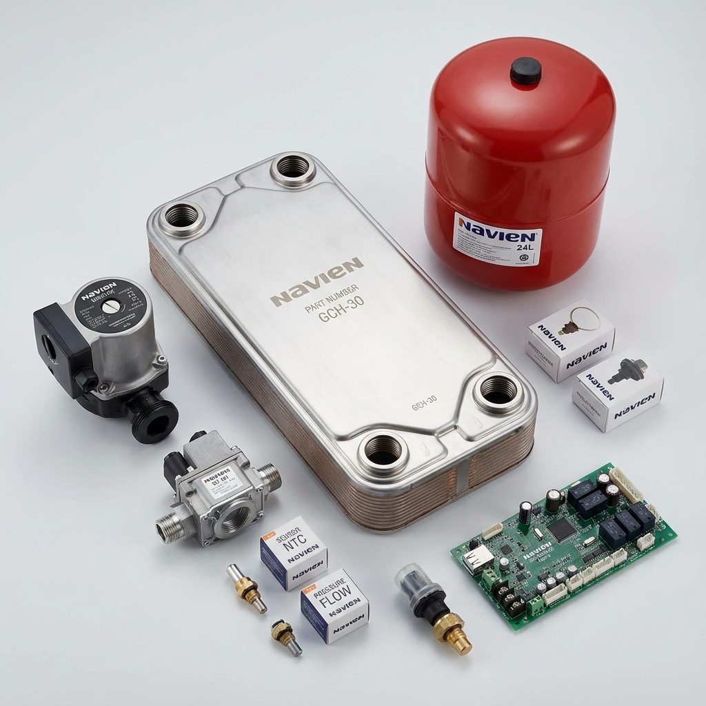

    

    

        

            <h1 class="display-5 fw-bold mb-4">Ремонт котлов Navien</h1>
            
Профессиональный ремонт газовых котлов <strong>Navien (Навьен)</strong> в Москве и Московской области. Гарантия качества, оригинальные запчасти, выезд в день обращения.

            <a class="btn btn-primary btn-lg rounded-pill mt-3 px-5 py-3" href="https://service04.ru/contact-us/feedback">Вызвать мастера</a>
        

        

            
        

    

    

        

            

                

                    <i class="fas fa-bolt fa-3x mb-3 text-primary"></i>
                    <h4 class="fw-bold">Быстрый ремонт</h4>
                    
Устраняем неисправности за 1 визит. Наши специалисты имеют большой опыт работы с котлами Navien всех моделей.

                

            

            

                

                    <i class="fas fa-certificate fa-3x mb-3 text-success"></i>
                    <h4 class="fw-bold">Гарантия на работы</h4>
                    
Предоставляем официальную гарантию на все виды выполненных работ и установленные запчасти.

                

            

            

                

                    <i class="fas fa-map-marker-alt fa-3x mb-3 text-danger"></i>
                    <h4 class="fw-bold">Работаем по всей Москве</h4>
                    
Выезжаем в любой район Москвы и Московской области. Срочный выезд мастера в течение 2 часов.

                

            

        

    

    

        <h2 class="display-6 fw-bold">Основные причины неисправности котлов Navien</h2>
        
Наиболее распространенные проблемы и их признаки

    

    
    

        

            

                

                    

                        <svg class="text-danger me-3" width="24" height="24" fill="currentColor" viewBox="0 0 16 16">
                            <path d="M8.982 1.566a1.13 1.13 0 0 0-1.96 0L.165 13.233c-.457.778.091 1.767.98 1.767h13.713c.889 0 1.438-.99.98-1.767L8.982 1.566zM8 5c.535 0 .954.462.9.995l-.35 3.507a.552.552 0 0 1-1.1 0L7.1 5.995A.905.905 0 0 1 8 5zm.002 6a1 1 0 1 1 0 2 1 1 0 0 1 0-2z"/>
                        </svg>
                        

                            <h5 class="card-title fw-bold">Проблемы с циркуляцией</h5>
                            
Неисправность циркуляционного насоса, засорение фильтров или завоздушивание системы приводят к перегреву котла.

                        

                    

                

            

        

        
        

            

                

                    

                        <svg class="text-danger me-3" width="24" height="24" fill="currentColor" viewBox="0 0 16 16">
                            <path d="M8.982 1.566a1.13 1.13 0 0 0-1.96 0L.165 13.233c-.457.778.091 1.767.98 1.767h13.713c.889 0 1.438-.99.98-1.767L8.982 1.566zM8 5c.535 0 .954.462.9.995l-.35 3.507a.552.552 0 0 1-1.1 0L7.1 5.995A.905.905 0 0 1 8 5zm.002 6a1 1 0 1 1 0 2 1 1 0 0 1 0-2z"/>
                        </svg>
                        

                            <h5 class="card-title fw-bold">Износ теплообменника</h5>
                            
Образование накипи и коррозия в теплообменнике снижают эффективность работы котла и могут привести к протечкам.

                        

                    

                

            

        

        
        

            

                

                    

                        <svg class="text-danger me-3" width="24" height="24" fill="currentColor" viewBox="0 0 16 16">
                            <path d="M8.982 1.566a1.13 1.13 0 0 0-1.96 0L.165 13.233c-.457.778.091 1.767.98 1.767h13.713c.889 0 1.438-.99.98-1.767L8.982 1.566zM8 5c.535 0 .954.462.9.995l-.35 3.507a.552.552 0 0 1-1.1 0L7.1 5.995A.905.905 0 0 1 8 5zm.002 6a1 1 0 1 1 0 2 1 1 0 0 1 0-2z"/>
                        </svg>
                        

                            <h5 class="card-title fw-bold">Неисправность электроники</h5>
                            
Скачки напряжения и износ электронных компонентов могут вызвать сбои в работе платы управления.

                        

                    

                

            

        

        
        

            

                

                    

                        <svg class="text-danger me-3" width="24" height="24" fill="currentColor" viewBox="0 0 16 16">
                            <path d="M8.982 1.566a1.13 1.13 0 0 0-1.96 0L.165 13.233c-.457.778.091 1.767.98 1.767h13.713c.889 0 1.438-.99.98-1.767L8.982 1.566zM8 5c.535 0 .954.462.9.995l-.35 3.507a.552.552 0 0 1-1.1 0L7.1 5.995A.905.905 0 0 1 8 5zm.002 6a1 1 0 1 1 0 2 1 1 0 0 1 0-2z"/>
                        </svg>
                        

                            <h5 class="card-title fw-bold">Проблемы с розжигом</h5>
                            
Загрязнение электродов розжига, неисправность газового клапана или проблемы с подачей газа мешают запуску котла.

                        

                    

                

            

        

        
        

            

                

                    

                        <svg class="text-danger me-3" width="24" height="24" fill="currentColor" viewBox="0 0 16 16">
                            <path d="M8.982 1.566a1.13 1.13 0 0 0-1.96 0L.165 13.233c-.457.778.091 1.767.98 1.767h13.713c.889 0 1.438-.99.98-1.767L8.982 1.566zM8 5c.535 0 .954.462.9.995l-.35 3.507a.552.552 0 0 1-1.1 0L7.1 5.995A.905.905 0 0 1 8 5zm.002 6a1 1 0 1 1 0 2 1 1 0 0 1 0-2z"/>
                        </svg>
                        

                            <h5 class="card-title fw-bold">Падение давления</h5>
                            
Протечки в системе отопления, неисправность расширительного бака или автоматического воздухоотводчика.

                        

                    

                

            

        

        
        

            

                

                    

                        <svg class="text-danger me-3" width="24" height="24" fill="currentColor" viewBox="0 0 16 16">
                            <path d="M8.982 1.566a1.13 1.13 0 0 0-1.96 0L.165 13.233c-.457.778.091 1.767.98 1.767h13.713c.889 0 1.438-.99.98-1.767L8.982 1.566zM8 5c.535 0 .954.462.9.995l-.35 3.507a.552.552 0 0 1-1.1 0L7.1 5.995A.905.905 0 0 1 8 5zm.002 6a1 1 0 1 1 0 2 1 1 0 0 1 0-2z"/>
                        </svg>
                        

                            <h5 class="card-title fw-bold">Неисправность датчиков</h5>
                            
Выход из строя датчиков температуры, давления или тяги приводит к некорректной работе системы.

                        

                    

                

            

        

    

    

        

            

                
            

            

                <h2 class="display-6 fw-bold mb-4">Причины поломок котлов Navien</h2>
                

                    

                        

                            

                                

                                    <strong>1</strong>
                                

                            

                            

                                <h5 class="fw-bold">Жесткая вода</h5>
                                
Повышенное содержание солей в воде приводит к образованию накипи на теплообменнике и снижению эффективности теплопередачи.

                            

                        

                    

                    

                        

                            

                                

                                    <strong>2</strong>
                                

                            

                            

                                <h5 class="fw-bold">Нестабильное электропитание</h5>
                                
Скачки напряжения в электросети могут повредить электронную плату управления и другие электронные компоненты.

                            

                        

                    

                    

                        

                            

                                

                                    <strong>3</strong>
                                

                            

                            

                                <h5 class="fw-bold">Отсутствие обслуживания</h5>
                                
Регулярное техническое обслуживание необходимо для предотвращения большинства неисправностей и продления срока службы котла.

                            

                        

                    

                    

                        

                            

                                

                                    <strong>4</strong>
                                

                            

                            

                                <h5 class="fw-bold">Неправильная эксплуатация</h5>
                                
Несоблюдение рекомендаций производителя по температурному режиму и давлению в системе приводит к преждевременному износу.

                            

                        

                    

                    

                        

                            

                                

                                    <strong>5</strong>
                                

                            

                            

                                <h5 class="fw-bold">Естественный износ</h5>
                                
Со временем все компоненты котла изнашиваются и требуют замены даже при правильной эксплуатации.

                            

                        

                    

                

            

        

    

    

        <h2 class="display-6 fw-bold">Стоимость ремонта котлов Navien</h2>
        
Прозрачное ценообразование без скрытых платежей

    

    

        

            

                <table class="table table-hover table-striped mb-0">
                    <thead class="table-primary">
                        <tr>
                            <th scope="col" class="py-3">Вид работ</th>
                            <th scope="col" class="py-3">Стоимость ремонта</th>
                        </tr>
                    </thead>
                    <tbody>
                        <tr>
                            <td class="py-3">Диагностика неисправности</td>
                            <td class="py-3 fw-bold">1 500 ₽</td>
                        </tr>
                        <tr>
                            <td class="py-3">Промывка теплообменника</td>
                            <td class="py-3 fw-bold">от 3 800 ₽</td>
                        </tr>
                        <tr>
                            <td class="py-3">Замена циркуляционного насоса</td>
                            <td class="py-3 fw-bold">от 4 500 ₽</td>
                        </tr>
                        <tr>
                            <td class="py-3">Ремонт/замена газового клапана</td>
                            <td class="py-3 fw-bold">от 5 200 ₽</td>
                        </tr>
                        <tr>
                            <td class="py-3">Замена трехходового клапана</td>
                            <td class="py-3 fw-bold">от 4 000 ₽</td>
                        </tr>
                        <tr>
                            <td class="py-3">Ремонт/замена платы управления</td>
                            <td class="py-3 fw-bold">от 7 000 ₽</td>
                        </tr>
                        <tr>
                            <td class="py-3">Замена расширительного бака</td>
                            <td class="py-3 fw-bold">от 3 500 ₽</td>
                        </tr>
                        <tr>
                            <td class="py-3">Устранение протечки</td>
                            <td class="py-3 fw-bold">от 3 000 ₽</td>
                        </tr>
                        <tr>
                            <td class="py-3">Чистка горелки и электродов</td>
                            <td class="py-3 fw-bold">от 2 500 ₽</td>
                        </tr>
                        <tr>
                            <td class="py-3">Замена датчиков (температуры, давления)</td>
                            <td class="py-3 fw-bold">от 2 400 ₽</td>
                        </tr>
                        <tr>
                            <td class="py-3">Профилактическое обслуживание</td>
                            <td class="py-3 fw-bold">от 2 800 ₽</td>
                        </tr>
                        <tr>
                            <td class="py-3">Замена теплообменника</td>
                            <td class="py-3 fw-bold">от 8 500 ₽</td>
                        </tr>
                    </tbody>
                </table>
            

            

                <strong>Обратите внимание:</strong> Указаны ориентировочные цены на работы без учета стоимости запчастей. Точная стоимость ремонта определяется после диагностики.
            

        

    

    

        

            

                <h2 class="display-6 fw-bold mb-4">Оригинальные запчасти Navien</h2>
                
Мы используем только оригинальные комплектующие от производителя, что гарантирует:

                <ul class="list-unstyled">
                    <li class="mb-3">
                        <svg class="text-success me-2" width="20" height="20" fill="currentColor" viewBox="0 0 16 16">
                            <path d="M10.97 4.97a.75.75 0 0 1 1.07 1.05l-3.99 4.99a.75.75 0 0 1-1.08.02L4.324 8.384a.75.75 0 1 1 1.06-1.06l2.094 2.093 3.473-4.425a.267.267 0 0 1 .02-.022z"/>
                        </svg>
                        Полную совместимость с вашей моделью котла
                    </li>
                    <li class="mb-3">
                        <svg class="text-success me-2" width="20" height="20" fill="currentColor" viewBox="0 0 16 16">
                            <path d="M10.97 4.97a.75.75 0 0 1 1.07 1.05l-3.99 4.99a.75.75 0 0 1-1.08.02L4.324 8.384a.75.75 0 1 1 1.06-1.06l2.094 2.093 3.473-4.425a.267.267 0 0 1 .02-.022z"/>
                        </svg>
                        Длительный срок службы запчастей
                    </li>
                    <li class="mb-3">
                        <svg class="text-success me-2" width="20" height="20" fill="currentColor" viewBox="0 0 16 16">
                            <path d="M10.97 4.97a.75.75 0 0 1 1.07 1.05l-3.99 4.99a.75.75 0 0 1-1.08.02L4.324 8.384a.75.75 0 1 1 1.06-1.06l2.094 2.093 3.473-4.425a.267.267 0 0 1 .02-.022z"/>
                        </svg>
                        Сохранение гарантии производителя
                    </li>
                    <li class="mb-3">
                        <svg class="text-success me-2" width="20" height="20" fill="currentColor" viewBox="0 0 16 16">
                            <path d="M10.97 4.97a.75.75 0 0 1 1.07 1.05l-3.99 4.99a.75.75 0 0 1-1.08.02L4.324 8.384a.75.75 0 1 1 1.06-1.06l2.094 2.093 3.473-4.425a.267.267 0 0 1 .02-.022z"/>
                        </svg>
                        Надежность и безопасность эксплуатации
                    </li>
                </ul>
            

            

                
            

        

    

    

        <h2 class="display-6 fw-bold">Наиболее распространенные коды ошибок котлов Navien</h2>
        
Расшифровка основных ошибок и способы их устранения

    

    

        

            

                

                    <h2 class="accordion-header" id="heading01">
                        <button class="accordion-button" type="button" data-bs-toggle="collapse" data-bs-target="#collapse01" aria-expanded="true" aria-controls="collapse01">
                            <strong class="text-danger me-3">01</strong> Сбой розжига (отсутствие пламени)
                        </button>
                    </h2>
                    

                        

                            
<strong>Причины:</strong> Отсутствие газа, неисправность газового клапана, загрязнение электродов розжига, проблемы с системой дымоудаления.

                            
<strong>Решение:</strong> Проверить подачу газа, очистить электроды, проверить дымоход. При необходимости заменить газовый клапан.

                        

                    

                

                
                

                    <h2 class="accordion-header" id="heading02">
                        <button class="accordion-button collapsed" type="button" data-bs-toggle="collapse" data-bs-target="#collapse02" aria-expanded="false" aria-controls="collapse02">
                            <strong class="text-danger me-3">02</strong> Ложный сигнал пламени
                        </button>
                    </h2>
                    

                        

                            
<strong>Причины:</strong> Влага на электронной плате, неисправность электрода ионизации, проблемы с газовым клапаном.

                            
<strong>Решение:</strong> Высушить плату, очистить или заменить электрод ионизации, проверить газовый клапан.

                        

                    

                

                
                

                    <h2 class="accordion-header" id="heading03">
                        <button class="accordion-button collapsed" type="button" data-bs-toggle="collapse" data-bs-target="#collapse03" aria-expanded="false" aria-controls="collapse03">
                            <strong class="text-danger me-3">03</strong> Ошибка вентилятора (дымоудаления)
                        </button>
                    </h2>
                    

                        

                            
<strong>Причины:</strong> Неисправность вентилятора, засорение дымохода, проблемы с датчиком тяги (прессостатом).

                            
<strong>Решение:</strong> Очистить дымоход, проверить работу вентилятора, заменить прессостат при необходимости.

                        

                    

                

                
                

                    <h2 class="accordion-header" id="heading10">
                        <button class="accordion-button collapsed" type="button" data-bs-toggle="collapse" data-bs-target="#collapse10" aria-expanded="false" aria-controls="collapse10">
                            <strong class="text-danger me-3">10</strong> Перегрев теплообменника
                        </button>
                    </h2>
                    

                        

                            
<strong>Причины:</strong> Неисправность циркуляционного насоса, засорение теплообменника, завоздушивание системы, неисправность датчика температуры.

                            
<strong>Решение:</strong> Проверить работу насоса, удалить воздух из системы, промыть теплообменник, заменить датчик.

                        

                    

                

                
                

                    <h2 class="accordion-header" id="heading12">
                        <button class="accordion-button collapsed" type="button" data-bs-toggle="collapse" data-bs-target="#collapse12" aria-expanded="false" aria-controls="collapse12">
                            <strong class="text-danger me-3">12</strong> Затухание пламени
                        </button>
                    </h2>
                    

                        

                            
<strong>Причины:</strong> Недостаточное давление газа, проблемы с дымоудалением, загрязнение электродов.

                            
<strong>Решение:</strong> Проверить давление газа, очистить дымоход и электроды, проверить систему подачи воздуха.

                        

                    

                

                
                

                    <h2 class="accordion-header" id="heading13">
                        <button class="accordion-button collapsed" type="button" data-bs-toggle="collapse" data-bs-target="#collapse13" aria-expanded="false" aria-controls="collapse13">
                            <strong class="text-danger me-3">13</strong> Низкое давление воды в системе
                        </button>
                    </h2>
                    

                        

                            
<strong>Причины:</strong> Утечка воды в системе отопления, неисправность расширительного бака, проблемы с датчиком давления.

                            
<strong>Решение:</strong> Найти и устранить течь, подкачать расширительный бак, проверить датчик давления, долить воду в систему.

                        

                    

                

                
                

                    <h2 class="accordion-header" id="heading15">
                        <button class="accordion-button collapsed" type="button" data-bs-toggle="collapse" data-bs-target="#collapse15" aria-expanded="false" aria-controls="collapse15">
                            <strong class="text-danger me-3">15</strong> Ошибка датчика температуры ГВС
                        </button>
                    </h2>
                    

                        

                            
<strong>Причины:</strong> Неисправность датчика температуры ГВС, обрыв или замыкание в цепи датчика.

                            
<strong>Решение:</strong> Проверить контакты датчика, при необходимости заменить датчик температуры.

                        

                    

                

                
                

                    <h2 class="accordion-header" id="heading16">
                        <button class="accordion-button collapsed" type="button" data-bs-toggle="collapse" data-bs-target="#collapse16" aria-expanded="false" aria-controls="collapse16">
                            <strong class="text-danger me-3">16</strong> Ошибка датчика температуры отопления
                        </button>
                    </h2>
                    

                        

                            
<strong>Причины:</strong> Неисправность датчика температуры отопления, обрыв или замыкание в цепи датчика.

                            
<strong>Решение:</strong> Проверить контакты датчика, при необходимости заменить датчик температуры.

                        

                    

                

            

            
            

                <strong>Важно:</strong> При появлении кода ошибки не рекомендуется самостоятельно вмешиваться в работу котла. Обратитесь к квалифицированному специалисту для точной диагностики и ремонта.
            

        

    

    

        

            

                <h3 class="display-6 fw-bold mb-4">Нужен ремонт котла Navien?</h3>
                
Обратитесь к нам прямо сейчас! Наши специалисты с многолетним опытом готовы помочь вам устранить любые неисправности котлов Navien.

                
Мы гарантируем профессиональный подход, использование оригинальных запчастей и оперативное выполнение работ. Работаем без выходных, выезд мастера в день обращения.

                <a class="btn btn-light btn-lg rounded-pill mt-3 px-5 py-3" href="https://service04.ru/contact-us/feedback">Заказать ремонт сейчас</a>
            

        

    

