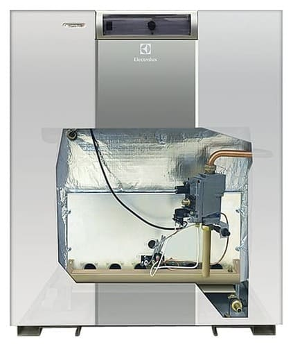

        

        

            <h1 class="display-6 fw-bold text-primary mb-3">Ремонт и обслуживание котлов Electrolux FSB P</h1>
            
Добро пожаловать в наш сервисный центр, специализирующийся на ремонте и обслуживании котельного оборудования Electrolux FSB P. Наша команда высококвалифицированных техников готова предложить вам надежные решения для обеспечения непрерывной работы вашего котла.

            
            

                
                
                
            

            <a class="btn btn-primary btn-lg fw-bold shadow-sm" href="https://service04.ru/contact-us/feedback"><i class="fas fa-phone-volume me-2"></i>Вызвать мастера</a>
        

    

    
    

        <h4 class="fw-bold mb-3 text-primary"><i class="fas fa-link me-2"></i>Быстрая навигация:</h4>
        

            
<a class="btn btn-info w-100 fw-bold" href="#h_502932282121696497228452">Гарантия</a>

            
<a class="btn btn-info w-100 fw-bold" href="#h_8863801872641696497348438">Связь (Задать вопрос)</a>

            
<a class="btn btn-info w-100 fw-bold" href="#h_9363462084621696497400302">Зона обслуживания</a>

        

    

    

        

            
            
        

        

            <h3 class="fw-bold text-primary mb-3"><i class="fas fa-thumbs-up me-2"></i>Почему выбирают нас?</h3>
            <ol class="small list-group list-group-flush shadow-sm">
                <li class="list-group-item bg-light"><strong class="text-primary"><i class="fas fa-user-tie me-2"></i>Опытные специалисты:</strong> Наша команда обладает многолетним опытом и глубокими знаниями работы котлов Electrolux FSB P. Наши техники прошли обширное обучение.</li>
                <li class="list-group-item"><strong class="text-primary"><i class="fas fa-certificate me-2"></i>Оригинальные запчасти:</strong> Мы используем только оригинальные запчасти Electrolux с сертификатами качества для гарантии долговечности ремонта.</li>
                <li class="list-group-item bg-light"><strong class="text-primary"><i class="fas fa-medal me-2"></i>Качество и надежность: </strong>Мы работаем с современным оборудованием, чтобы обеспечить максимальную надежность вашего котла после ремонта.</li>
                <li class="list-group-item"><strong class="text-primary"><i class="fas fa-address-card me-2"></i>Индивидуальный подход:</strong> Мы проводим детальную диагностику и разрабатываем оптимальное решение для восстановления работоспособности вашего котла.</li>
                <li class="list-group-item bg-light"><strong class="text-primary"><i class="fas fa-shipping-fast me-2"></i>Быстрый и надежный сервис:</strong> Мы ценим ваше время и стремимся провести ремонт в кратчайшие сроки, минимизируя время ожидания.</li>
            </ol>
        

    

    <h4 class="fw-bold mb-4 text-primary"><i class="fas fa-list-check me-2"></i>Наши услуги:</h4>
    

        

            <ul class="list-unstyled ms-3 p-3 rounded shadow-sm bg-light">
                <li class="mb-2"><i class="fas fa-check me-2 text-success"></i> Диагностика и обслуживание газовых котлов Electrolux FSB P.</li>
                <li class="mb-2"><i class="fas fa-check me-2 text-success"></i> Определение причины неисправности.</li>
                <li class="mb-2"><i class="fas fa-check me-2 text-success"></i> Ремонт и замена компонентов котельного оборудования.</li>
                <li class="mb-2"><i class="fas fa-check me-2 text-success"></i> Профилактическое обслуживание и очистка системы.</li>
            </ul>
        

        

            <ul class="list-unstyled ms-3 p-3 rounded shadow-sm bg-light">
                <li class="mb-2"><i class="fas fa-check me-2 text-success"></i> Регулировка и настройка параметров работы котла.</li>
                <li class="mb-2"><i class="fas fa-check me-2 text-success"></i> Установка и настройка котельного оборудования.</li>
                <li class="mb-2"><i class="fas fa-check me-2 text-success"></i> Консультации по эффективному и безопасному использованию.</li>
                <li class="mb-2"><i class="fas fa-check me-2 text-success"></i> Тестирование и проверка работоспособности после ремонта.</li>
            </ul>
        

    

    
    

        

            
        

        

            <h4 class="fw-bold mb-3 text-primary"><i class="fas fa-heartbeat me-2"></i>Почему важно регулярно обслуживать котел Electrolux FSB P?</h4>
            
Регулярное обслуживание котла позволяет поддерживать его в отличной работоспособности и продлевать срок службы. Это также помогает избегать неожиданных поломок и снижает риск возгорания и других опасных ситуаций.

            
Если у вас возникли проблемы с котлом Electrolux FSB P или вам нужна профессиональная помощь, не стесняйтесь обращаться к нам. Мы гарантируем быстрое реагирование, высокое качество обслуживания и доступные цены.

        

    

    

        
    

    

        

            

                <h4 id="h_502932282121696497228452" class="fw-bold mb-3 text-success"><i class="fas fa-shield-alt me-2"></i>Гарантия:</h4>
                
Мы предоставляем гарантию на все выполненные работы и установленные запчасти от **6 месяцев**. Мы стремимся к полной удовлетворенности клиентов и готовы решить любые возникающие проблемы после ремонта.

            

        

        

            

                <h5 id="h_8863801872641696497348438" class="fw-bold mb-3 text-info"><i class="fas fa-headset me-2"></i>Свяжитесь с нами:</h5>
                
Если у вас возникли проблемы с газовым котлом Electrolux FSB P или вам требуется профессиональное обслуживание и ремонт, свяжитесь с нами. <a class="btn btn-info btn-sm ms-2" href="https://service04.ru/contact-us"><i class="fas fa-envelope me-1"></i>Наши контакты</a>

                
Наша команда готова ответить на все ваши вопросы и предоставить качественные услуги по ремонту и обслуживанию вашего котла.

            

        

    

    

        

            <h5 id="h_9363462084621696497400302" class="fw-bold mb-3 text-primary"><i class="fas fa-map-marker-alt me-2"></i>Зона обслуживания котельного оборудования</h5>
            
Работаем по Москве и всем городам Московской области: Апрелевка, Балашиха, Барвиха, Бронницы, Видное, Воскресенск, Голицино, Дмитров, Долгопрудный, Домодедово, Егорьевск, Железнодорожный, Жуковский, Звенигород, Зеленоград, Икша, Истра, Ивантеевка, Королёв, Красногорск, Кубинка, Куровское, Лобня, Люберцы, Мытищи, Наро-Фоминск, Нахабино, Новая Москва, Ногинск, Одинцово, Орехово-Зуево, Подольск, Пушкино, Раменское, Реутов, Селятино, Сергиев-Посад, Софрино, Сходня, Фрязино, Химки, Щелково, Электросталь.

            
СНИЖЕНИЕ ЦЕН НА РЕМОНТ КОТЛОВ.

            
ДИАГНОСТИКА+РЕМОНТ 4600 руб. !!! Выезд 50руб/км !!!

            <a class="btn btn-primary btn-lg mt-3" href="https://service04.ru/contact-us/feedback"><i class="fas fa-phone-volume me-2"></i>Вызвать мастера</a>
            
            

                
            

        

    

    

        

            

                
<button type="button" class="btn-close btn-close-white" data-bs-dismiss="modal" aria-label="Close"></button>

                

            

        

    

    

        

            

                
<button type="button" class="btn-close btn-close-white" data-bs-dismiss="modal" aria-label="Close"></button>

                

            

        

    

    

        

            

                
<button type="button" class="btn-close btn-close-white" data-bs-dismiss="modal" aria-label="Close"></button>

                

            

        

    

