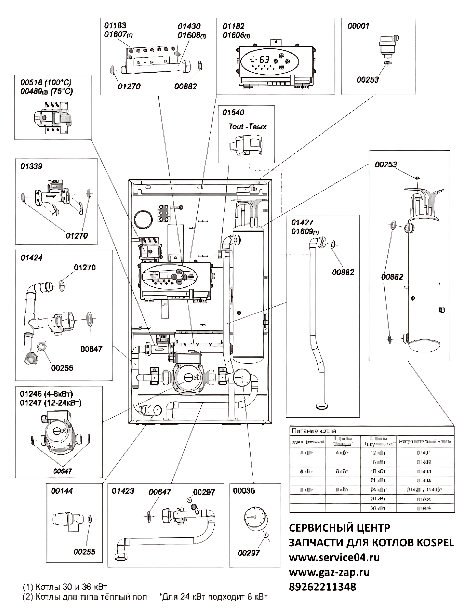

---
title: 'Схема запчастей котла Kospel EKCO L2'
---

<section class="bg-primary text-white fw-bold mb-5">

Визуальное руководство по компонентам электрического котла

</section>

Ниже представлена схема расположения и обозначения основных запасных частей и компонентов **электрического котла Kospel EKCO L2**. Используйте эту схему для идентификации деталей при подборе запчастей.

<h5 class="h6 text-dark"><i class="fas fa-info-circle"></i>Важно!</h5>

Для точного подбора запчасти сверяйтесь с артикулом на схеме и технической документацией котла. При сомнениях обратитесь к специалистам.

<header class="card-header bg-info text-white">

<i class="fas fa-project-diagram"></i> Схема компонентов

</header>

**Щелкните по изображению, чтобы открыть увеличенную версию схемы.**

Схема запчастей котла Kospel EKCO L2

<header class="card-header bg-success text-white">

<i class="fas fa-cogs"></i> Распространенные запчасти EKCO L2

</header>

Ниже перечислены некоторые из наиболее часто заменяемых компонентов котла Kospel EKCO L2:

<ul class="ml-0 list-unstyled">
<li class="mb-2"><i class="fas fa-microchip"></i> <strong>Плата управления</strong></li>
<li class="mb-2"><i class="fas fa-thermometer-half"></i> <strong>Датчики температуры</strong></li>
<li class="mb-2"><i class="fas fa-bolt"></i> <strong>ТЭНы (электронагревательные элементы)</strong></li>
</ul>

<ul class="ml-0 list-unstyled">
<li class="mb-2"><i class="fas fa-pump"></i> <strong>Циркуляционный насос</strong></li>
<li class="mb-2"><i class="fas fa-valve"></i> <strong>Предохранительный клапан</strong></li>
<li class="mb-2"><i class="fas fa-grip-lines"></i> <strong>Уплотнения и прокладки</strong></li>
</ul>

Полный перечень запчастей с артикулами вы можете найти на увеличенной схеме выше.

<h3 class="h4 display-4 text-white mb-3"><i class="fas fa-shopping-cart"></i>Нужна запчасть для котла Kospel EKCO L2?</h3>

Свяжитесь с нами для подбора и заказа оригинальных комплектующих!

<a href="tel:+79262211348" class="btn btn-light btn-lg w-100"> <i class="fas fa-phone"></i> Позвонить </a>

<a href="https://service04.ru/contact-us/feedback" class="btn btn-warning btn-lg w-100 text-dark"> <i class="fas fa-envelope"></i> Оставить заявку </a>

