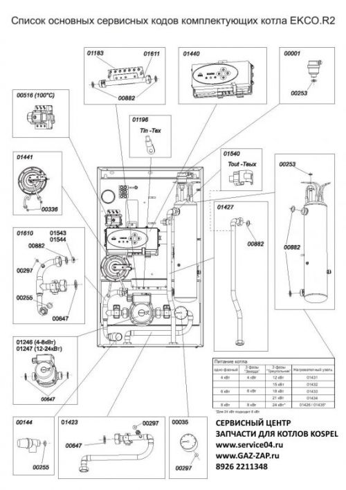

---
title: 'Схема запчастей EKCO_R2'
---

<figure class="image is-inline-block"></figure>

Схема запчастей <strong>EKCO_R2</strong> предназначена для быстрого и точного подбора оригинальных комплектующих к газовому водонагревателю или отопительному котлу, оснащённому автоматикой серии EKCO_R2.

Данная схема содержит маркировку всех ключевых узлов и элементов: от газового клапана и пилотной горелки до термопар, регуляторов и крепёжных деталей. Благодаря детальной разметке вы можете легко определить артикул необходимой запчасти и избежать ошибок при заказе.

<h5 class="h5"><i class="fas fa-info-circle me-2"></i>Как использовать схему?</h5>
<ul class="mb-0">
<li>Найдите на схеме нужный вам узел (например, «термопара» или «газовый клапан»)</li>
<li>Запишите каталожный номер (артикул), указанный рядом с изображением</li>
<li>Введите артикул в строку поиска на нашем сайте или сообщите его нашему консультанту</li>
</ul>

Все запчасти, соответствующие схеме EKCO_R2, представлены в нашем каталоге. Мы предлагаем только оригинальные комплектующие от производителя <strong>SIT Group</strong> — надёжные, безопасные и полностью совместимые с вашим оборудованием.

<strong>Важно:</strong> при самостоятельной замене запчастей убедитесь, что вы точно идентифицировали модель и артикул. В случае сомнений — свяжитесь с нашим техническим специалистом. Неправильно подобранная деталь может привести к неисправности оборудования или нарушению условий гарантии.

<a href="tel:+79262211348" class="btn btn-primary btn-lg me-3"> <i class="fas fa-phone me-2"></i>Позвонить специалисту </a> <a href="https://service04.ru/contact-us/feedback" class="btn btn-warning btn-lg text-dark"> <i class="fas fa-envelope me-2"></i>Запросить подбор запчастей </a>

