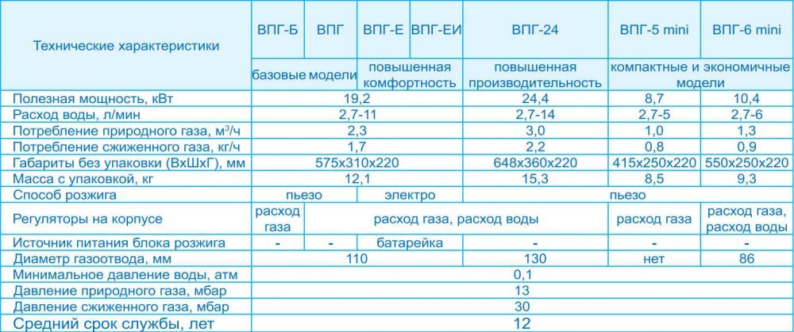
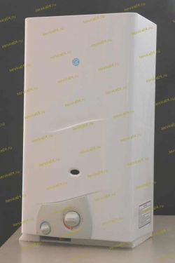

---
title: 'Газовые проточные водонагреватели « Россиянка-М»'
---

<figure class="image is-inline-block"></figure>

Компания «Россиянка» — производитель современного высокотехнологичного оборудования для комфортного обеспечения горячей водой и отопления жилья. Все изделия разработаны с учетом **российских условий эксплуатации**.

Уверенно работают при низком давлении воды и идеально подходят семьям с детьми и пожилыми людьми. Оснащены совершенной системой безопасности, назначение которой — не допустить аварийных ситуаций из-за неправильных действий пользователя.

<figure class="image is-inline-block has-border-light"></figure>

Данные модели выпускаются с 2001 года. Предназначены для подготовки горячей воды для бытовых нужд в проточном режиме. Производительность, в зависимости от модели, от **5 до 14 литров в минуту**.

Способ розжига — без спичек, электрический от батарейки или на пьезоэлементах. Устанавливаются в домах и квартирах при наличии стационарного дымохода (кроме модели ВПГ-5 mini).

Применение высококачественных материалов и наличие в конструкции **защиты от образования накипи** в теплообменнике гарантируют, что долгие годы у Вас не будет проблем с приготовлением горячей воды.

Газовая колонка должна быть удобной и красивой. Поэтому у всех колонок «Россиянка-М» такие **компактные размеры** и **симпатичный дизайн**. **Гарантия на все модели — 2 года.**

<figure class="image mt-5"></figure>

<h2 class="h4 display-4 mb-4" style="padding-bottom: 5px; border-bottom: 2px solid #e37a25; color: #e37a25;">ТАБЛИЦА ГАЗОВЫХ ПРОТОЧНЫХ ВОДОНАГРЕВАТЕЛЕЙ</h2>

<figure class="image is-inline-block"></figure>

Вся продукция сертифицирована Госстандартом России.

Гарантия 2 года

<table class="table is-bordered is-striped w-100 is-narrow">
<thead class="bg-secondary-lighter">
<tr>
<th class="has-text-weight-bold">Модель</th>
<th class="has-text-weight-bold">Расход воды, л/мин</th>
<th class="has-text-weight-bold">Полезная мощность, кВт</th>
<th class="has-text-weight-bold">Габариты с упаковкой, мм</th>
<th class="has-text-weight-bold">Вес с упаковкой, кг</th>
</tr>
</thead>
<tbody>
<tr>
<td class="has-text-weight-bold">ВПГ-5 mini (пьезорозжиг, не требует подключения к дымоходу)</td>
<td>от 2,7 до 5</td>
<td>8,7</td>
<td>483*303*283</td>
<td>8,5</td>
</tr>
<tr>
<td class="has-text-weight-bold">ВПГ-6 mini (пьезорозжиг)</td>
<td>от 2,7 до 6</td>
<td>10,4</td>
<td>635*303*283</td>
<td>9,3</td>
</tr>
<tr>
<td class="has-text-weight-bold">ВПГ-Б (пьезорозжиг, без контроля расхода)</td>
<td>от 2,7 до 11</td>
<td>19,2</td>
<td>650*365*272</td>
<td>12,1</td>
</tr>
<tr>
<td class="has-text-weight-bold">ВПГ (пьезорозжиг)</td>
<td>от 2,7 до 11</td>
<td>19,2</td>
<td>650*365*272</td>
<td>12,1</td>
</tr>
<tr>
<td class="has-text-weight-bold">ВПГ-Е (электророзжиг)</td>
<td>от 2,7 до 11</td>
<td>19,2</td>
<td>650*365*272</td>
<td>12,1</td>
</tr>
<tr>
<td class="has-text-weight-bold">ВПГ-ЕИ (электророзжиг и блок ионизации)</td>
<td>от 2,7 до 11</td>
<td>19,2</td>
<td>650*365*272</td>
<td>12,1</td>
</tr>
<tr>
<td class="has-text-weight-bold">ВПГ-24 (пьезорозжиг)</td>
<td>от 2,7 до 14</td>
<td>24,4</td>
<td>750*430*285</td>
<td>15,3</td>
</tr>
<tr>
<td class="has-text-weight-bold">ВПГ- 24 ЕИ (электророзжиг и блок ионизации)</td>
<td>от 2,7 до 14</td>
<td>24,4</td>
<td>750*430*285</td>
<td>15,3</td>
</tr>
</tbody>
</table>

<h2 class="h4 display-4 mb-4" style="padding-bottom: 5px; border-bottom: 2px solid #e37a25; color: #e37a25;">Ремонт газовых колонок Россиянка</h2>

Работаем без предоплаты, а также делаем скидки пенсионерам!

Выезжаем на ремонт газовых колонок Россиянка в любой район Москвы и Ближнего Московской области:

Королев, Красногорск, Видное, Химки, Балашиха, Щелково, Пушкино, Мытищи, Зеленоград и др.

У нас в машине есть все необходимые комплектующие и запчасти.

<h3 class="h5 has-text-uppercase" style="color: #e37a25;">СЕРТИФИКАТЫ</h3>

Здесь будет размещена галерея сертификатов. (Исходный код не содержал изображений).

