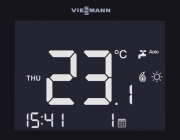
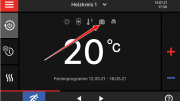

---
title: 'Как перевести котел Viessmann в летний режим?'
---

<section class="section">

<!-- Заголовок -->
<section class="bg-primary text-white fw-bold mb-5">

Экономьте энергию в тёплое время года

</section>
<!-- Вступление -->

Когда наступают солнечные дни, экономьте энергию, переключая свой котел с зимнего режима на летний.

Если ваш котёл не оснащён системой регулирования температуры наружного воздуха с автоматическим переходом в летний режим, переведите его в этот режим вручную, когда наступят тёплые дни.

<!-- Как включить летний режим -->

<header class="card-header bg-info text-white">

<i class="fas fa-thermometer-empty me-2"></i>Как включить летний режим

</header>

<ul>
<li class="mb-2"><i class="fas fa-hand-point-right text-primary me-2"></i> Для этого выберите позицию <strong>«летний режим»</strong> или <strong>«только горячая вода»</strong>.</li>
<li class="mb-2"><i class="fas fa-faucet text-info me-2"></i> Обычно она обозначена пиктограммой в форме <strong>крана</strong>.</li>
<li class="mb-2"><i class="fas fa-thermometer-full text-warning me-2"></i> При наступлении холодов вернитесь в <strong>зимний режим</strong> (изображение <strong>радиатора</strong>).</li>
</ul>

<figure class="image is-inline-block mb-2"></figure>

Пример панели управления

<i class="fas fa-lightbulb me-2"></i>Совет

Если у вас есть комнатный термостат или пульт дистанционного управления, переход в летний режим задаётся именно на этом устройстве. Обратитесь к руководству по эксплуатации аксессуара, чтобы избежать ненужной работы котла и циркуляционного насоса в режиме отопления и дополнительно сэкономить энергию.

<!-- Как включить режим отпуска -->

<header class="card-header bg-warning text-dark">

<i class="fas fa-plane-departure me-2"></i>Как включить режим отпуска котла?

</header>

Включите режим отпуска вашей системы отопления Viessmann на время вашего отсутствия.

<figure class="image is-inline-block"></figure>

Интерфейс режима отпуска

Котлы Viessmann имеют широкий набор заводских настроек, которые упрощают управление и позволяют изменять параметры теплогенератора за несколько шагов. Настройки по умолчанию помогают экономить энергию и снижают затраты на отопление.

<strong>Режим отпуска</strong> доступен как расписание через регулятор отопления. Владельцы арендованного жилья или пользователи без доступа к теплогенератору, как правило, не могут менять этот режим самостоятельно.

<!-- Режим отдыха в деталях -->

<header class="card-header bg-success text-white">

<i class="fas fa-info-circle me-2"></i>Режим отдыха в деталях

</header>

Владелец может задать даты прибытия и отъезда для каждого отопительного контура, напрямую влияя на работу теплогенератора. Режим отдыха влияет на центральное отопление, подготовку горячей воды, мощность нагрева и общее энергопотребление.

<h5 class="h6 text-primary mt-3"><i class="fas fa-home me-2"></i>Центральное отопление</h5>
<ul>
<li><i class="fas fa-thermometer-quarter text-info mr-1"></i> Для контуров «отопление и ГВС»: нагрев до пониженной температуры.</li>
<li><i class="fas fa-snowflake text-warning mr-1"></i> Для контуров «только ГВС»: отопление отключено, активна защита от замерзания.</li>
</ul>
<h5 class="h6 text-primary mt-3"><i class="fas fa-shower me-2"></i>Отопление ГВС</h5>
<ul>
<li><i class="fas fa-ban text-danger mr-1"></i> Если режим отпуска включён для всех контуров, нагрев ГВС отключается.</li>
<li><i class="fas fa-shield-alt text-success mr-1"></i> Активна защита от замерзания оборудования ГВС.</li>
</ul>

<i class="fas fa-clock me-2"></i>Важно!

В заводских настройках режим отпуска начинается в 00:00 следующего дня после отъезда и завершается в 00:00 дня возвращения. Время можно изменить вручную согласно инструкции по эксплуатации.

<!-- Информационные блоки -->

<i class="fas fa-thermometer-half me-2"></i>Режим отдыха снижает мощность нагрева

При активном режиме отпуска система поддерживает пониженную комнатную температуру. Нагрев идёт только до заранее заданного значения, которое не рекомендуется опускать ниже 16 °C, чтобы снизить риск образования плесени.

<i class="fas fa-piggy-bank me-2"></i>Режим отдыха экономит энергию

Режим отпуска позволяет отапливать только необходимый минимум в период вашего отсутствия. Его можно использовать не только во время длительных каникул: если вы знаете, что дом будет пустовать несколько дней, включение режима отпуска поможет снизить расходы на отопление.

<!-- Как включить режим отпуска (пример) -->

<header class="card-header bg-dark text-white">

<i class="fas fa-cog me-2"></i>Как включить режим отпуска (пример)

</header>

<strong>Включить режим отпуска</strong>

Расписание и режим отпуска доступны на всех котлах Viessmann с регулятором Vitotronic (примерно с 1999 года). Последовательность пунктов меню зависит от модели и года выпуска, поэтому точный порядок приведён в руководстве по эксплуатации.

<!-- Упрощённый аккордеон можно сделать через Bulma extensions или собственный JS;
             здесь – статический пример блока -->

Пример: Vitodens 200-W с Vitotronic 200

<ul>
<li class="mb-1"><i class="fas fa-bars text-primary me-2"></i> Нажмите на значок меню, затем выберите пункт «Отопление».</li>
<li class="mb-1"><i class="fas fa-list-ol text-info me-2"></i> Выберите нужный контур отопления и подтвердите выбор кнопкой ОК.</li>
<li class="mb-1"><i class="fas fa-calendar-alt text-warning me-2"></i> В меню появится пункт «Праздничная программа» (режим отпуска).</li>
<li class="mb-1"><i class="fas fa-edit text-success me-2"></i> Задайте даты отъезда и возвращения с помощью кнопок со стрелками.</li>
<li class="mb-1"><i class="fas fa-check text-danger me-2"></i> Нажмите ОК, чтобы активировать программу отпуска.</li>
</ul>

<!-- Призыв к действию -->

<h3 class="h4 display-4"><i class="fas fa-question-circle me-2"></i>Нужна помощь с котлом Viessmann?</h3>

Специалисты помогут настроить режимы работы и провести обслуживание!

<a href="tel:+79262211348" class="btn btn-light btn-lg w-100"> <i class="fas fa-phone me-2"></i>Позвонить </a>

<a href="https://service04.ru/contact-us/feedback" class="btn btn-warning btn-lg w-100 text-dark"> <i class="fas fa-envelope me-2"></i>Оставить заявку </a>

</section>