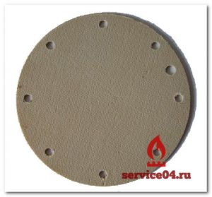

---
title: 'Мембрана для газовой колонки Нева 3208'
---

<section class="section">

<figure class="image is-inline-block"></figure>

Колонка **Нева 3208** снята с производства, но до сих пор активно используется во многих городах России. Основным отличием от других газовых колонок является простота конструкции и надежность. Если вдруг что-то ломается, всегда можно найти запчасти, в том числе и мембрану.

<h4 class="h5 mt-4">Мембрана (диафрагма) водяного клапана изготавливается в нескольких вариантах:</h4>

Резина

Силикон (Повышенной прочности)

Специальный материал

Мембрана подходит для водяного узла проточного газового нагревателя ВПГ «НЕВА» 3208, ВПГ-18, ВПГ-23 (белая) вакуумная.

<figure class="image is-inline-block" style="max-width: 400px;"></figure>

<h3 class="h4 display-4 text-warning">ЗАКАЗАТЬ МЕМБРАНУ ИЛИ ВЫЗВАТЬ МАСТЕРА</h3>

Если вы хотите купить мембрану для газовой колонки Нева, обратитесь к нам, и мы поможем вам. Узнать стоимость, наличие, а также Вызвать мастера на ремонт газовой колонки Вы можете по нашему телефону:

<a href="tel:89262211348" class="btn btn-primary btn-lg w-100 has-text-weight-bold"> <i class="fas fa-phone"></i> 8 (926) 221-13-48 </a>

Или оставьте заявку на сайте.

<h4 class="h5 text-info"><i class="fas fa-shipping-fast"></i>Доставка и Самовывоз</h4>
<ul class="ml-4">
<li>Вы можете заказать мембрану, и мы привезем ее курьером к вам домой или на работу (по Москве и области).</li>
<li>Также отправляем запчасти по России **транспортной компанией СДЭК** (по предоплате 100%).</li>
<li>Самовывоз со склада (Схему проезда можно найти в разделе контакты).</li>
</ul>

<h4 class="h5 text-success"><i class="fas fa-credit-card"></i>Варианты оплаты</h4>
<ul class="ml-4">
<li>Оплата наличными в магазине</li>
<li>Банковской картой (в магазине)</li>
<li>Онлайн перевод (Сбербанк, Qiwi, Яндекс Деньги)</li>
<li>Наличными курьеру при получении</li>
</ul>

</section>