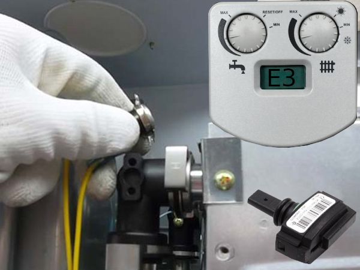

---
title: 'Перестройка на пропан — TLO верс.15 (Медведь)'
---

<!-- Заголовок -->

(Набор SPB-TLO15)

<!-- Важное предупреждение -->

<h2 class="mb-0"><i class="fas fa-exclamation-triangle me-2"></i>Важно!</h2>

<strong>Перестройку может выполнить только производителем уполномоченный сервисный центр!</strong>

<!-- Порядок перестройки -->

<h3 class="mb-0"><i class="fas fa-tools me-2"></i>Порядок перестройки</h3>

<h4><i class="fas fa-gas-pump text-warning me-2"></i>Замена сопел горелок:</h4>
<ol>
<li class="mb-2"><i class="fas fa-toggle-off text-secondary me-2"></i> Перекройте подачу газа</li>
<li class="mb-2"><i class="fas fa-wrench text-primary me-2"></i> Отвинтите исходные сопла (2,65 мм) одновременно с исходными уплотнениями (1)</li>
<li class="mb-2"><i class="fas fa-plus-circle text-success me-2"></i> Под сопла с диаметром 1,6 мм из комплекта SPB-TLO15 установите новые уплотнения</li>
<li class="mb-2"><i class="fas fa-screwdriver text-info me-2"></i> Навинтите новые сопла диаметра 1,6 мм из комплекта SPB-TLO15 с новыми уплотняющими шайбами (2)</li>
</ol>

<!-- Настройка давления газа -->

<h4 class="mb-0"><i class="fas fa-tachometer-alt me-2"></i>Настройка давления газа</h4>

<ul class="mb-3">
<li class="mb-2"><i class="fas fa-ruler-vertical text-primary me-2"></i> Давление измеряется при помощи U-образного манометра (по отношению к атмосферному) или другого подходящего измерителя давления.</li>
<li class="mb-2"><i class="fas fa-screwdriver text-warning me-2"></i> Прежде чем начать регулировку, отвинтите запорный винт точки измерения выходного давления газа (4) и наденьте на неё шланг U-образного манометра.</li>
<li class="mb-2"><i class="fas fa-cog text-info me-2"></i> Отверните латунную заглушку (5) и при помощи пластмассового установочного винта настройте давление на форсунке (см. таблицу).</li>
<li class="mb-2"><i class="fas fa-power-off text-danger me-2"></i> После завершения регулировки котёл отключить, извлечь гибкую трубку U-образного манометра и чутко дотянуть запорный винт точки измерения.</li>
<li class="mb-2"><i class="fas fa-check-circle text-success me-2"></i> Котёл ввести в ход и провести проверку герметичности точек измерения на газовой арматуре.</li>
</ul>

<h5 class="mt-4"><i class="fas fa-table text-secondary me-2"></i>Таблица параметров:</h5>

<table class="table table-bordered table-striped">
<thead class="thead-dark">
<tr>
<th scope="col">Обозначение</th>
<th scope="col">Тип газа</th>
<th scope="col">Давление (мбар)</th>
</tr>
</thead>
<tbody>
<tr>
<td>ZP</td>
<td>G20</td>
<td>20 мбар</td>
</tr>
<tr>
<td>B</td>
<td>G30</td>
<td>30 мбар</td>
</tr>
<tr>
<td>P</td>
<td>G31</td>
<td>37 мбар</td>
</tr>
</tbody>
</table>

<table class="table table-bordered table-striped">
<thead class="thead-dark">
<tr>
<th scope="col">Этап</th>
<th scope="col">Ø Сопла (мм)</th>
<th scope="col">Давление на сопле (мбар)</th>
</tr>
</thead>
<tbody>
<tr>
<td>Исходное состояние</td>
<td>2,65 мм</td>
<td>11,8 мбар</td>
</tr>
<tr>
<td>Перестройка ZP</td>
<td>1,60 мм</td>
<td>28,6 мбар</td>
</tr>
<tr>
<td>Перестройка P</td>
<td>1,60 мм</td>
<td>35,6 мбар</td>
</tr>
</tbody>
</table>

<!-- Замена сопла главной горелки -->

<h5 class="mb-0"><i class="fas fa-burn me-2"></i>Замена сопла главной горелки</h5>

<ol>
<li class="mb-2"><i class="fas fa-arrow-right text-primary me-2"></i> Устраните трубку главной горелки</li>
<li class="mb-2"><i class="fas fa-arrow-down text-danger me-2"></i> Вытяните исходную трубку главной горелки (3)</li>
<li class="mb-2"><i class="fas fa-plus text-success me-2"></i> Установите новое сопло 30 (0,30 мм) из комплекта SPB-TLO15</li>
<li class="mb-2"><i class="fas fa-arrow-left text-info me-2"></i> Установите трубку главной горелки</li>
</ol>

<!-- Финальные предупреждения -->

<h6 class="mb-0"><i class="fas fa-exclamation-circle me-2"></i>Предупреждение</h6>

<ul class="mb-0">
<li class="mb-2"><i class="fas fa-certificate text-primary me-2"></i> При перестройке используйте оригинальные детали, поставленные производителем или авторизированным лицом.</li>
<li class="mb-2"><i class="fas fa-shield-alt text-warning me-2"></i> Настройка всех элементов застрахуется (например, каплей краски).</li>
<li class="mb-2"><i class="fas fa-sticky-note text-info me-2"></i> Прямо на котле отмечается наклейкой (входит в состав комплекта SPB-TLO15), для какого вида топлива котёл предназначен.</li>
<li class="mb-2"><i class="fas fa-file-alt text-success me-2"></i> В прилагаемой технической документации котла делается отметка о замене, дате замены и лице, которое осуществило замену.</li>
</ul>

<!-- Настройка Lightcard (опционально, если требуется кастомизация и Lightcard уже загружен) -->
