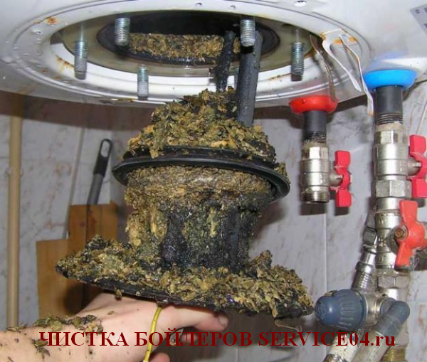
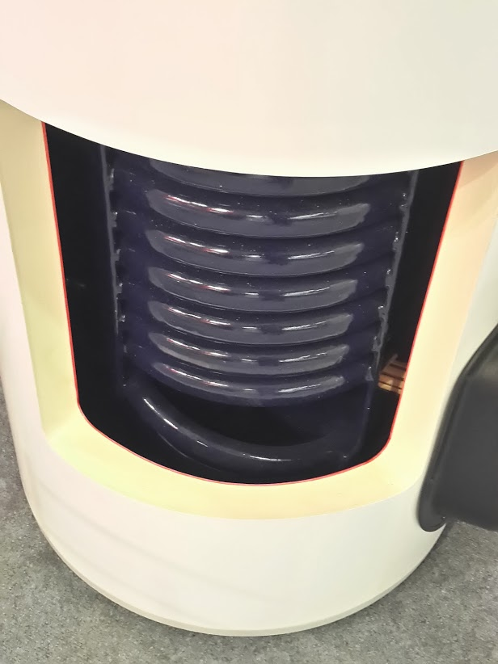

---
title: 'Ремонт бойлера'
---

<section class="section" style="background-color: #fbfaf9;">

<section class="bg-primary text-white fw-bold mb-5">

Восстановление работоспособности вашего водонагревателя

</section>

<figure class="image"></figure>

<h2 class="h5"><i class="fas fa-info-circle text-info"></i>Выполнение всех видов ремонта бойлеров</h2>

Электричество, канализация и горячая вода — важные элементы комфортной жизни, но любая бытовая техника со временем требует обслуживания или ремонта.

**Ремонт бойлеров** сложнее профилактики, поэтому выгоднее регулярно очищать нагревательный элемент от накипи, проверять контакты и контролировать температурный режим.

Различают **текущий ремонт бойлеров** (устранение мелких неисправностей) и **капитальный ремонт**.

<header class="card-header bg-warning text-dark">

<i class="fas fa-exclamation-triangle"></i>Показания к проведению ремонтных работ

</header>

<ul class="ml-4">
<li class="mb-2"><i class="fas fa-clock text-primary"></i> **Срок эксплуатации бойлера превышает 2 года.**</li>
<li class="mb-2"><i class="fas fa-thermometer-empty text-danger"></i> **Нагрев воды стал значительно дольше, чем указано в паспорте.**</li>
<li class="mb-2"><i class="fas fa-tint-slash text-muted"></i> **Вода из бойлера мутная или с посторонним цветом.**</li>
<li class="mb-2"><i class="fas fa-fire text-warning"></i> **Бойлер перегревается.**</li>
</ul>

Если присутствует хотя бы один из этих признаков, чистка и ремонт бойлера необходимы.

Устранить неисправность можно самостоятельно или пригласить мастера по ремонту бойлеров. Конструкция водонагревателя относительно проста, и при внимательном изучении инструкции можно определить и устранить многие типовые поломки.

<header class="card-header bg-danger text-white">

<i class="fas fa-tools"></i>Типичные неисправности бойлеров

</header>

<ul class="mb-4 ms-4">
<li class="mb-3"><i class="fas fa-exchange-alt text-info"></i> **Недостаточное количество воды в бойлере** указывает на неправильное подключение патрубков входа и выхода. Ошибку обычно удаётся обнаружить и устранить в начале эксплуатации.</li>
<li class="mb-3"><i class="fas fa-thermometer-quarter text-warning"></i> **Недостаточный нагрев воды.** В большинстве случаев ремонт сводится к обслуживанию ТЭНа: удалению накипи или проверке электрического соединения с термостатом.</li>
<li class="mb-3"><i class="fas fa-tint text-primary"></i> **Протекает бак.** Коррозия может сделать ремонт нецелесообразным, и после окончания гарантии часто требуется замена всего бойлера. К утечкам также приводят неправильная эксплуатация и отсутствие чистки.</li>
<li class="mb-3"><i class="fas fa-arrow-up text-success"></i> **Нагрев труб, подающих холодную воду,** свидетельствует о поломке обратного клапана; его замена устраняет проблему.</li>
<li class="mb-3"><i class="fas fa-plug text-danger"></i> **Нагрев вилки бойлера** возникает при несоответствии вилки, розетки или шнура потребляемой мощности прибора.</li>
</ul>

<figure class="image is-inline-block mb-3"></figure>

<header class="card-header bg-success text-white">

<i class="fas fa-check-double"></i>Эффект от профилактических мер

</header>

Текущий ремонт бойлеров — регулярная и полезная процедура. Выполнять его можно как самостоятельно, так и с привлечением специалистов.

Профилактика позволяет:

<i class="fas fa-bolt fa-2x"></i>

Существенно снизить энергопотребление

<i class="fas fa-calendar-plus fa-2x"></i>

Продлить срок службы водонагревателя

<i class="fas fa-clock fa-2x"></i>

Сократить время нагрева воды

Регулярное обслуживание помогает **экономить на покупке нового оборудования** и **сохранять спокойствие**. Если важен комфорт и надёжность, лучше пригласить мастера, который быстро выполнит ремонт, а наблюдение за его работой поможет в дальнейшем увереннее обслуживать бойлер самостоятельно.

<figure class="image"></figure>

<figure class="image"></figure>

<h3 class="h4 display-4 text-white"><i class="fas fa-phone"></i>Нужен ремонт бойлера?</h3>

Вызовите мастера прямо сейчас!

<a href="tel:+79262211348" class="btn btn-light btn-lg w-100"> <i class="fas fa-phone"></i> +7 (926) 221-13-48 </a>

<a href="https://service04.ru/contact-us/feedback" class="btn btn-warning btn-lg w-100 text-dark"> <i class="fas fa-envelope"></i> Написать нам </a>

</section>