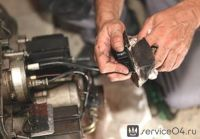
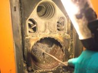
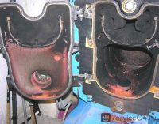
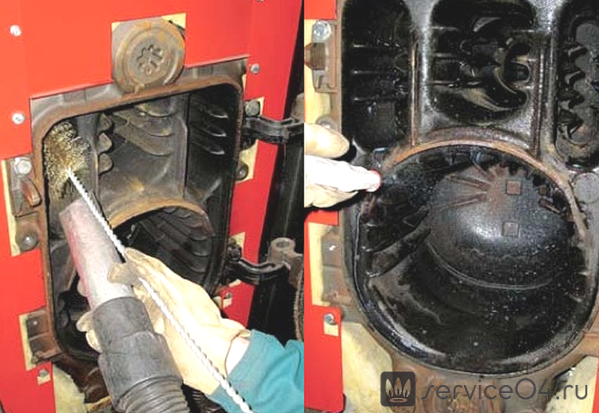

---
title: 'Сертифицированный ремонт и обслуживание дизельных котлов'
---

<!-- Заголовок -->
<section class="bg-primary text-white mb-5">

</section>
<!-- Основное описание и изображение -->

<figure class="image is-256x256 mx-auto"></figure>

Для отопления частных домов, коттеджей, коммерческих и промышленных помещений все чаще устанавливается котельное оборудование на жидком топливе. <strong>Дизельная котельная</strong> стала экономичной и безопасной альтернативой традиционному газовому оборудованию (в качестве основного или резервного источника отопления).

<a href="https://service04.ru/remont-dizelnoy-gorelki.html" class="btn btn-primary is-outlined is-primary"> <i class="fas fa-fire me-2"></i>РЕМОНТ ДИЗЕЛЬНЫХ ГОРЕЛОК </a>

<!-- Почему котел выходит из строя -->

<h2 class="h4 display-4 mb-0"><i class="fas fa-exclamation-triangle me-2"></i>Почему дизельный котел выходит из строя?</h2>

Техника на жидком топливе от отечественных и зарубежных производителей отличается безопасностью и стабильностью работы на протяжении нескольких лет. Но даже самому надежному оборудованию требуется профессиональный ремонт и своевременное обслуживание.

<strong>Аварийный или поточный ремонт дизельных котлов может понадобиться в ряде случаев:</strong>

<ul>
<li class="mb-2"><i class="fas fa-project-diagram text-primary me-2"></i> Некачественный проект или его отсутствие;</li>
<li class="mb-2"><i class="fas fa-tools text-success me-2"></i> Непрофессиональный подбор и монтаж оборудования;</li>
<li class="mb-2"><i class="fas fa-exclamation-circle text-warning me-2"></i> Нарушение правил эксплуатации техники;</li>
<li class="mb-2"><i class="fas fa-gas-pump text-danger me-2"></i> Низкосортное топливо с высоким уровнем загрязнителей;</li>
<li class="mb-2"><i class="fas fa-tachometer-alt text-info me-2"></i> Перепады давления в системе;</li>
<li class="mb-2"><i class="fas fa-broom text-muted me-2"></i> Загрязнение основных элементов – встроенная или навесная горелка на жидком топливе требует обязательной чистки или замены;</li>
<li class="mb-2"><i class="fas fa-smoke text-dark me-2"></i> Срабатывание датчика из загрязнения дымохода;</li>
<li class="mb-2"><i class="fas fa-tint text-primary me-2"></i> Снижение давления топлива на входе и др.</li>
</ul>

При возникновении неисправностей и сбоев котел не включается, отключается сразу после старта, не греет воду или не нагревает теплоноситель до заданной температуры. Также при поломках могут возникать посторонние шумы, чувствоваться запах энергоносителя (мазут, ДТ) или скапливаться продукты горения.

<h5 class="h5"><i class="fas fa-skull-crossbones me-2"></i>Важно!</h5>

Оценка состояния оборудования, диагностика неисправностей, устранение возможных поломок, настройка дизельного котла – это работа, которую должны выполнять только профессионалы. Попытки самостоятельного ремонта ведут к усложнению восстановительных работ, а в некоторых случаях – к необходимости замены котла.

<figure class="image is-256x256 mx-auto"></figure>

<!-- Галерея изображений -->

<figure class="image is-192x192 mx-auto"></figure>

<figure class="image is-192x192 mx-auto"></figure>

<figure class="image is-192x192 mx-auto"></figure>

<!-- Этапы ремонтных работ -->

<h3 class="h4 display-4 mb-0 has-text-uppercase"><i class="fas fa-list-ol me-2"></i>Этапы ремонтных работ</h3>

Наша компания осуществляет сертифицированный ремонт и сервисное обслуживание дизельных котлов напольного и настенного типа инсталляции. При выполнении ремонтных или сервисных работ наши мастера осуществляют:

<ul>
<li class="mb-3"><i class="fas fa-sync text-primary me-2"></i> <strong>Восстановление работоспособности оборудования</strong> без замены основных рабочих узлов, модулей и деталей. В процессе обслуживания выполняется промывка, очистка теплообменника, электродов и горелки.</li>
<li class="mb-3"><i class="fas fa-calendar-check text-success me-2"></i> <strong>Плановое обслуживание</strong> – выполняется полноценная чистка дизельного котла, настройка основных рабочих параметров для оптимальной работы техники.</li>
</ul>

<ul>
<li class="mb-3"><i class="fas fa-shield-alt text-warning me-2"></i> <strong>Предупредительное плановое обслуживание</strong> дает возможность исключить остановку оборудования и минимизировать расходы на выполнения ремонта.</li>
<li class="mb-3"><i class="fas fa-hammer text-danger me-2"></i> <strong>Капитальный или аварийный ремонт</strong> – это полная разборка оборудования с заменой модулей, плат, деталей и установкой новых соединительных/расходных элементов.</li>
</ul>

Своевременное техническое обслуживание дизельных котлов исключает поломку сложной и дорогостоящей техники. Специалисты нашей компании осуществляют обслуживание, поточный и аварийный ремонт всех видов дизельных котлов (настенные и напольные, бытовые и полупромышленные) в самые короткие сроки по минимальным расценкам.

<h5 class="h5"><i class="fas fa-phone me-2"></i>Свяжитесь с нами!</h5>

Все работы по обслуживанию вашей котельной техники будут выполнены в удобное для вас время.

<figure class="image is-inline-block"></figure>

<!-- Контакты -->

<h3 class="h4 display-4"><i class="fas fa-phone me-2"></i>Закажите ремонт дизельного котла</h3>

Профессиональный сервис с гарантией

<a href="tel:+79262211348" class="btn btn-primary btn-lg"> <i class="fas fa-phone me-2"></i>+7(926) 221-13-48 </a> <a href="https://service04.ru/contact-us/feedback" class="btn btn-primary btn-lg is-warning text-dark"> <i class="fas fa-envelope me-2"></i>Написать нам </a>

