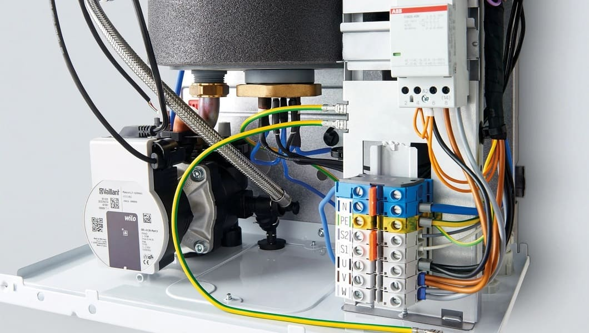
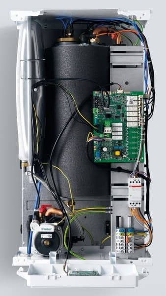

---
title: 'Наши услуги включают:'
---

Электрические котлы Protherm модели Skat и Ray занимают особую нишу на рынке отопительной техники. Это экономичное, простое в эксплуатации оборудование, которое имеет доступную стоимость и широкий функционал. Но самая надежная котельная техника во время работы может ломаться, не функционировать согласно оптимальным показателям по разным причинам. Именно в таких случаях необходим квалифицированный ремонт электрического котла Protherm (Протерм) Скат  в нашем сервисном центре.

<a class="btn btn-primary" href="https://service04.ru/master" target="_blank" rel="noopener">Вызвать мастера</a>

Наша компания специализируемся на ремонте электрических котлов Protherm Skat и Ray и предлагаем полный спектр услуг, связанных с обслуживанием и восстановлением работоспособности ваших котлов. Наша команда опытных специалистов готова помочь вам с любыми проблемами, связанными с вашим электрическим котлом Protherm.

Диагностика котла: Мы проводим тщательную диагностику вашего электрического котла Protherm, чтобы выявить любые проблемы или неисправности. Наши специалисты используют современное оборудование и методы, чтобы точно определить причину возникшей проблемы.

Ремонт котлов: Мы предлагаем профессиональный ремонт электрических котлов Protherm. Независимо от того, простая ли это замена деталей или сложный ремонт электрической системы, наши опытные техники обладают необходимыми знаниями и навыками для быстрого и качественного устранения неисправностей.

Замена деталей: Если ваш электрический котел Protherm требует замены каких-либо деталей, мы предлагаем широкий выбор оригинальных запчастей Protherm. Мы работаем только с надежными поставщиками и гарантируем качество заменяемых деталей.

Обслуживание котлов: Регулярное обслуживание вашего электрического котла Protherm является важным аспектом его эффективной и безопасной работы. Мы предлагаем услуги по техническому обслуживанию, которые включают очистку, проверку и настройку котла, а также проверку на утечки и обеспечение безопасности.

Наша команда готова предоставить вам надежные и профессиональные услуги по ремонту электрических котлов Protherm. Мы стремимся обеспечить высокий уровень обслуживания и удовлетворить потребности наших клиентов. Свяжитесь с нами сегодня, чтобы получить бесплатную консультацию или назначить визит нашего специалиста для ремонта или обслуживания вашего электрического котла Protherm.

<h3>Виды ремонтов котлов Протерм</h3>

Мы предлагаем широкий спектр услуг по ремонту электрических котлов Protherm. Наша команда опытных специалистов готова помочь вам в любой ситуации, будь то аварийный или плановый ремонт, техническое обслуживание, монтаж или пусконаладка.

<h4>Аварийный ремонт</h4>

Если ваш котел Protherm неожиданно перестал работать, наши специалисты готовы приехать к вам и быстро устранить проблему. Мы работаем круглосуточно и готовы приехать к вам в любое время суток.

<h4>Плановый ремонт</h4>

Если вы хотите продлить срок службы вашего котла Protherm, мы можем провести плановый ремонт и заменить изношенные детали. Это поможет предотвратить аварии и сэкономить на дорогостоящих ремонтах в будущем.

<h4>Техническое обслуживание</h4>

Регулярное техническое обслуживание поможет убедиться, что ваш котел Protherm работает эффективно и безопасно. Наши специалисты проведут все необходимые проверки и очистят котел от накопившегося загрязнения.

<h4>Монтаж и пусконаладка </h4>

Если вы хотите установить новый котел Protherm, наши специалисты помогут вам выбрать подходящую модель и проведут профессиональный монтаж. Мы также проведем пусконаладку и убедимся, что котел работает правильно.

Мы стремимся предоставлять нашим клиентам высококачественные услуги по доступным ценам. Свяжитесь с нами для получения дополнительной информации или для заказа услуг. Мы будем рады помочь вам! 

<h4>Сервисное обслуживание котлов: почему это важно и как это сделать</h4>

Сервисное обслуживание котлов — это комплекс мероприятий, которые направлены на проверку, чистку, настройку и ремонт всех важных элементов котла, таких как теплообменник, насос, фильтры, аноды, электроника и другие.

Сервисное обслуживание котлов позволяет:

<ul style="margin: 12px 0px 0px; display: flex; flex-direction: col; gap: 10px; padding-inline-start: 24px; color: #111111;  background-color: rgba(255, 255, 255, 0.7);">
<li>Предотвратить возникновение неисправностей и поломок, которые могут привести к остановке работы котла или его повреждению.</li>
<li>Повысить эффективность и экономичность работы котла, снизив расход газа и электроэнергии.</li>
<li>Продлить срок службы котла, избежав износа или коррозии его деталей.</li>
<li>Обеспечить безопасность эксплуатации котла, предупредив риск перегрева, утечки газа, пожара или других аварийных ситуаций.</li>
</ul>

Мы предлагаем вам высококачественные услуги по сервисному обслуживанию котлов любых марок и моделей. Наши специалисты имеют все необходимые инструменты, запчасти и сертификаты для выполнения этой работы.

Гарантируем вам:

<ul style="margin: 12px 0px 0px; display: flex; flex-direction: col; gap: 10px; padding-inline-start: 24px; color: #111111;  background-color: rgba(255, 255, 255, 0.7);">
<li>Быстрый и удобный выезд на объект в любое удобное для вас время.</li>
<li>Качественное и надежное выполнение всех видов работ по сервисному обслуживанию котла.</li>
<li>Разумные и конкурентоспособные цены за наши услуги.</li>
<li>Гарантию на все выполненные работы и замененные запчасти.</li>
</ul>

Не откладывайте сервисное обслуживание вашего котла. Закажите его прямо сейчас и получите специальную скидку! Для этого свяжитесь с нами по телефону или <a href="https://service04.ru/master" target="_blank" rel="noopener">заполните форму на нашем сайте</a>. 

Сервисное обслуживание котлов рекомендуется проводить<strong> не реже одного раза в год</strong>, а также при появлении признаков неисправности или снижения эффективности работы котла. Для проведения сервисного обслуживания котлов необходимо обратиться к профессиональным мастерам, которые имеют опыт и квалификацию в этой области.

PROTHERM RAY

PROTHERM SKAT версия 13

  

<h5 style="card-sizing: border-card; margin-top: 0px; margin-bottom: 0.5rem; font-weight: 500; line-height: 1.2; font-size: 1.25rem;">Зона обслуживания котельного оборудования</h5>

Работаем по Москве и всем городам Московской области: Апрелевка, Балашиха, Барвиха, Бронницы, Видное, Воскресенск, Голицино, Дмитров, Долгопрудный, Домодедово, Егорьевск, Железнодорожный, Жуковский, Звенигород, Зеленоград, Икша, Истра, Ивантеевка, Королёв, Красногорск, Кубинка, Куровское, Лобня, Люберцы, Мытищи, Наро-Фоминск, Нахабино, Новая Москва, Ногинск, Одинцово, Орехово-Зуево, Подольск, Пушкино, Раменское, Реутов, Селятино, Сергиев-Посад, Софрино, Сходня, Фрязино, Химки, Щелково, Электросталь.

СНИЖЕНИЕ ЦЕН НА РЕМОНТ КОТЛОВ.

ДИАГНОСТИКА+РЕМОНТ  4600 руб. !!! Выезд 50руб/км !!!

<a class="btn btn-primary" href="https://service04.ru/master" style="card-sizing: border-card; color: #ffffff; text-decoration: none; background-color: #007bff; display: inline-block; font-weight: 400; text-align: center; vertical-align: middle; user-select: none; border: 1px solid #007bff; padding: 0.375rem 0.75rem; font-size: 1rem; line-height: 1.5; border-radius: 0.25rem; transition: color 0.15s ease-in-out 0s, background-color 0.15s ease-in-out 0s, border-color 0.15s ease-in-out 0s, card-shadow 0.15s ease-in-out 0s; cursor: pointer;" target="_blank" rel="noopener">Вызвать мастера</a>

