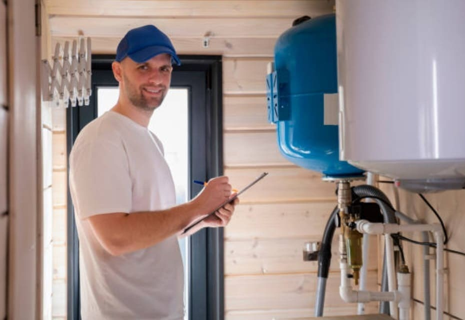

---
title: 'Авторизованный сервисный центр котельного оборудования'
---

Электрические котлы <strong>Protherm</strong> - это синоним надежности и комфорта в области обогрева. Однако даже такое качественное оборудование может требовать ремонта по различным причинам. Наша компания специализируется на профессиональном ремонте электрических котлов Protherm, предоставляя качественные услуги и экспертное обслуживание для обеспечения бесперебойной работы вашей системы отопления.

<h2 class="mt-4">Мы предлагаем следующие услуги по ремонту и обслуживанию электрических котлов Protherm:</h2>

Наши специалисты используют только оригинальные запчасти и высококачественное оборудование для ремонта. Мы гарантируем качество наших услуг и профессионализм наших специалистов.

<h5 style="text-align: center;">Диагностика неисправностей</h5>

<h5 style="text-align: center;">Ремонт котлов и техническое обслуживание котлов</h5>

<h5 style="text-align: center;">Замена запчастей</h5>

<h5 style="text-align: center;">Установка и настройка оборудования</h5>

<h3> Почему стоит выбрать нас для ремонта:</h3>
<ol>
<li><strong>Опытные специалисты: </strong>Наши профессиональные мастера имеют богатый опыт в ремонте электрических котлов Protherm. Мы знаем каждую деталь и особенность этого оборудования.</li>
<li><strong>Использование оригинальных запчастей:</strong> Мы используем только оригинальные запчасти, что гарантирует надежность и долговечность восстановленного оборудования.</li>
<li><strong>Регулярное обслуживание: </strong>Ремонт электрических котлов Protherm может быть связан не только с устранением поломок, но и с проведением регулярного обслуживания. Это позволяет предупредить возможные проблемы и снизить риск непредвиденных сбоев.</li>
<li><strong>Быстрый ремонт:</strong> Мы понимаем, как важно быстро восстановить работоспособность котла. Наши специалисты оперативно реагируют на вызовы и предоставляют быстрый ремонт без ущерба для качества.</li>
<li><strong>Прозрачная ценовая политика</strong>: Мы предоставляем честные и прозрачные цены на наши услуги ремонта. Клиенты всегда знают, за что они платят.</li>
<li><strong>Гарантия на ремонт:</strong> Мы уверены в качестве нашей работы, поэтому предоставляем гарантию на выполненные ремонтные работы.</li>
</ol>

Мы монтируем и обслуживаем оборудование PROTHERM уже более 15 лет. Каждый специалист ежегодно походит сертификацию и повышает свою квалификацию. На Вашем котле не будут учиться!

Если ваш электрический котел Protherm нуждается в ремонте, вы можете полагаться на нашу компанию. Мы предоставляем профессиональные услуги ремонта с учетом всех особенностей и требований данного бренда. Наша команда готова вернуть ваш котел в идеальное рабочее состояние, обеспечивая комфорт и надежность в вашем доме. Свяжитесь с нами, чтобы получить качественный ремонт и экспертное обслуживание электрических котлов Protherm.

<a class="btn btn-primary" href="https://service04.ru/master">Вызвать мастера</a>

<h4>Процесс ремонта электрических котлов Protherm:</h4>

<ul id="tabs-nav-4453587791.217657" class="nav nav-tabs" role="tablist">
<li class="nav-item"><a id="tabs-tab-header-7473694470" class="nav-link active" role="tab" href="#tabs-tab-7473694470" data-toggle="tab" aria-controls="tabs-tab-7473694470" aria-selected="true">1. Заявка на ремонт</a></li>
<li class="nav-item"><a id="tabs-tab-header-3250146451" class="nav-link" role="tab" href="#tabs-tab-3250146451" data-toggle="tab" aria-controls="tabs-tab-3250146451" aria-selected="false">2. Выезд и диагностика</a></li>
<li class="nav-item"><a id="tabs-tab-header-9247835879" class="nav-link" role="tab" href="#tabs-tab-9247835879" data-toggle="tab" aria-controls="tabs-tab-9247835879" aria-selected="false">3. Ремонт и замена запчастей</a></li>
<li class="nav-item"><a id="tabs-tab-header-9293720298" class="nav-link" role="tab" href="#tabs-tab-9293720298" data-toggle="tab" aria-controls="tabs-tab-9293720298" aria-selected="false">4. Тестирование и проверка</a></li>
<li class="nav-item"><a id="tabs-tab-header-5007333064" class="nav-link" role="tab" href="#tabs-tab-5007333064" data-toggle="tab" aria-controls="tabs-tab-5007333064" aria-selected="false">5. Сопровождение</a></li>
</ul>

Вы можете связаться с сервисным центром, чтобы оставить заявку на ремонт котла Protherm. Обычно это можно сделать по телефону или через онлайн-форму на сайте.

 

Специалисты сервисного центра проведут диагностику вашего котла Protherm, чтобы определить причину поломки и оценить степень необходимого вмешательства.

 После диагностики специалисты приступят к ремонту котла Protherm. Если необходимо, будут заменены поврежденные или изношенные компоненты.

После ремонта котла Protherm будет проведено тестирование, чтобы убедиться, что он работает должным образом и соответствует стандартам безопасности.

 После ремонта котла Protherm сервисный центр может предложить вам дополнительные услуги по обслуживанию и регулярному техническому обследованию, чтобы поддерживать его в отличном состоянии.

<blockquote>

Важно помнить, что ремонт электрических котлов Protherm должен выполняться только квалифицированными специалистами, чтобы избежать повреждения оборудования и гарантировать безопасность. Регулярное обслуживание и ремонт помогут продлить срок службы вашего котла Protherm и обеспечить надежную работу в течение многих лет.

</blockquote>

Важно помнить, что ремонт электрических котлов Protherm должен выполняться только квалифицированными специалистами, чтобы избежать повреждения оборудования и гарантировать безопасность. Регулярное обслуживание и ремонт помогут продлить срок службы вашего котла Protherm и обеспечить надежную работу в течение многих лет.

<h5>Вот некоторые из основных проблем, которые могут возникнуть у электрического котла Protherm Skat:</h5>
<ul style="list-style-type: square;">
<li><strong>Отсутствие нагрева:</strong> Это одна из наиболее распространенных проблем, с которой сталкиваются владельцы котлов. Отсутствие нагрева может быть вызвано неисправностью термостата, проблемами с нагревательным элементом или проблемами с электрическими соединениями.</li>
<li><strong>Перепады напряжения:</strong> Нестабильное напряжение в сети может вызвать сбои в работе котла. Это может привести к неправильной работе электроники, отказу включения или выключения котла, а также к повреждению чувствительных компонентов.</li>
<li><strong>Утечка воды:</strong> Протечка воды может возникнуть из-за износа уплотнительных элементов, трещин в корпусе котла или несоответствиям в подключении водопроводных труб.</li>
<li><strong>Засорение или накипь:</strong> Отложения накипи на нагревательных элементах или внутренних поверхностях котла могут снижать эффективность теплопередачи и приводить к перегреву оборудования.</li>
<li><strong>Неисправности электроники:</strong> Проблемы с платой управления, датчиками и другими электронными компонентами могут вызывать ошибки в работе котла, некорректное отображение информации или даже полное отказ оборудования.</li>
<li><strong>Шумы и вибрации:</strong> Некорректная установка или износ деталей может вызывать шумы и вибрации во время работы котла, что может быть раздражающим и указывать на проблему.</li>
<li><strong>Проблемы с давлением:</strong> Недостаточное или избыточное давление в системе отопления может вызвать перебои в работе котла, а также привести к аварийным ситуациям.</li>
</ul>

В случае возникновения любых из перечисленных проблем рекомендуется обращаться к профессионалам для диагностики и ремонта. Самостоятельная попытка решения проблемы может привести к ухудшению ситуации или даже повреждению оборудования.

<strong>Чтобы получить консультацию или заказать ремонт котла Protherm, свяжитесь с нами по телефону или оставьте заявку на сайте. Мы с радостью поможем вам решить любую проблему с вашим электрическим котлом!</strong>

<strong></strong>
