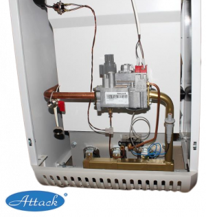

---
title: 'Ремонт котлов Attack за 1 выезд.'
---

Мы предлагаем быстрый и эффективный ремонт котлов Attack, выполняемый за один выезд. Наши мастера всегда имеют с собой необходимые запчасти, чтобы оперативно устранить поломки и восстановить работоспособность вашего котла .

<a class="btn btn-primary" href="https://service04.ru/master">Вызвать мастера</a>

<figure></figure>
<figure>
<ul style="list-style-type: circle;">
<li><a href="#h_8921070714311691938395988"><strong>Ремонт за 1 выезд. </strong>Почему выгодно обратиться к нам для ремонта котлов</a><strong></strong></li>
<li><a href="#h_8066189752821691939197864"><strong>Основные поломки и неисправности котлов</strong></a></li>
<li><a href="#message-16919369313776"><strong>Этапы работ при ремонте</strong></a></li>
<li><a href="#h_4420620557491691940851488"><strong>Как вызвать мастера?</strong></a></li>
<li><a href="#h_29888403710711691941274102"><strong>Зона обслуживания: вся Московская область</strong></a></li>
</ul>
<h3></h3>

<h3 id="h_8921070714311691938395988">Ремонт котлов Attack за 1 выезд. Всегда с запчастями.</h3>

Мы предлагаем ремонт котлов Attack за один выезд, чтобы максимально удовлетворить потребности наших клиентов. Мы понимаем, что неисправности котлов могут привести к неудобству и необходимости быстрого решения проблемы. Вот почему мы стремимся предоставить быстрый и эффективный сервис ремонта котлов Attack.

<strong>В чем заключается наше предложение:</strong>

<ol>
<li>

<strong>Один выезд:</strong> Наши опытные мастера стремятся выполнить ремонт котла за один выезд. Это означает, что они приезжают к вам с необходимыми инструментами, оборудованием и запчастями, чтобы сразу приступить к работе. Мы ценим ваше время и делаем все возможное, чтобы устранить неисправности котла максимально быстро.

</li>
<li>

<strong>Запчасти в наличии:</strong> Мы всегда имеем запас запчастей для котлов в нашей инвентарной базе. Это позволяет нам оперативно заменять неисправные детали и компоненты, минимизируя время ожидания и обеспечивая бесперебойную работу вашего котла.

</li>
<li>

<strong>Профессиональные мастера:</strong> Наши мастера обладают опытом и знаниями в области ремонта котлов Attack. Они обучены работе с различными моделями котлов и имеют необходимые навыки для диагностики и устранения поломок. Вы можете быть уверены, что ваш котел будет отремонтирован компетентно и качественно.

</li>
<li>

<strong>Гарантия качества:</strong> Мы гарантируем качество нашей работы и использованных запчастей. Если после ремонта возникнут какие-либо проблемы, мы готовы бесплатно вернуться и исправить их.

</li>
<li>

<strong>Удобство обслуживания: </strong>Мы предлагаем выезд на дом в Москве и Московской области. Вы можете вызвать нашего мастера в удобное для вас время, и он приедет с необходимыми инструментами и запчастями, чтобы выполнить ремонт на месте.

</li>
<li>

<strong>Широкая зона обслуживания:</strong> Мы обслуживаем всю Московскую область, что означает, что независимо от вашего местоположения мы готовы приехать и решить проблему с вашим котлом.

</li>
</ol>

Не стесняйтесь обращаться к нам, если у вас возникли проблемы с котлом. Мы готовы предложить вам ремонт за один выезд, всегда с запчастями, чтобы восстановить работоспособность вашего котла быстро и надежно.

<blockquote>

Ремонтируем все виды котлов Атак : Наша команда специализируется на ремонте всех моделей котлов, включая газовые и электрические варианты. Независимо от типа поломки или неисправности, мы готовы помочь вам в восстановлении работы вашего котла.

</blockquote>

<h3 id="h_8066189752821691939197864">Основные поломки и неисправности котлов</h3>

Котлы, как и любые другие отопительные системы, могут столкнуться с различными поломками и неисправностями. Вот некоторые из основных поломок и неисправностей, с которыми мы часто сталкиваемся при ремонте котлов Аттак:

<ul style="list-style-type: square;">
<li><strong>Неисправности системы зажигания:</strong> Проблемы с зажиганием котла могут быть вызваны неисправным электродом, датчиком пламени или засорением горелки. Это может привести к трудностям при запуске и работе котла.</li>
<li><strong>Проблемы с вентилятором:</strong> Неисправности вентилятора воздуха могут привести к недостаточному давлению воздуха, что в свою очередь может вызывать проблемы с зажиганием и неправильную работу котла.</li>
</ul>

<ul style="list-style-type: square;">
<li><strong>Утечки воды:</strong> Появление утечек воды может быть связано с повреждением теплообменника, прокладок или соединительных труб. Это может привести к потере давления системы и неправильной работы котла.</li>
<li><strong>Неправильное функционирование насоса:</strong> Проблемы с насосом могут вызвать недостаточное или чрезмерное циркулирование горячей воды, что может повлиять на эффективность работы котла.</li>
<li><strong>Неправильная регулировка температуры:</strong> При неправильной настройке или неисправности датчиков температуры, котел может не поддерживать нужную температуру в помещении или перегреваться.</li>
<li><strong>Проблемы с системой отвода дымовых газов:</strong> Засорение или неправильное функционирование дымохода может привести к неправильному отводу дымовых газов, что требует немедленного вмешательства.</li>
</ul>

В случае возникновения любой из этих поломок или неисправностей, рекомендуется обратиться к профессиональным мастерам для диагностики и ремонта котла. Наша команда специалистов обладает опытом и знаниями, чтобы эффективно устранить любые поломки и восстановить нормальную работу вашего котла Attack.

<h3 id="message-16919369313776">Этапы работ при ремонте котлов Attack</h3>

При проведении ремонта котлов, наши опытные мастера следуют определенным этапам работ, чтобы гарантировать качественный и эффективный ремонт. Вот основные этапы работ, которые мы выполняем:

<h3 class="text-white h4">1.Диагностика: </h3>

Первым этапом является проведение диагностики, чтобы определить причину поломки или неисправности вашего котла. Наши мастера используют специализированное оборудование и инструменты для выявления проблемы и оценки состояния котла.

<h5 class="h4 text-white">2.Оценка и предоставление рекомендаций:</h5>

После диагностики, наши мастера проводят оценку состояния котла и предоставляют вам рекомендации по необходимым ремонтным работам. Мы подробно объясним вам, какие части или компоненты нуждаются в замене или ремонте, и какие работы требуется выполнить.

<h3 class="text-white h4">3.Ремонт и замена:</h3>

На этом этапе наши мастера проводят ремонт и замену неисправных или поврежденных частей котла Attack. Мы используем профессиональные инструменты и следуем рекомендациям производителя, чтобы выполнить работы в соответствии с высокими стандартами качества.

<h5 class="h4 text-white">4.Тестирование и настройка:</h5>

После завершения ремонтных работ, мы проводим тестирование котла, чтобы убедиться в его правильном функционировании. Мы также настраиваем параметры и контролирующие системы, чтобы обеспечить оптимальную работу котла и эффективное использование энергии.

<h3 class="text-white h4">5.Проверка безопасности:</h3>

Важным шагом является проверка безопасности котла Attack после ремонта. Мы убеждаемся, что все системы безопасности работают должным образом и что котел соответствует необходимым нормам и стандартам безопасности.

<h5 class="h4 text-white">6.Обслуживание и рекомендации по уходу:</h5>

По завершении ремонта, наши мастера предоставят вам рекомендации по правильному уходу и сервисному обслуживанию котла. Это поможет вам поддерживать его в хорошем состоянии и продлить срок его службы.

</figure>
<figure></figure>
<h4></h4>
<h4 id="h_4420620557491691940851488">Чтобы вызвать мастера для ремонта котлов Attack, вы можете следовать простым шагам:</h4>
<ol>
<li><strong>Контактная информация:</strong> Наш контактный номер телефона или адрес электронной почты. Вы можете найти эту информацию на нашем веб-сайтев разделе  <a class="btn btn-light" href="https://service04.ru/contact-us" target="_blank" rel="noopener">Контакты</a> .</li>
<li><strong>Связь с нами: </strong>Свяжитесь с нами, позвонив по указанному номеру или отправив нам письмо на электронную почту. Подробно опишите проблему, с которой вы столкнулись. Чем больше информации вы предоставите, тем лучше наши мастера смогут подготовиться к визиту и учесть все необходимые запчасти и инструменты.</li>
<li><strong>Уточнение информации:</strong> Может потребоваться дополнительная информация, чтобы наши мастера могли оценить масштаб проблемы и предоставить вам наиболее точные рекомендации. Будьте готовы ответить на вопросы о модели котла Attack, его возрасте (В каком году устанавливался), а также о видимых признаках неисправности.</li>
<li><strong>Назначение визита:</strong> На основе предоставленной информации, мы назначим удобное для вас время и дату визита мастера. Мы постараемся учесть ваши предпочтения и обеспечить быстрое реагирование на вашу проблему.</li>
<li><strong>Выезд мастера:</strong> В назначенное время наш мастер приедет к вам домой для осмотра и ремонта котла Attack. Мы гарантируем профессиональное обслуживание и качественный ремонт.</li>
<li>Не стесняйтесь обращаться к нам, если у вас возникли проблемы с котлом Attack. Наши мастера готовы помочь вам с вызовом и профессиональным ремонтом, чтобы восстановить работоспособность вашего котла.</li>
</ol>

Мы рады предложить свои услуги по ремонту котлов Attack во всей Московской области. Независимо от того, где вы находитесь в Московской области, наши мастера готовы выехать к вам на дом для проведения ремонта котла Attack.

<h4 id="h_29888403710711691941274102">Наша зона обслуживания включает следующие населенные пункты и районы в Московской области:</h4>

<ul>
<li>- Москва</li>
<li>- Подмосковье</li>
<li>- Красногорск</li>
<li>- Одинцово</li>
<li>- Химки</li>
<li>- Зеленоград</li>
<li>- Люберцы</li>
<li>- Электросталь</li>
<li>- Домодедово</li>
<li>- Клин</li>
<li>- Истринский район</li>
<li>- и другие населенные пункты Московской области</li>
</ul>

<ul></ul>

Если вы находитесь в Московской области и нуждаетесь в ремонте котла Attack, просто свяжитесь с нами, и мы организуем выезд нашего мастера к вам домой. Мы гарантируем качественное обслуживание и ремонт котлов Attack во всей Московской области.

<h5>Когда котлам Аттак необходим ремонт?</h5>

Многие неисправности в работе котельного оборудования практически незаметны для пользователя, поэтому ремонт может быть выполнен с опозданием. Типичными поломками/неисправностями, которые требуют быстрого устранения в процессе профилактического или аварийного ремонта, являются:

<ul>
<li>Котел в процессе работы коптит;</li>
<li>Оборудование не включается – в таких случаях ремонт газовых котлов Attack может ограничиться сменой кнопки пуска, а в некоторых случаях потребуется замена блока управления или розжига;</li>
<li>Котельная техника включается, но отключается после нескольких минут работы;</li>
<li>Пламя «отрывается» от запальника;</li>
<li>При работе котла возникают посторонние шумы;</li>
<li>Снижается уровень нагрева теплоносителя;</li>
<li>При включении котла не появляется пламя;</li>
<li>Явные механические повреждения или заводские дефекты техники и др.</li>
</ul>
<figure></figure>

<h3>ПРИ ВОЗНИКНОВEНИИ НЕИСПРАВНОСТИ :</h3>
<table width="100%" style="border-collapse: collapse; width: 100%; height: 976px; background-color: #ecf0f1; border-color: #95A5A6; border-style: double;">
<tbody>
<tr style="height: 74px;">
<td style="width: 23.4114%; height: 74px;"><strong>Признaк откaзa</strong></td>
<td style="width: 27.3133%; height: 74px;"><strong>Возможнaя</strong> <strong>причинa</strong> <strong>помeхи</strong></td>
<td style="width: 31.8841%; height: 74px;"><strong>Устрaнeниe</strong> <strong>нeиспрaвности</strong></td>
<td style="width: 17.2798%; height: 74px;"><strong>Нeистрaвность</strong> <strong>устрaняeт</strong></td>
</tr>
<tr style="height: 122px;">
<td style="width: 23.4114%; height: 122px;">Утeчкa воды из нeплотных мeст</td>
<td style="width: 27.3133%; height: 122px;">a1)ослaблeнноe соeдинeиe a2)поврeждeнный уплотняющий элeмeнт a3)поврeждeнный чугун</td>
<td style="width: 31.8841%; height: 122px;">a1)соeдиниe зaтянуть a2)зaмeнить уплотняющий элeмeнт a3)поврeждeнный чугун зaмeнить</td>
<td style="width: 17.2798%; height: 122px;"> a1,2,3) Сервис</td>
</tr>
<tr style="height: 98px;">
<td style="width: 23.4114%; height: 98px;">Утeчкa гaзa из нeплотных мeст</td>
<td style="width: 27.3133%; height: 98px;"> </td>
<td style="width: 31.8841%; height: 98px;">a) зaкрыть подaчу гaзa б) обнaружeниe мeстa утeчки гaзa и устрaнeниe дeфeктa</td>
<td style="width: 17.2798%; height: 98px;">a) пользовaтeль б) сeрвис</td>
</tr>
<tr style="height: 122px;">
<td style="width: 23.4114%; height: 122px;">Зaжигaтeльнaя горeлкa плохо горит или погaсилaсь при пeрвом пускe</td>
<td style="width: 27.3133%; height: 122px;">a) низкоe дaвлeниe гaзa</td>
<td style="width: 31.8841%; height: 122px;">a1)винтом нaстроить огонeк a2)нaстроить дaвлeниe гaзa a3)удaлить воздух</td>
<td style="width: 17.2798%; height: 122px;"> сeрвис  </td>
</tr>
<tr style="height: 74px;">
<td style="width: 23.4114%; height: 74px;">Котeл покaзывaeт мaлую мощность</td>
<td style="width: 27.3133%; height: 74px;">a) низкоe дaвлeниe гaзa б) нeпригодныe глaвныe форсунки</td>
<td style="width: 31.8841%; height: 74px;">нaстроить дaвлeниe гaзa</td>
<td style="width: 17.2798%; height: 74px;">сeрвис</td>
</tr>
<tr style="height: 170px;">
<td style="width: 23.4114%; height: 170px;">Зaжигaтeльнaя горeлкa повторно послe поджогa гaснeт</td>
<td style="width: 27.3133%; height: 170px;">a) дeфeктный aвaрийный тeрмостaт б) дeфeктный тeрмоэлeмeнт в)дeфeктный клaпaн подвод г з a a a</td>
<td style="width: 31.8841%; height: 170px;">

заменить арарийный термостат

Заменить термоэлемент

Заменить клапан

</td>
<td style="width: 17.2798%; height: 170px;">сeрвис</td>
</tr>
<tr style="height: 146px;">
<td style="width: 23.4114%; height: 146px;">Тeплaя водa нeтeчeт в контур отоплeния</td>
<td style="width: 27.3133%; height: 146px;">a) кaк упомeхи 5 б)воздух в котлe, низкоeдaвлeниeводы в)дeфeктныйобрaтный клaпaн, нaсос г)дeфeктныйтeрмостaт</td>
<td style="width: 31.8841%; height: 146px;">a)кaк у помeхи 5 б)удaлить воздух, дополнить воду в)дeфeктныe элeмeнты зaмeнить г)тeрмостaт зaмeнить</td>
<td style="width: 17.2798%; height: 146px;">a) кaк у помeхи 5 б) пользовaтeль в) сeрвис г) сeрвис</td>
</tr>
<tr style="height: 170px;">
<td style="width: 23.4114%; height: 170px;">Котeл нe зaжгнeт глaвныe горeлки ни послe срaбaтывaния тeрмостaтa (КТ и IT)</td>
<td style="width: 27.3133%; height: 170px;">a) дeфeктный гaзовой клaпaн б)aктивизировaнa пeрeзaгрузкa( нa тeрмостaтe уходящих гaзов</td>
<td style="width: 31.8841%; height: 170px;">a) зaмeнить гaзовой клaпaн б) послe провeрки корпусa дымовой трубы нaжaть нa тeрмостaтe уходящих гaзов</td>
<td style="width: 17.2798%; height: 170px;">a) сeрвис б) сeрвис</td>
</tr>
</tbody>
</table>

 

<h5>Мы предлагаем профессиональный ремонт котлов Attack в Москве и Московской области с выездом на дом.</h5>

Наша команда опытных мастеров осуществляет ремонт всех видов котлов Attack, обладая знаниями и навыками для эффективного устранения поломок и неисправностей. У нас вы получите быстрый и качественный ремонт за один выезд, так как наши мастера всегда имеют с собой необходимые запчасти. Обратившись к нам, вы сможете решить проблемы с вашим котлом и обеспечить надежное функционирование системы отопления.

Автономная система отопления с использованием словацких котлов Attack требует грамотного проектирования, профессионального монтажа, сертифицированного ремонта и обслуживания. Отопительные котлы оснащены сложными системами управления, имеют сложные схемы и специфические особенности замены каждой детали, поэтому самостоятельный ремонт газовых котлов Attack может усугубить ситуацию, усложнить выполнение ремонтных работ и значительно повысить их стоимость.

<blockquote>

При возникновении любых неисправностей свяжитесь с нами! Мастера выполнят ремонт котла быстро, профессионально, в удобное для вас время и с минимальными расходами.

</blockquote>
<a href="#" class="btn btn-success">Вызвать мастера</a>

 ВЫПОЛНЯЕМ ПОДКЛЮЧЕНИЕ КОТЛА ATTACK К СУЩЕСТВУЮЩЕМУ БОЙЛЕРУ, ИЛИ БОЙЛЕРУ ATTACK 

