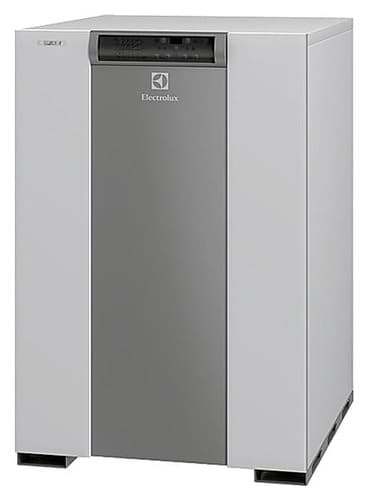

---
title: 'Bez nazvaniya'
---

Добро пожаловать в наш сервисный центр, специализирующийся на ремонте и обслуживании котельного оборудования Electrolux FSB P. Наша команда высококвалифицированных техников готова предложить вам надежные решения для обеспечения непрерывной работы вашего котла.

<a class="btn btn-primary" href="https://service04.ru/master" style="color: #ffffff;">Вызвать мастера</a>  

<figure></figure>

<a class="btn btn-primary" href="#h_502932282121696497228452">Гарантия</a> <a class="btn btn-primary" href="#h_8863801872641696497348438">Задать вопрос</a> <a class="btn btn-primary" href="#h_9363462084621696497400302">Зона обслуживания </a>  

<h3>Почему выбирают нас?</h3>
<ol>
<li>Опытные специалисты: Наша команда состоит из высококвалифицированных и опытных специалистов, которые имеют глубокие знания и понимание работы напольных газовых котлов Electrolux FSB P. Мы постоянно обновляем свои навыки и следим за последними технологическими разработками, чтобы предоставить нашим клиентам высокий уровень сервиса.  Мы обладаем многолетним опытом в сфере ремонта газовых котлов, включая модели Electrolux. Наши техники прошли обширное обучение и имеют все необходимые навыки для качественного обслуживания вашего оборудования.</li>
<li>Оригинальные запчасти: Мы используем только оригинальные запчасти Electrolux, чтобы гарантировать качество и долговечность ремонта. Все запчасти, которые мы устанавливаем, имеют сертификаты качества и соответствуют стандартам производителя.</li>
<li>Качество и надежность: Мы работаем только с оригинальными запчастями и использованием современного оборудования, чтобы обеспечить максимальную надежность вашего котла после ремонта.</li>
<li>Индивидуальный подход: Мы понимаем, что каждая неисправность может иметь свои особенности, поэтому мы предлагаем индивидуальный подход к каждому клиенту. Наша команда проводит детальную диагностику проблемы и разрабатывает оптимальное решение, чтобы восстановить работоспособность вашего газового котла Electrolux FSB P.</li>
<li>Быстрый и надежный сервис: Мы ценим ваше время и стремимся обеспечить быстрый и надежный сервис. Мы делаем все возможное, чтобы провести ремонт в кратчайшие сроки, не затрачивая качество работы. Мы понимаем, как важно быстро восстановить работоспособность вашего котла. Наша команда старается минимизировать время ожидания и предоставлять услуги наивысшего качества.</li>
</ol>

<h3></h3>

<h4>Наши услуги:</h4>
<ul>
<li>Диагностика и обслуживание газовых котлов Electrolux FSB P.</li>
<li>Определение причины неисправности газового котла Electrolux FSB P.</li>
<li>Ремонт и замена компонентов котельного оборудования.</li>
<li>Профилактическое обслуживание и очистка системы отложений и загрязнений.</li>
<li>Регулировка и настройка параметров работы котла.</li>
<li>Установка и настройка котельного оборудования.</li>
<li>Консультации по эффективному и безопасному использованию вашего котла.</li>
<li>Тестирование и проверка работоспособности после ремонта.</li>
</ul>

<h4></h4>
<h4>Почему важно регулярно обслуживать котел Electrolux FSB P?</h4>

Регулярное обслуживание котла позволяет поддерживать его в отличной работоспособности и продлевать срок службы. Это также помогает избегать неожиданных поломок и снижает риск возгорания и других опасных ситуаций.

Если у вас возникли проблемы с котлом Electrolux FSB P или вам нужна профессиональная помощь, не стесняйтесь обращаться к нам. Мы гарантируем быстрое реагирование, высокое качество обслуживания и доступные цены. Сделайте ваш комфорт и безопасность нашим приоритетом. Обратитесь к нам сегодня и дайте вашему котлу Electrolux FSB P второй шанс на долгую и надежную службу. Наши специалисты всегда готовы помочь вам!

<h4 id="h_502932282121696497228452">Гарантия:</h4>

Мы предоставляем гарантию на все выполненные работы и установленные запчасти от 6 мес.  Мы стремимся к полной удовлетворенности клиентов и готовы решить любые возникающие проблемы после ремонта.

<h5 id="h_8863801872641696497348438">Свяжитесь с нами:</h5>

Если у вас возникли проблемы с газовым котлом Electrolux FSB P или вам требуется профессиональное обслуживание и ремонт, свяжитесь с нами.  <a class="btn btn-primary" href="https://service04.ru/contact-us">Наши контакты</a>  Наша команда готова ответить на все ваши вопросы и предоставить качественные услуги по ремонту и обслуживанию вашего котла.

<h5 style="line-height: 1.2;" id="h_9363462084621696497400302">Зона обслуживания котельного оборудования</h5>

Работаем по Москве и всем городам Московской области: Апрелевка, Балашиха, Барвиха, Бронницы, Видное, Воскресенск, Голицино, Дмитров, Долгопрудный, Домодедово, Егорьевск, Железнодорожный, Жуковский, Звенигород, Зеленоград, Икша, Истра, Ивантеевка, Королёв, Красногорск, Кубинка, Куровское, Лобня, Люберцы, Мытищи, Наро-Фоминск, Нахабино, Новая Москва, Ногинск, Одинцово, Орехово-Зуево, Подольск, Пушкино, Раменское, Реутов, Селятино, Сергиев-Посад, Софрино, Сходня, Фрязино, Химки, Щелково, Электросталь.

СНИЖЕНИЕ ЦЕН НА РЕМОНТ КОТЛОВ.

ДИАГНОСТИКА+РЕМОНТ  4600 руб. !!! Выезд 50руб/км !!!

<a class="btn btn-primary" href="https://service04.ru/master" style="color: #ffffff;">Вызвать мастера</a>

