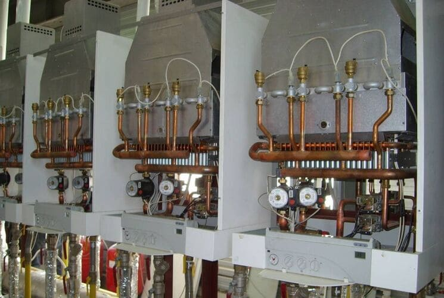

---
title: 'Почему выбирают нас?'
---

Добро пожаловать на нашу страницу, посвященную ремонту газовых котлов Thermona в Московской области! Мы специализируемся на обслуживании и ремонте котлов Thermona, а также предлагаем широкий ассортимент запчастей для них.

<a class="btn btn-primary" href="https://service04.ru/master">Вызвать мастера</a>

<ol>
<li>

Профессионализм: Мы имеем богатый опыт в ремонте газовых котлов Thermona. Наши мастера обладают глубокими знаниями о технических особенностях и технологиях, применяемых в продукции Thermona. Большой опыт в исправлении <a href="https://service04.ru/oshibki-thermona" h3="ошибки Thermona" target="_blank" rel="noopener">ошибок Thermona</a>. Они проходят ежегодные курсы на представительстве с получением сертификатов. Мастера нашего сервисного центра могут выполнить  ремонт котлов Thermona начинается от простого и заканчивая капитальным ремонтом котлов Thermona (переборкой секций чугунных котлов). Мы выполняем ремонт всех видов котлов  — настенных котлов, электрических котлов, конденсационных котлов.

</li>
<li>

Оригинальные запчасти: Для ремонта мы используем только оригинальные запчасти, что гарантирует долгосрочную надежность и оптимальную работу вашего котла после ремонта. Большинство запчастей находится у нас на складе. Если чего-то не хватит во время ремонта, производим быстрый заказ с Представительства Термона.

</li>
<li>

Индивидуальный подход: Мы понимаем, что каждая модель котла Thermona может иметь свои уникальные характеристики и проблемы. Поэтому мы разрабатываем индивидуальные решения для каждого клиента. 

</li>
<li>

Быстрое реагирование: Мы ценим ваше время, поэтому готовы оперативно отреагировать на вызов и провести диагностику вашего котла в кратчайшие сроки.

</li>
<li>

Гарантия качества: Мы уверены в качестве наших услуг и предоставляем гарантию на выполненные работы.

</li>
</ol>

<h3 style="text-align: center;">Наши услуги:</h3>
<ul>
<li><strong>Диагностика и выявление неисправностей.</strong></li>
<li><strong>Чистка и обслуживание газовых котлов.</strong></li>
<li><strong>Замена деталей и комплектующих.</strong></li>
<li><strong>Профилактическое обслуживание для предотвращения поломок.</strong></li>
<li><strong>Сервисное обслуживание с заключением договора для МосОблГаза</strong></li>
</ul>

Если ваш газовый котел Thermona нуждается в ремонте или техническом обслуживании, не стесняйтесь обращаться к нам. Мы гарантируем качественное и надежное восстановление работы вашего оборудования.

<ul></ul>

Что такое качественная диагностика и ремонт газовых котлов.?

<figure>

<strong>Выявление нарушений, устранение неполадок - все это входит обслуживание газовых котлов Thermona.</strong>

<ul>
<li dir="ltr">

Диагностика параметров котла на работу платы управления

</li>
<li dir="ltr">

Тестирование всей безопасности котла сюда входит проверка датчиков по дымоходу проверка датчика перегрева срабатывание маностата воздуха

</li>
<li dir="ltr">

Проверка магниевого анода (производится только для котлов со встроенным бойлером)

</li>
<li dir="ltr">

Проверка газового клапана работа, а также давление газа на входе и выход регулировка газового клапана если показания отличаются от нормы

</li>
<li dir="ltr">

В любое обслуживание котлов обязательным пунктом входят регулировка настройка параметров электронной платы чистка теплообменника, а также наладка котла перед запуском

</li>
</ul>

</figure>

<h4>ОСНОВНЫЕ НЕПОЛАДКИ КОТЛА THERMONA</h4>

Термона считается одними из самых надежных котлов в Чехии, но входе эксплуатации и могут возникнуть различные неисправности чаще всего ошибки и неисправности связанные с соблюдением технологии монтажа, а также эксплуатации котлов. Ниже перечислены некоторые из основных возможных неисправностей, с которыми пользователи могут столкнуться при эксплуатации котла Thermona:

<ol>
<li>

Нет горячей воды: Эта проблема может быть связана с неисправным датчиком температуры, проблемами с электронным контролем или другими компонентами, отвечающими за нагрев воды.

</li>
<li>

Снижение давления: Если давление в системе отопления снижается, это может указывать на утечку воды, проблемы с расширительным баком или автоматическим наполнением.

</li>
<li>

Неисправность зажигания: Зажигание горелки может стать затруднительным из-за проблем с электрической цепью, датчиками, искровой системой или газовой подачей.

</li>
<li>

Частые отключения: Котел может периодически отключаться из-за перегрева, неполадок в системе безопасности или других технических причин.

</li>
<li>

Шумы и вибрации: Некоторые шумы и вибрации могут быть связаны с проблемами с насосом, вентилятором или другими механическими компонентами.

</li>
<li>

Неправильное отображение информации: На дисплее котла могут появляться ошибки или неправильные показания, что может указывать на проблемы с электроникой.

</li>
<li>

Запах газа: Если вы замечаете запах газа вокруг котла, немедленно прекратите использование и вызовите специалистов, так как это может свидетельствовать о утечке газа.

</li>
<li>

Проблемы с системой циркуляции: Если отопительная система не циркулирует воду должным образом, это может привести к неравномерному нагреву или даже замерзанию.

</li>
<li>

Нарушение работы датчиков: Ошибки в работе датчиков температуры или давления могут повлиять на эффективность и безопасность работы котла.

</li>
</ol>

Котел Tермона стал постоянно отключается, выдавать знак аварии и скачет давление, возникают проблемы с дымоходом в этом случае мы рекомендуем вызвать специалистов чтобы они провели диагностику и отремонтировали ваш котел.

<ul>
<li dir="ltr">

Настенных газовых котлов (THERM PRO X.A, TX.A CLN, TCLN PRO KX.A, TKX.A  LXZ.A 5, TLXZ.A 5 CX.A, TCX.A  LN, TLN X.A, TLX.A)

</li>
</ul>
<ul>
<li dir="ltr">

Конденсационных котлов  (THERM KD.A KDC.A KDZ.A  DZ5.A KD.A )

</li>
</ul>
<ul>
<li dir="ltr">

Напольных котлов (THERM EZ/B , P/B,  THERM E)

</li>
</ul>
<ul>
<li dir="ltr">

Промышленных котлов

</li>
</ul>
<ul>
<li dir="ltr">

Электрических котлов (THERM EL )

</li>
</ul>

Если вам требуется ремонт котла Thermona или вы ищете запчасти для него, свяжитесь с нами по указанным контактным данным. Наша команда готова ответить на все ваши вопросы и помочь вам с вашими потребностями.

<strong>Телефон: +79262211348 Email: 89262211348@gmail.com Адрес сервиса: г. Москва ул. 16-я Парковая 36 А</strong>

Не оставляйте свой котел Thermona без должного обслуживания! Обращайтесь к нам для ремонта и приобретения запчастей, и мы сделаем все возможное, чтобы ваш котел работал эффективно и безопасно.

После выполнения работ мастер выдает клиенту заказ наряд на выполненные работы. По этому документу будет поддерживаться гарантия на все работы дается гарантия минимум 30 дней до 6 месяцев при замене деталей.

При выполнении монтажа котла мы предоставляем официальную гарантию от представительства Термона, но для этого вам нужно заключить сервисный договор.

<blockquote>

Важно помнить, что газовые котлы являются сложными техническими устройствами, и ремонт должен проводиться только квалифицированными специалистами. Не стоит пытаться самостоятельно ремонтировать котел, чтобы избежать возможных повреждений или нарушения безопасности.

</blockquote>

<h5>Зона обслуживания котельного оборудования</h5>

Работаем по Москве и всем городам Московской области: <strong>Апрелевка, Балашиха, Барвиха, Бронницы, Видное, Воскресенск, Голицино, Дмитров, Долгопрудный, Домодедово, Егорьевск, Железнодорожный, Жуковский, Звенигород, Зеленоград, Икша, Истра, Ивантеевка, Королёв, Красногорск, Кубинка, Куровское, Лобня, Люберцы, Мытищи, Наро-Фоминск, Нахабино, Новая Москва, Ногинск, Одинцово, Орехово-Зуево, Подольск, Пушкино, Раменское, Реутов, Селятино, Сергиев-Посад, Софрино, Сходня, Фрязино, Химки, Щелково, Электросталь.</strong>

<strong>СНИЖЕНИЕ ЦЕН НА РЕМОНТ КОТЛОВ.</strong>

<strong>ДИАГНОСТИКА+РЕМОНТ  4600 руб. !!! Выезд 50руб/км !!!</strong>

<a class="btn btn-primary" href="https://service04.ru/master">Вызвать мастера</a>

