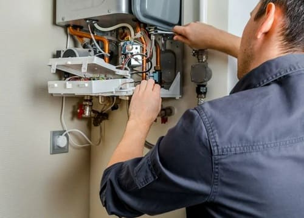

---
title: 'Профессиональный ремонт газовых котлов: низкие цены и сервисная гарантия на все работы'
---

Газовое котельное оборудование является самым экономичным, простым в использовании и надежным. Но даже такой практичной технике требуется качественный ремонт и своевременное сервисное обслуживание. Ремонт котлов, работающих на магистральном или сжиженном природном газе, является залогом безопасной эксплуатации техники.

<h4>Услуги сертифицированного ремонта котлов</h4>

Специалисты нашей компании выполняют ремонт газовых котлов отечественного и зарубежного производства. Мастера отлично знакомы со спецификой эксплуатации и обслуживания напольного/настенного оборудования всех востребованных моделей котлов.

  

Специалисты нашей компании выполняют ремонт газовых котлов отечественного и зарубежного производства. Мастера отлично знакомы со спецификой эксплуатации и обслуживания напольного/настенного оборудования всех востребованных моделей котлов.

Самыми распространенными проблемами, с которыми сталкиваются пользователи газового котельного оборудования, являются:

<ul>
<li>Выход из строя автоматики из-за перепадов напряжения;</li>
<li>Образование накипи и/или поломка теплообменника из-за низкого качества воды;</li>
<li>Неправильная эксплуатация оборудования и несоблюдение рекомендаций производителя.</li>
</ul>

Сертифицированный ремонт газовых котлов в исполнении специалистов компании – это обширный перечень работ:

<ul>
<li>Комплексная диагностика для определения поломок;</li>
<li>Чистка основных элементов оборудования;</li>
<li>Восстановление или замена деталей и рабочих узлов;</li>
<li>Настройка техники.</li>
</ul>

 Все работы осуществляются нами в строгом соответствии с требованиями заводов изготовителей с использованием новейшего специализированного оборудования. Данное обстоятельство позволяет нам утверждать, что результатом нашей деятельности по ремонту и монтажу газовых котлов является предоставление клиенту действительно высококачественных услуг.

Мы настоятельно рекомендуем всем своим клиентам проводить плановый профилактический ремонт газового котла. Все дело в том, что аварийный ремонт газового котла обходится в разы дороже планового и в обязательном порядке сопровождается остановкой всей системы отопления.

Обратившись к нам, вы получите в свое распоряжение высококвалифицированных специалистов, которые быстро и максимально качественно произведут все необходимые работы.

Помните: газовый котел является источником повышенной опасности, и несвоевременное или неправильное его обслуживание может привести к весьма трагическим последствиям. Обращайтесь к нам — экономя на отоплении, не экономьте на безопасности.
