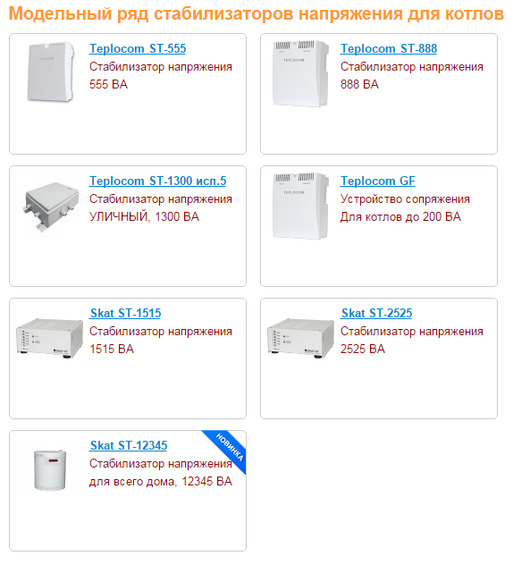

---
title: 'Стабилизаторы напряжения «Бастион»'
---

<!-- Заголовок -->

Безопасность и стабильность работы вашего котла

<!-- Введение -->

<h2 class="card-h3" style="color: #e37a25;"><i class="fas fa-shield-alt me-2"></i>Стабилизаторы напряжения для газового котла</h2>

Для нормальной работы отопительного оборудования требуется стабильное электропитание с отклонениями от заданных параметров не больше 10%.

Но электросети в любом населенном пункте не радуют качеством электропитания. Поэтому <strong>стабилизатор напряжения для газового котла Бастион</strong> – это выгодное и недорогое решение для бесперебойной и продолжительной работы отопительного оборудования с разной мощностью.

<!-- Виды стабилизаторов -->

<h3 class="mb-0"><i class="fas fa-list me-2"></i>Виды стабилизаторов для котлов отопления</h3>

Стабилизатор напряжения – устройство, предназначенное для качественного и бесперебойного электропитания котельного оборудования, арматуры, насосов, вентиляторов, которые используются в системе отопления.

На рынке котельного оборудования актуальны несколько типов стабилизаторов, которые отличаются по принципу работы:

<h5 class="text-uppercase" style="color: #e37a25;"><i class="fas fa-microchip me-2"></i> Тиристорные (симисторные)</h5>
<ul class="mb-0">
<li>Высокая точность и скорость срабатывания</li>
<li>Бесшумны в работе</li>
<li>Просты в эксплуатации</li>
<li>Мгновенное переключение питания</li>
<li class="mt-2"><strong>Пример:</strong> Teplocom 555 888 1300 (“Бастион”)</li>
</ul>

<h5 class="text-uppercase" style="color: #e37a25;"><i class="fas fa-cogs me-2"></i> Электромеханические</h5>
<ul class="mb-0">
<li>Приемлемая точность срабатывания</li>
<li>Устойчивость к перегрузкам</li>
<li>Обширные диапазоны напряжения</li>
<li>Регулировка подачи напряжения щеткой</li>
</ul>

<h5 class="text-uppercase" style="color: #e37a25;"><i class="fas fa-bolt me-2"></i> Электронные (релейные)</h5>
<ul class="mb-0">
<li>Высокая скорость срабатывания</li>
<li>Работа с обширным диапазоном напряжений</li>
<li>Точность зависит от величины ключей/ступеней</li>
</ul>

<!-- Изображения -->

<h5 class="alert-heading"><i class="fas fa-exclamation-triangle me-2"></i>Важно!</h5>

Выбирая <strong>стабилизаторы напряжения Бастион для котлов</strong> или устройства иных брендов, важно учесть не только принцип работы, но также: суммарную мощность установленного оборудования, данные электросети и выходные диапазоны стабилизации напряжения.

<!-- Преимущества -->

<h4 class="mb-0"><i class="fas fa-thumbs-up me-2"></i>Преимущества стабилизаторов «Бастион»</h4>

<i class="fas fa-plug fa-3x text-primary mb-2"></i>
<h5>Стабильность</h5>

Поддержание напряжения в заданных пределах

<i class="fas fa-shield-alt fa-3x text-success mb-2"></i>
<h5>Защита</h5>

От перепадов напряжения и скачков в сети

<i class="fas fa-sync-alt fa-3x text-info mb-2"></i>
<h5>Надежность</h5>

Долговечная работа оборудования

<i class="fas fa-ruble-sign fa-3x text-warning mb-2"></i>
<h5>Экономия</h5>

Недорогое решение для защиты котла

<!-- Заказ -->

<h3 class="card-h3"><i class="fas fa-shopping-cart me-2"></i>Купить стабилизатор напряжения «Бастион»</h3>

Обеспечьте надежную работу вашего котла

<a href="tel:+79262211348" class="btn btn-light btn-lg btn-block"> <i class="fas fa-phone me-2"></i>Позвонить </a>

<a href="https://service04.ru/contact-us/feedback" class="btn btn-warning btn-lg btn-block text-dark"> <i class="fas fa-envelope me-2"></i>Оставить заявку </a>

