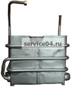

---
title: 'Теплообменники для газовых водонагревателей'
---

<!-- Заголовок -->

Радиаторы для газовых колонок - надежные запчасти для вашего оборудования

<!-- Введение -->

<strong>Теплообменники для газовых водонагревателей</strong> - это ключевые элементы отопительного оборудования, обеспечивающие эффективную передачу тепла от сгорания газа к теплоносителю (воде).

Они используются в <strong>газовой колонке в квартире на кухне</strong> и других местах установки водонагревателей.

<h5 class="alert-heading"><i class="fas fa-info-circle me-2"></i>Важно!</h5>

Теплообменник выполнен из <strong>толстой меди высокого качества</strong>. В случае течи теплообменника или выявления брака, допущенного на производстве, мы производим обмен на новый теплообменник.

 

<!-- Модели теплообменников -->

<h2 class="mb-0"><i class="fas fa-list me-2"></i>Модели теплообменников для газовых колонок</h2>

<!-- НЕВА 4510 -->

<h5 class="mb-0"><i class="fas fa-fire me-2"></i>Теплообменник НЕВА 4510</h5>

<ul class="mb-0">
<li class="mb-2"><i class="fas fa-industry text-primary me-2"></i> Предназначен для газовой колонки: НЕВА 4510</li>
<li class="mb-2"><i class="fas fa-border-all text-success me-2"></i> Радиаторы для газовых колонок</li>
<li class="mb-2"><i class="fas fa-copper-plate text-warning me-2"></i> Выполнен из толстой меди высокого качества</li>
<li class="mb-2"><i class="fas fa-exchange-alt text-info me-2"></i> Обмен на новый при течи или браке</li>
</ul>

<!-- ВПГ 18 -->

<h5 class="mb-0"><i class="fas fa-temperature-high me-2"></i>Теплообменник ВПГ 18</h5>

<ul class="mb-0">
<li class="mb-2"><i class="fas fa-industry text-primary me-2"></i> Предназначен для газовой колонки: производства Санкт Петербург</li>
<li class="mb-2"><i class="fas fa-copper-plate text-success me-2"></i> Выполнен из толстой меди высокого качества</li>
<li class="mb-2"><i class="fas fa-exchange-alt text-warning me-2"></i> Обмен на новый при течи или браке</li>
</ul>

<!-- «Канорд» -->

<h5 class="mb-0"><i class="fas fa-industry me-2"></i>Теплообменник «Канорд»</h5>

<ul class="mb-0">
<li class="mb-2"><i class="fas fa-industry text-primary me-2"></i> Предназначен для водяного контура котлов изготовленных заводом «Канорд»</li>
<li class="mb-2"><i class="fas fa-copper-plate text-success me-2"></i> Сделан из медной трубы высокого качества</li>
</ul>

<!-- ПГ 6 -->

<h5 class="mb-0"><i class="fas fa-fire-alt me-2"></i>Теплообменник ПГ 6</h5>

<ul class="mb-0">
<li class="mb-2"><i class="fas fa-industry text-primary me-2"></i> Предназначен для газовой колонки производства: Польша</li>
<li class="mb-2"><i class="fas fa-copper-plate text-success me-2"></i> Выполнен из толстой меди высокого качества</li>
<li class="mb-2"><i class="fas fa-paint-brush text-warning me-2"></i> Снаружи покрыт специальной жаростойкой краской</li>
</ul>

<!-- КГИ-56 -->

<h5 class="mb-0"><i class="fas fa-tint me-2"></i>Теплообменник КГИ-56</h5>

<ul class="mb-0">
<li class="mb-2"><i class="fas fa-industry text-primary me-2"></i> Предназначен для газовой колонки: «Тула» производства завод «Штамп» г. Тула</li>
<li class="mb-2"><i class="fas fa-exchange-alt text-success me-2"></i> Обмен на новый при течи или браке</li>
</ul>

<!-- Астра ВПГ 21 -->

<h5 class="mb-0"><i class="fas fa-star me-2"></i>Теплообменник Астра ВПГ 21</h5>

<ul class="mb-0">
<li class="mb-2"><i class="fas fa-industry text-primary me-2"></i> Предназначен для газовой колонки: Астра модель 8910, 8910 исполнение 06</li>
<li class="mb-2"><i class="fas fa-certificate text-success me-2"></i> Имеет сертификат соответствия</li>
<li class="mb-2"><i class="fas fa-copper-plate text-warning me-2"></i> Выполнен из толстой меди высокого качества</li>
</ul>

<!-- Beretta -->

<h5 class="mb-0"><i class="fas fa-industry me-2"></i>Теплообменник Beretta</h5>

<ul class="mb-0">
<li class="mb-2"><i class="fas fa-industry text-primary me-2"></i> Предназначен для газовой колонки: «Beretta» модель Idrabagno 11, Idrabagno 11i</li>
<li class="mb-2"><i class="fas fa-copper-plate text-success me-2"></i> Выполнен из толстой меди высокого качества</li>
<li class="mb-2"><i class="fas fa-paint-brush text-warning me-2"></i> Снаружи покрыт специальной жаростойкой краской</li>
<li class="mb-2"><i class="fas fa-exchange-alt text-info me-2"></i> Обмен на новый при течи или браке</li>
</ul>

<!-- ВПГ 23 -->

<h5 class="mb-0"><i class="fas fa-fire me-2"></i>Теплообменник ВПГ 23</h5>

<ul class="mb-0">
<li class="mb-2"><i class="fas fa-industry text-primary me-2"></i> Предназначен для газовой колонки производства Санкт Петербург</li>
<li class="mb-2"><i class="fas fa-copper-plate text-success me-2"></i> Выполнен из толстой меди высокого качества</li>
<li class="mb-2"><i class="fas fa-exchange-alt text-warning me-2"></i> Обмен на новый при течи или браке</li>
</ul>

<!-- Астра ВПГ 18 -->

<h5 class="mb-0"><i class="fas fa-star me-2"></i>Теплообменник Астра ВПГ 18</h5>

<ul class="mb-0">
<li class="mb-2"><i class="fas fa-industry text-primary me-2"></i> Предназначен для газовой колонки: Астра модель 8910 исполнение 08</li>
<li class="mb-2"><i class="fas fa-certificate text-success me-2"></i> Имеет сертификат соответствия</li>
<li class="mb-2"><i class="fas fa-copper-plate text-warning me-2"></i> Выполнен из толстой меди высокого качества</li>
<li class="mb-2"><i class="fas fa-exchange-alt text-info me-2"></i> Обмен на новый при течи или браке</li>
</ul>

<!-- Vaillant 19-2 XZ -->

<h5 class="mb-0"><i class="fas fa-industry me-2"></i>Теплообменник Vaillant 19-2 XZ</h5>

<ul class="mb-0">
<li class="mb-2"><i class="fas fa-industry text-primary me-2"></i> Предназначен для газовой колонки: Vaillant 19-2 XZ-C+</li>
<li class="mb-2"><i class="fas fa-industry text-success me-2"></i> Vaillant premium SOE 19/2</li>
<li class="mb-2"><i class="fas fa-copper-plate text-warning me-2"></i> Выполнен из толстой меди высокого качества</li>
<li class="mb-2"><i class="fas fa-paint-brush text-info me-2"></i> Снаружи покрыт специальной жаростойкой краской</li>
<li class="mb-2"><i class="fas fa-certificate text-secondary me-2"></i> Гарантия 1 год, обмен на новый при течи или браке</li>
</ul>

<!-- Ладогаз ВПГ 10М -->

<h5 class="mb-0"><i class="fas fa-bolt me-2"></i>Теплообменник Ладогаз ВПГ 10М</h5>

<ul class="mb-0">
<li class="mb-2"><i class="fas fa-industry text-primary me-2"></i> Предназначен для энергосберегающей газовой колонки: Ладогаз ВПГ 10М</li>
<li class="mb-2"><i class="fas fa-copper-plate text-success me-2"></i> Выполнен из толстой меди высокого качества</li>
<li class="mb-2"><i class="fas fa-fire text-warning me-2"></i> Пайка осуществляется твердым медно фосфорным припоем МФ9</li>
<li class="mb-2"><i class="fas fa-certificate text-info me-2"></i> Гарантия 1 год, обмен на новый при течи или браке</li>
</ul>

<!-- Ладогаз ВПГ 10А -->

<h5 class="mb-0"><i class="fas fa-bolt me-2"></i>Теплообменник Ладогаз ВПГ 10А</h5>

<ul class="mb-0">
<li class="mb-2"><i class="fas fa-industry text-primary me-2"></i> Предназначен для газовой колонки: Ладогаз ВПГ 10А</li>
<li class="mb-2"><i class="fas fa-copper-plate text-success me-2"></i> Выполнен из толстой меди высокого качества</li>
<li class="mb-2"><i class="fas fa-fire text-warning me-2"></i> Пайка осуществляется твердым медно фосфорным припоем МФ9</li>
<li class="mb-2"><i class="fas fa-certificate text-info me-2"></i> Гарантия 1 год, обмен на новый при течи или браке</li>
</ul>

<!-- Electrolux GWH275RN -->

<h5 class="mb-0"><i class="fas fa-industry me-2"></i>Теплообменник Electrolux GWH275RN</h5>

<ul>
<li class="mb-2"><i class="fas fa-industry text-primary me-2"></i> Предназначен для газовой колонки: Electrolux GWH275RN</li>
<li class="mb-2"><i class="fas fa-copper-plate text-success me-2"></i> Выполнен из толстой меди высокого качества</li>
<li class="mb-2"><i class="fas fa-paint-brush text-warning me-2"></i> Снаружи покрыт специальной жаростойкой краской</li>
<li class="mb-2"><i class="fas fa-certificate text-info me-2"></i> Имеет сертификат соответствия</li>
<li class="mb-2"><i class="fas fa-shield-alt text-danger me-2"></i> Наш сервисный центр дает гарантию на этот товар</li>
<li class="mb-2"><i class="fas fa-exchange-alt text-secondary me-2"></i> Обмен на новый при течи или браке (только при установке нашим сервисным центром)</li>
</ul>

Теплообменник Electrolux GWH275RN

<!-- Технические характеристики -->

<h3 class="mb-0"><i class="fas fa-sliders-h me-2"></i>Технические характеристики теплообменников</h3>

<table class="table table-bordered table-striped text-center">
<thead class="thead-dark">
<tr>
<th>Модель</th>
<th>Присоединительные размеры</th>
<th>Габаритные размеры (Д×Ш×В), мм</th>
<th>Масса, кг</th>
</tr>
</thead>
<tbody>
<tr>
<td><strong>ВПГ 18</strong></td>
<td>1/2"</td>
<td>350×210×440</td>
<td>3,23</td>
</tr>
<tr>
<td><strong>«Канорд»</strong></td>
<td>-</td>
<td>360×240×240</td>
<td>2,97</td>
</tr>
<tr>
<td><strong>ПГ 6</strong></td>
<td>1/2"</td>
<td>380×180×530</td>
<td>3,92</td>
</tr>
<tr>
<td><strong>КГИ-56</strong></td>
<td>1/2"</td>
<td>350×180×420</td>
<td>4,8</td>
</tr>
<tr>
<td><strong>Астра ВПГ 21</strong></td>
<td>1/2"</td>
<td>340×190×300</td>
<td>3,5</td>
</tr>
<tr>
<td><strong>Beretta</strong></td>
<td>3/8"</td>
<td>290×170×360</td>
<td>2,94</td>
</tr>
<tr>
<td><strong>ВПГ 23м</strong></td>
<td>1/2"</td>
<td>370×190×100</td>
<td>2,83</td>
</tr>
<tr>
<td><strong>Астра ВПГ 18</strong></td>
<td>-</td>
<td>350×150×130</td>
<td>2,33</td>
</tr>
<tr>
<td><strong>Vaillant 19-2 XZ</strong></td>
<td>3/8"</td>
<td>290×170×360</td>
<td>2,94</td>
</tr>
<tr>
<td><strong>Ладогаз ВПГ 10М</strong></td>
<td>1/2"</td>
<td>310×160×470</td>
<td>3,51</td>
</tr>
<tr>
<td><strong>Ладогаз ВПГ 10А</strong></td>
<td>1/2"</td>
<td>290×170×440</td>
<td>3,04</td>
</tr>
<tr>
<td><strong>Electrolux GWH275RN</strong></td>
<td>3/8"</td>
<td>290×170×360</td>
<td>2,94</td>
</tr>
</tbody>
</table>

<!-- Преимущества -->

<h4 class="mb-0"><i class="fas fa-thumbs-up me-2"></i>Преимущества наших теплообменников</h4>

<i class="fas fa-copper-plate fa-3x text-primary mb-2"></i>
<h5>Качество</h5>

Выполнен из толстой меди высокого качества

<i class="fas fa-paint-brush fa-3x text-success mb-2"></i>
<h5>Защита</h5>

Покрыт специальной жаростойкой краской

<i class="fas fa-shield-alt fa-3x text-warning mb-2"></i>
<h5>Гарантия</h5>

1 год гарантии на товар

<i class="fas fa-recycle fa-3x text-info mb-2"></i>
<h5>Обмен</h5>

Обмен на новый при течи или браке

<!-- Заказ -->

<h3 class="card-h3"><i class="fas fa-shopping-cart me-2"></i>Купить теплообменники для газовых колонок</h3>

Оригинальные запчасти SIT с гарантией

<a href="tel:+79262211348" class="btn btn-light btn-lg btn-block"> <i class="fas fa-phone me-2"></i>Позвонить </a>

<a href="https://service04.ru/contact-us/feedback" class="btn btn-warning btn-lg btn-block text-dark"> <i class="fas fa-envelope me-2"></i>Оставить заявку </a>

