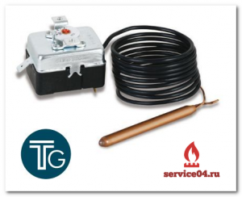

---
title: 'TG400'
---

<!-- Заголовок -->

Предохранительный термостат с автоматическим сбросом

90-110°C

Диапазон срабатывания

<!-- Основное описание -->

<h3 class="mb-0"><i class="fas fa-info-circle me-2"></i>Описание продукта</h3>

<h4 class="card-h3">TG400 - Предохранительный термостат</h4>

Автоматический сброс с отказоустойчивой функцией

<h5 class="alert-heading"><i class="fas fa-shield-alt me-2"></i>Ключевые особенности:</h5>
<ul class="mb-0">
<li><i class="fas fa-sync-alt me-1"></i> Автоматический сброс после срабатывания</li>
<li><i class="fas fa-shield me-1"></i> Отказоустойчивая функция безопасности</li>
<li><i class="fas fa-sliders-h me-1"></i> Диапазон регулировки: 90 ÷ 110°C</li>
<li><i class="fas fa-plug me-1"></i> Параметры контактов: 16(4) А 250В~</li>
<li><i class="fas fa-bolt me-1"></i> Спозолоченные контакты: 100 мВ 0,3 А</li>
</ul>

<h5 class="alert-heading"><i class="fas fa-cogs me-2"></i>Специальные исполнения:</h5>

«Компенсированные» исполнения доступны по запросу. Термостаты с позолоченными контактами доступны по запросу.

<!-- Технические характеристики -->

<h3 class="mb-0"><i class="fas fa-list me-2"></i>Технические характеристики</h3>

<h5><i class="fas fa-thermometer-empty me-2"></i>Температурные параметры</h5>
<ul>
<li>Диапазон регулировки: <strong>90 ÷ 110°C</strong></li>
<li>Тип сброса: <strong>Автоматический</strong></li>
<li>Функция: <strong>Отказоустойчивая</strong></li>
</ul>

<h5><i class="fas fa-bolt me-2"></i>Электрические параметры</h5>
<ul>
<li>Контакты: <strong>16(4) А 250В~</strong></li>
<li>Спозолоченные контакты: <strong>100 мВ 0,3 А</strong></li>
<li>Тип контактов: <strong>SPDT</strong></li>
</ul>

<h5><i class="fas fa-ruler-combined me-2"></i>Колба</h5>
<ul class="mb-0">
<li>Размеры: <strong>Ø 6,5 x 73 мм</strong></li>
<li>Материал: <strong>Медь</strong></li>
</ul>

<h5><i class="fas fa-arrows-alt-h me-2"></i>Капилляр</h5>
<ul class="mb-0">
<li>Материал: <strong>Медь + ПВХ</strong></li>
</ul>

<h5><i class="fas fa-weight-hanging me-2"></i>Длина</h5>
<ul class="mb-0">
<li>Стандартные длины: <strong>1000 мм / 1500 мм</strong></li>
</ul>

<!-- Правая колонка - модели и заказ -->

<!-- Модели -->

<h4 class="mb-0"><i class="fas fa-cardes me-2"></i>Модели TG400</h4>

<table class="table table-striped table-bordered">
<thead class="thead-dark">
<tr>
<th>Код</th>
<th>Контакты</th>
<th>Длина</th>
</tr>
</thead>
<tbody>
<tr>
<td><small>962-11228-00A</small></td>
<td>Стандарт</td>
<td>1000 мм</td>
</tr>
<tr>
<td><small>962-11238-00A</small></td>
<td>Стандарт</td>
<td>1500 мм</td>
</tr>
<tr>
<td><small>962-11328-00A</small></td>
<td>Стандарт</td>
<td>1000 мм</td>
</tr>
<tr>
<td><small>962-11338-00A</small></td>
<td>Стандарт</td>
<td>1500 мм</td>
</tr>
<tr class="table-warning">
<td><small>964-11238-00A</small></td>
<td>Позолоч.</td>
<td>1500 мм</td>
</tr>
<tr class="table-warning">
<td><small>964-11328-00A</small></td>
<td>Позолоч.</td>
<td>1000 мм</td>
</tr>
<tr class="table-warning">
<td><small>964-11338-00A</small></td>
<td>Позолоч.</td>
<td>1500 мм</td>
</tr>
</tbody>
</table>

<i class="fas fa-star me-1"></i> <strong>Позолоченные контакты</strong> - доступны по запросу

<!-- Заказ -->

<h4 class="mb-0"><i class="fas fa-shopping-cart me-2"></i>Заказать</h4>

<btn btn-primary class="btn btn-success btn-lg"> <i class="fas fa-phone me-2"></i>Позвонить </btn btn-primary> <btn btn-primary class="btn btn-primary"> <i class="fas fa-envelope me-2"></i>Отправить запрос </btn btn-primary> <btn btn-primary class="btn btn-warning"> <i class="fas fa-calculator me-2"></i>Рассчитать стоимость </btn btn-primary>

<!-- Преимущества -->

<h4 class="mb-0"><i class="fas fa-thumbs-up me-2"></i>Преимущества</h4>

<i class="fas fa-sync-alt fa-2x text-success mt-1 me-3"></i>

<h5 class="mt-0">Автоматический сброс</h5>

Не требует ручного вмешательства

<i class="fas fa-shield-alt fa-2x text-primary mt-1 me-3"></i>

<h5 class="mt-0">Безопасность</h5>

Отказоустойчивая функция защиты

<i class="fas fa-cogs fa-2x text-warning mt-1 me-3"></i>

<h5 class="mt-0">Надежность</h5>

Медные компоненты и качественные материалы

<!-- Применение -->

<h3 class="card-h3 text-center"><i class="fas fa-industry me-2"></i>Области применения</h3>

<i class="fas fa-shower fa-2x mb-2"></i>
<h5>Водонагреватели</h5>

<i class="fas fa-fire fa-2x mb-2"></i>
<h5>Газовые котлы</h5>

<i class="fas fa-tint fa-2x mb-2"></i>
<h5>Системы отопления</h5>

<i class="fas fa-bath fa-2x mb-2"></i>
<h5>Термобаки</h5>

<!-- Гарантия -->

<h4 class="alert-heading"><i class="fas fa-certificate me-2"></i>Гарантия качества</h4>

Все термостаты TG400 проходят строгий контроль качества и имеют сертификаты соответствия

<btn btn-primary class="btn btn-outline-success"> <i class="fas fa-file-pdf me-2"></i>Сертификаты </btn btn-primary>

