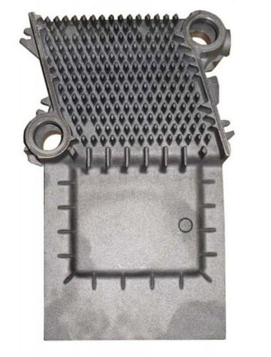
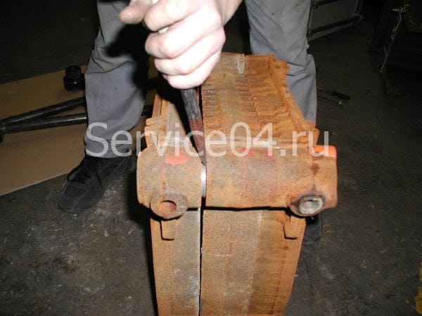
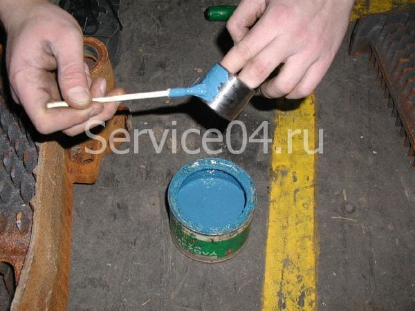
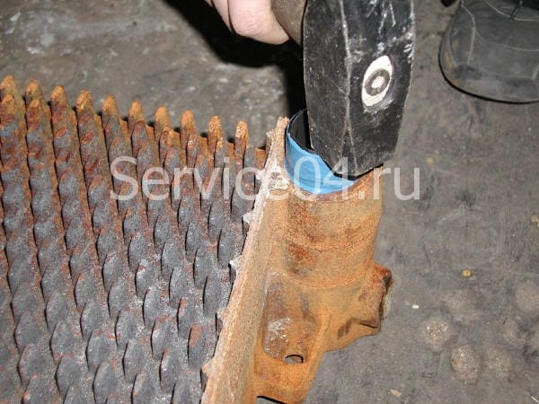
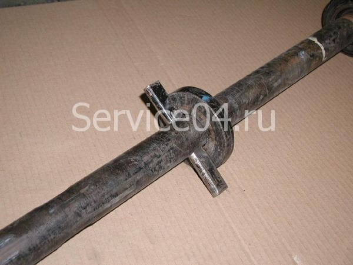

---
title: 'Этапы работ по замене секции котла, приведения теплообменника в рабочее состояние (Инструкция)'
---

Добро пожаловать на страницу нашей компании, специализирующейся в ремонте и замене секций чугунных котлов. Если ваш чугунный котел стал нуждаться в замене секций, мы предлагаем вам надежное и профессиональное решение для восстановления его работоспособности.

<a class="btn btn-primary" href="https://service04.ru/master">Вызвать мастера</a>

<a href="#h_9170228392071693411007217" class="btn btn-success">Инструкция по замене секции</a>

Немного теории – какие явления вызывают  протечку (разрушение) теплообменника?

Технология устранения повреждения отсеков чугунного теплообменника продиктована его устройством. Проблема ремонта решается заменой секции котла. Теплообменник представляет собой сборную конструкцию. Элементы собираются в единый агрегат посредством комплектующих (соединительных конических ниппелей). 

Нарушение целостности одной из секций приводит к выходу из строя всего устройства. Каковы причины возникновения разрушающих деформаций и течи теплообменника?

Нагревающие устройства из чугуна более долговечны по сравнению со стальными аналогами. Чугун меньше корродирует в водной среде. Поэтому газовые котлы из этого материала почти не ржавеют. Однако чугун (в отличие от стали) более чувствителен к локальным пикам температур. На сохранение физических свойств конструкции негативно влияет воздействие холодной воды на разогретый металл.

Для предотвращения появления трещин в чугунных котлах важно соблюдать рекомендации по эксплуатации, регулярно проводить профилактическое обслуживание и следить за состоянием оборудования. В случае обнаружения трещин или других повреждений рекомендуется обратиться к специалистам для оценки ситуации и возможного ремонта.

Перечисленные ситуации возникают при нарушении правил обслуживания:

<ul>
<li>Засоренность устройства ведет к перегреву отдельных небольших участков чугунной поверхности.</li>
<li>Подпитка на работающий газовый котел холодным теплоносителем создает контраст температур.</li>
<li>Некорректная настройка горелки нарушает общий тепловой режим.</li>
</ul>

 [% mg=pomuvkakotla %]

<blockquote>

Эти явления приводят к появлению т.н. «теплового шока» металла. В результате один или несколько элементов деформируются относительно других или просто лопается.

</blockquote>

   При пользовании бытовыми чугунными газовыми котлами нередко появляется течь воды. Причина чаще всего кроется в нарушении режима эксплуатации. Каковы «факторы риска» возникновения аварийных повреждений? Каким должен быть ремонт?

Распространенный поломка при эксплуатации – течь чугунного котла. Причин этому может быть несколько: микротрещина в теле конструкции, высыхание уплотняющего герметика. Тогда возникает необходимость замены секции чугунного котла. Для ремонта лучше пригласить специалистов из сервисной организации. Такие компании проводят ремонт регулярно. Для сборки аппаратов они имеют профессиональный инструмент.

Ремонт выполняется поэтапно. Начинается он с диагностики тела конструкции и заканчивается испытанием и запуском в работу. Промежуточные операции:

<ul>
<li>

<strong>Демонтаж кожуха и по секционная разборка;</strong>

</li>
<li>

<strong>Замена секции котла и стяжка всех элементов;</strong>

</li>
<li>

<strong>Подключение прибора к системе отопления;</strong>

</li>
<li>

<strong>Монтаж наружной обшивки.</strong>

</li>
</ul>

Для диагностики устройство останавливают. После охлаждения демонтируют кожух и слой теплоизоляции. Характер повреждений и количество подлежащих замене отсеков определяется визуально. Если утечка вызвана микротрещиной, и обнаружить местоположение дефекта сразу не удается, давление воды повышают до 2-х кг и оставляют на сутки.

<strong>Расколка на секции аккуратно производится механическим путем.</strong>

<strong>При этом стараются ударять только по дефектному элементу.</strong>

Далее следует замена секций чугунного котла. Соседние с поврежденным элементы осматриваются для своевременного обнаружения засоренности. Их промывают либо, заменяют новыми. Иногда мастера решают собрать агрегат и затем промывать его водой с химическими реагентами.

<strong>Сборка чугунных секций.</strong>

Перед стяжкой все поверхности контакта элементов между собой тщательно зачищают. Герметизируют тракт прохождения теплоносителя новыми ниппелями и смазывают их специальной пастой. После замены секции котла дымовой тракт также уплотняют. Для этого покрывают стыки мастикой или стягивают их шнурами.

<strong>Стяжка выполняется при помощи специального инструмента.</strong>

<strong>Очень важно не допустить перекоса и точно соединить секции.</strong>

<strong>При замене нескольких элементов их добавляют к собираемой конструкции строго по одному.</strong>

 

На следующем шаге устройство подключается к системе и подлежит опрессовке. Для этой операции в него подается максимальное разрешенное производителем давление. Для каждой модели этот параметр указан в паспорте.

Ремонт чугунного теплообменника требуется и без явного нарушения целостности. Когда в приборе регулярно падает давление теплоносителя и его приходится часто подпитывать водой. Причина подобного поведения котла скрывается в появлении микротрещины в топке. При высокой температуре жидкость успевает испариться и удаляется с дымовыми газами. Нестабильная работа – уважительный повод для обращения в сервисную службу.

<h5>Зона обслуживания котельного оборудования</h5>

Работаем по Москве и всем городам Московской области: <strong>Апрелевка, Балашиха, Барвиха, Бронницы, Видное, Воскресенск, Голицино, Дмитров, Долгопрудный, Домодедово, Егорьевск, Железнодорожный, Жуковский, Звенигород, Зеленоград, Икша, Истра, Ивантеевка, Королёв, Красногорск, Кубинка, Куровское, Лобня, Люберцы, Мытищи, Наро-Фоминск, Нахабино, Новая Москва, Ногинск, Одинцово, Орехово-Зуево, Подольск, Пушкино, Раменское, Реутов, Селятино, Сергиев-Посад, Софрино, Сходня, Фрязино, Химки, Щелково, Электросталь.</strong>

<strong>СНИЖЕНИЕ ЦЕН НА РЕМОНТ КОТЛОВ.</strong>

<strong>ДИАГНОСТИКА+РЕМОНТ  4600 руб. !!! Выезд 50руб/км !!!</strong>

<a class="btn btn-primary" href="https://service04.ru/master">Вызвать мастера</a>

