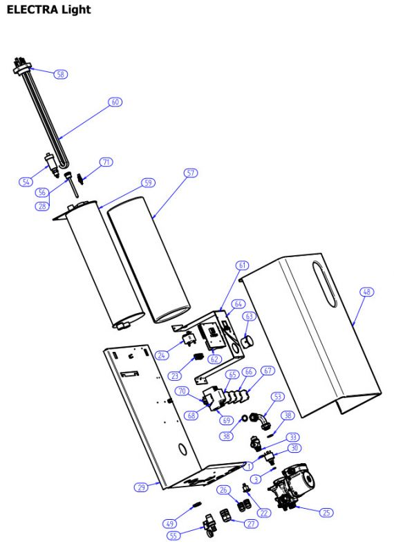

---
title: 'Запчасти для электро котла Mora Electra Light'
---

<!-- Заголовок -->

Оригинальные комплектующие для надежной работы вашего электрокотла

<!-- Основное изображение -->

<!-- Введение -->

<h3 class="card-h3" style="color: #e37a25;"><i class="fas fa-info-circle me-2"></i>Запчасти для электрокотла Mora Electra Light</h3>

Надежный и экономичный электрокотел <strong>Mora Electra Light</strong> требует качественного обслуживания и своевременной замены комплектующих. Использование оригинальных запчастей обеспечивает стабильную работу оборудования и продлевает срок его службы.

<h5 class="alert-heading"><i class="fas fa-exclamation-circle me-2"></i>Важно!</h5>

При замене запчастей в электрокотле <strong>Mora Electra Light</strong> рекомендуется обращаться к квалифицированным специалистам, имеющим допуск к работе с электрооборудованием.

<!-- Каталог запчастей -->

<h4 class="mb-0"><i class="fas fa-list me-2"></i>Каталог запчастей Mora Electra Light</h4>

<table class="table table-bordered table-striped">
<thead class="thead-dark">
<tr>
<th>№</th>
<th>Артикул</th>
<th>Наименование запчасти</th>
<th>Код</th>
</tr>
</thead>
<tbody>
<tr>
<td>1</td>
<td>2730615</td>
<td>Прокладка «O» 16×3</td>
<td>54008</td>
</tr>
<tr>
<td>3</td>
<td>2730619</td>
<td>Прокладка «O» 7.59×2.62</td>
<td>65001</td>
</tr>
<tr>
<td>11</td>
<td>3414249</td>
<td>Кабель контактора — сборка</td>
<td>65002</td>
</tr>
<tr>
<td>12</td>
<td>3414250</td>
<td>Кабель датчика давления — сборка</td>
<td>65003</td>
</tr>
<tr>
<td>14</td>
<td>3414252</td>
<td>Кабель термостата</td>
<td>65005</td>
</tr>
<tr>
<td>15</td>
<td>3414253</td>
<td>Перемычка X1_блок управления</td>
<td>65006</td>
</tr>
<tr>
<td>16</td>
<td>3414254</td>
<td>Заземляющий кабель наг.элемента</td>
<td>65007</td>
</tr>
<tr>
<td>17</td>
<td>3414255</td>
<td>Заземляющий кабель блока управления</td>
<td>65008</td>
</tr>
<tr>
<td>18</td>
<td>3414256</td>
<td>Заземляющий кабель кожуха</td>
<td>65009</td>
</tr>
<tr>
<td>19</td>
<td>3414257</td>
<td>Заземляющий кабель X1</td>
<td>65010</td>
</tr>
<tr>
<td>20</td>
<td>3414261</td>
<td>Кабель датчика давления</td>
<td>65030</td>
</tr>
<tr>
<td>22</td>
<td>3452049</td>
<td>Переключатель 0-1</td>
<td>54010</td>
</tr>
<tr>
<td>23</td>
<td>3456422</td>
<td>Клеммник ломающий</td>
<td>54023</td>
</tr>
<tr>
<td>24</td>
<td>4050461</td>
<td>Аварийный термостат — рестарт</td>
<td>60537</td>
</tr>
<tr>
<td>25</td>
<td>4262506</td>
<td>Насос Grundfos</td>
<td>54004</td>
</tr>
<tr>
<td>26</td>
<td>4841115</td>
<td>Концевая втулка scame pg9</td>
<td>60533</td>
</tr>
<tr>
<td>27</td>
<td>4841119</td>
<td>Концевая втулка scame pg21</td>
<td>60532</td>
</tr>
<tr>
<td>28</td>
<td>4841124</td>
<td>Пружина предохранительная</td>
<td>60539</td>
</tr>
<tr>
<td>29</td>
<td>4841821</td>
<td>Стена задняя — сборка</td>
<td>65013</td>
</tr>
<tr>
<td>30</td>
<td>4841822</td>
<td>Датчик давления</td>
<td>65014</td>
</tr>
<tr>
<td>33</td>
<td>5511646</td>
<td>Предохранительный клапан 3 бар</td>
<td>54014</td>
</tr>
<tr>
<td>38</td>
<td>7220238</td>
<td>Уплотнение temasil 12171</td>
<td>60581</td>
</tr>
<tr>
<td>48</td>
<td>9910251</td>
<td>Часть передняя — сборка</td>
<td>65015</td>
</tr>
<tr>
<td>49</td>
<td>9930239</td>
<td>Гайка G3/4</td>
<td>65016</td>
</tr>
<tr>
<td>53</td>
<td>EK08SB.N020-02-801</td>
<td>Труба насоса</td>
<td>65017</td>
</tr>
<tr>
<td>54</td>
<td>4050501</td>
<td>Клапан для выпуска воздуха</td>
<td>90086</td>
</tr>
<tr>
<td>55</td>
<td>4841125</td>
<td>Кран слива G1/2</td>
<td>60540</td>
</tr>
<tr>
<td>56</td>
<td>4841826</td>
<td>Гильза термодатчика 7×8-100</td>
<td>65018</td>
</tr>
<tr>
<td>57</td>
<td>4841816</td>
<td>Изоляция барабана котла</td>
<td>65019</td>
</tr>
<tr>
<td>58</td>
<td>2730613</td>
<td>Прокладка «O» 40×3 EPDM</td>
<td>60581</td>
</tr>
<tr>
<td>59</td>
<td>4841817</td>
<td>Барабан котла — сварная конструкция</td>
<td>65020</td>
</tr>
<tr>
<td>60</td>
<td>4841818</td>
<td>Нагревательный элемент 230В, 7500Вт</td>
<td>65021</td>
</tr>
<tr>
<td>61</td>
<td>4841820</td>
<td>Держатель блока управления</td>
<td>65022</td>
</tr>
<tr>
<td>62</td>
<td>3744407</td>
<td>Блок управления</td>
<td>65023</td>
</tr>
<tr>
<td>63</td>
<td>3880203</td>
<td>Манометр Cewal 0-4</td>
<td>65024</td>
</tr>
<tr>
<td>64</td>
<td>7358085</td>
<td>Наклейка</td>
<td>65025</td>
</tr>
<tr>
<td>65</td>
<td>3744412</td>
<td>Зажим линейный серый</td>
<td>65026</td>
</tr>
<tr>
<td>66</td>
<td>3744413</td>
<td>Зажим линейный голубой</td>
<td>65027</td>
</tr>
<tr>
<td>67</td>
<td>3744414</td>
<td>Зажим линейный PE</td>
<td>65028</td>
</tr>
<tr>
<td>68</td>
<td>3744378</td>
<td>Концевая клемма</td>
<td>60515</td>
</tr>
<tr>
<td>69</td>
<td>3744417</td>
<td>Контактор VS420-40/230</td>
<td>65029</td>
</tr>
<tr>
<td>70</td>
<td>3744372</td>
<td>Приборная планка 1</td>
<td>60521</td>
</tr>
<tr>
<td>71</td>
<td>4841732</td>
<td>Датчик температуры ОВ</td>
<td>55019</td>
</tr>
</tbody>
</table>

<!-- Преимущества -->

<h5 class="mb-0"><i class="fas fa-thumbs-up me-2"></i>Преимущества оригинальных запчастей Mora Electra Light</h5>

<i class="fas fa-sync fa-3x text-primary mb-2"></i>
<h6>Совместимость</h6>

Полная совместимость с электрокотлами Mora Electra Light

<i class="fas fa-shield-alt fa-3x text-success mb-2"></i>
<h6>Безопасность</h6>

Гарантированная безопасность эксплуатации

<i class="fas fa-cogs fa-3x text-warning mb-2"></i>
<h6>Надежность</h6>

Высокое качество исполнения и долговечность

<i class="fas fa-ruble-sign fa-3x text-info mb-2"></i>
<h6>Выгодная цена</h6>

Оптимальное соотношение цены и качества

<!-- Заказ -->

<h3 class="card-h3"><i class="fas fa-shopping-cart me-2"></i>Заказать запчасти для Mora Electra Light</h3>

Подберем нужные детали и обеспечим доставку

<a href="tel:+79262211348" class="btn btn-light btn-lg btn-block"> <i class="fas fa-phone me-2"></i>Позвонить </a>

<a href="https://service04.ru/contact-us/feedback" class="btn btn-warning btn-lg btn-block text-dark"> <i class="fas fa-envelope me-2"></i>Оставить заявку </a>

