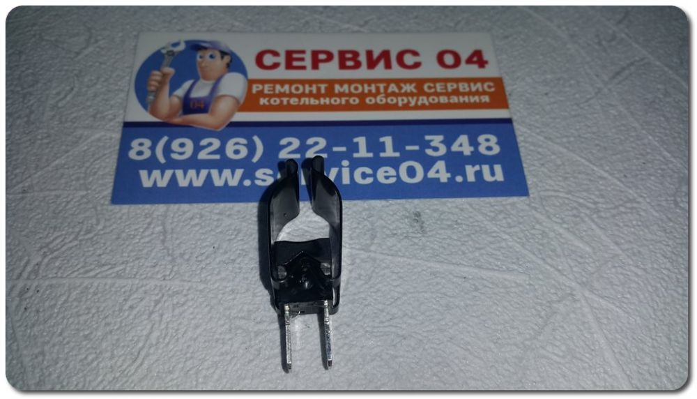
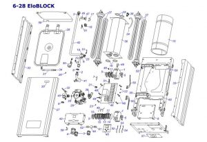

---
title: 'Запчасти для электрокотлов Protherm'
---

<section class="section">

<!-- Заголовок и введение -->

Экономичность и качество в каждой детали

<!-- Описание и преимущества -->

<figure class="image is-128x128 is-inline-block"></figure>

<h3 class="h5">Электрические котлы Скат Protherm</h3>

Линейка электрокотлов Protherm Skat относится к современным настенным системам отопления с высоким КПД, продуманной автоматикой и широким выбором оригинальных запчастей для обслуживания и ремонта.

<i class="bi bi-check-circle-fill text-success me-2"></i> Сертифицированные оригинальные детали.

<i class="bi bi-check-circle-fill text-success me-2"></i> Полная совместимость с оборудованием.

<i class="bi bi-check-circle-fill text-success me-2"></i> Выгодные цены для частных и корпоративных клиентов.

<i class="bi bi-check-circle-fill text-success me-2"></i> Гарантия качества на все запчасти.

<!-- Категории запчастей -->

<h3 class="h5 mb-4"><i class="bi bi-card-seam"></i> Категории запчастей</h3>

<h5 class="h6"><i class="bi bi-cpu text-primary"></i> Электронные компоненты</h5>
<ul>
<li><i class="bi bi-motherboard me-2"></i> Блоки автоматического управления и платы.</li>
<li><i class="bi bi-hdd-stack me-2"></i> Датчики давления, температуры, протока.</li>
<li><i class="bi bi-lightning-charge me-2"></i> Термостаты, термовыключатели.</li>
<li><i class="bi bi-plug me-2"></i> Контакторы, реле и клеммные колодки.</li>
</ul>

<h5 class="h6"><i class="bi bi-gear text-info"></i> Механические компоненты</h5>
<ul>
<li><i class="bi bi-thermometer-sun me-2"></i> Теплообменники и ТЭНы разных мощностей.</li>
<li><i class="bi bi-droplet me-2"></i> Расширительные баки и воздухоотводчики.</li>
<li><i class="bi bi-fan me-2"></i> Насосы отопления и комплектующие для обвязки.</li>
<li><i class="bi bi-wrench me-2"></i> Прокладки, крепёж и другие расходные материалы.</li>
</ul>

<!-- Каталог запчастей -->
<h3 class="h5 mb-4"><i class="bi bi-card-list"></i> Каталог запчастей</h3>

<!-- ТЭНы -->

ТЭНы
<figure class="image"></figure>

<h5 class="h6">ТЭНы различной мощности</h5>

0020094646 — ТЭН 3 кВт 0020094647 — ТЭН 6 кВт 0020094648 — ТЭН 7 кВт

Прокладка в комплекте.

<btn btn-primary class="btn btn-primary is-outlined is-primary btn-sm w-100"> <i class="bi bi-cart mr-1"></i> Заказать </btn btn-primary>

<!-- Клапаны -->

Клапаны
<figure class="image"></figure>

<h5 class="h6">Клапан предохранительный</h5>

0020094650

Обеспечивает сброс избыточного давления и защиту системы.

<btn btn-primary class="btn btn-primary is-outlined is-primary btn-sm w-100"> <i class="bi bi-cart mr-1"></i> Заказать </btn btn-primary>

<!-- Датчики -->

Датчики
<figure class="image"></figure>

<h5 class="h6">Датчик наружный 18 мм</h5>

0020035043

Модель JS3227/17 для погодозависимого управления.

<btn btn-primary class="btn btn-primary is-outlined is-primary btn-sm w-100"> <i class="bi bi-cart mr-1"></i> Заказать </btn btn-primary>

<!-- Показать все -->

<btn btn-primary class="btn btn-primary" data-target="allParts" aria-expanded="false"> <i class="bi bi-grid mr-1"></i> Показать все запчасти </btn btn-primary>

<!-- Схемы электрокотлов -->

<h3 class="h5 mb-4"><i class="bi bi-diagram-3"></i> Схемы электрокотлов Protherm</h3>

<ul>
<li class="is-active" data-target="skat11"><a>Скат 11</a></li>
<li data-target="skat13"><a>Скат 13</a></li>
<li data-target="eloblock"><a>EloBlock</a></li>
</ul>

<figure class="image"></figure>

<figure class="image"></figure>

<figure class="image"></figure>

<!-- Боковая панель -->

<!-- Преимущества покупки -->

<header class="card-header bg-primary text-white">

<i class="bi bi-star me-2"></i> Преимущества покупки у нас

</header>

 <i class="bi bi-patch-check"></i> 

<h5 class="h6">Оригинальные запчасти</h5>

Все комплектующие сертифицированы и адаптированы под котлы Protherm.

 <i class="bi bi-wallet2"></i> 

<h5 class="h6">Выгодные цены</h5>

Оптимальная стоимость без лишних посредников.

 <i class="bi bi-truck"></i> 

<h5 class="h6">Быстрая доставка</h5>

Отправка заказов в кратчайшие сроки по всей России.

 <i class="bi bi-shield-check"></i> 

<h5 class="h6">Гарантия качества</h5>

До 12 месяцев гарантии на запчасти при правильной установке.

<!-- Каталог для скачивания -->

 <i class="bi bi-file-earmark-pdf text-success" style="font-size: 2.5rem;"></i> 

<h4 class="h6">Полный каталог запчастей</h4>

Скачайте подробный каталог запчастей для электрокотлов Protherm в формате PDF.

<a href="https://service04.ru/zapchasti-dlja-ehlektrokotlov-protherm.html?file=files/img/zapchasti/Proterm/2/Ehlektrokotly%20Proterm%20SKAT.pdf" class="btn btn-success btn-sm"> <i class="bi bi-download mr-1"></i> Скачать каталог (2.9 МБ) </a>

<!-- Популярные модели -->

<header class="card-header">

<i class="bi bi-lightning me-2"></i> Популярные модели котлов

</header>

<ul>
<li class="d-flex is-justify-content-space-between mb-1">6K13 В наличии</li>
<li class="d-flex is-justify-content-space-between mb-1">9K13 В наличии</li>
<li class="d-flex is-justify-content-space-between mb-1">12K13 В наличии</li>
<li class="d-flex is-justify-content-space-between mb-1">18K13 В наличии</li>
<li class="d-flex is-justify-content-space-between mb-1">24K13 В наличии</li>
<li class="d-flex is-justify-content-space-between mb-1">14K13 Под заказ</li>
<li class="d-flex	is-justify-content-space-between mb-1">21K13 В наличии</li>
<li class="d-flex is-justify-content-space-between">28K13 В наличии</li>
</ul>

</section>