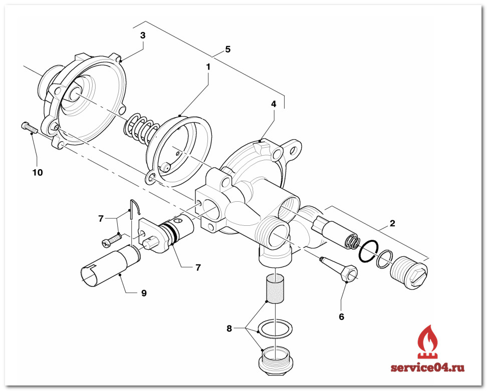
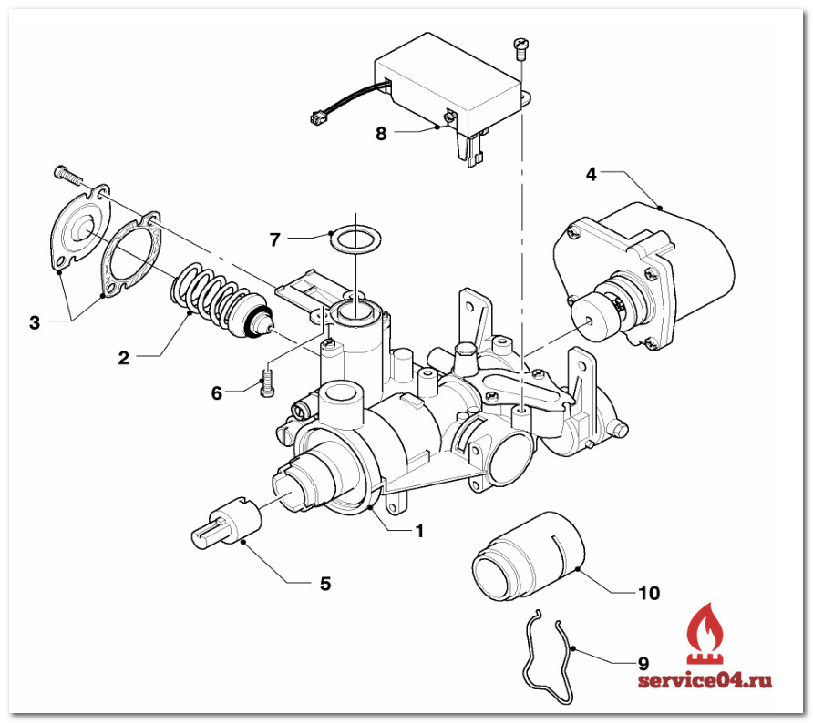
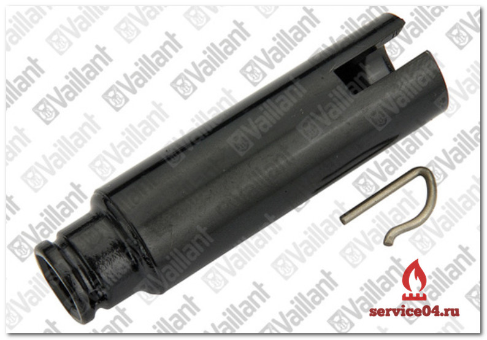

---
title: 'Запчасти для газовой колонки Vaillant AtmoMAG exclusiv 14-0 RXZ'
---

<!-- Заголовок и введение -->
<section class="hero mb-5">

<figure class="image is-inline-block mt-4"></figure>

Наличие запчастей — это залог качественного и быстрого ремонта. Наша фирма готова обеспечить полный перечень запчастей для колонки Vaillant, а также помочь с ремонтом.

В случае если вы сами производите ремонт, вы можете приобрести запчасти у нас на складе. У нас действует накопительная система скидок для мастеров специализированных фирм, а также для частных лиц.

</section>
<!-- Список компонентов с изображением -->

<figure class="image is-256x256"></figure>

<ul>
<li><strong>1 Датчик опрокидывания тяги</strong></li>
<li><strong>2 Предохранитель тяги</strong></li>
<li><strong>3 Теплообменник</strong></li>
<li><strong>4 Электрод розжига</strong></li>
<li><strong>5 Горелка</strong></li>
<li><strong>6 Тепловой предохранитель</strong></li>
<li><strong>7 Терморегулятор</strong></li>
<li><strong>8 Регулятор давления газа</strong></li>
<li><strong>9 Регулятор мощности</strong></li>
<li><strong>10 Газовая арматура</strong></li>
<li><strong>11 Запальная горелка</strong></li>
</ul>

<!-- Схемы -->

<figure class="image"></figure>

<figure class="image"></figure>

<figure class="image"></figure>

<figure class="image"></figure>

В нашем складе вы всегда можете купить запчасти для газовых колонок фирмы Vaillant. Запчасти находятся на оперативном складе в городе Москве, а также на основном складе в городе Серпухов.

<!-- Каталог запчастей -->

<h2 class="h4 display-4 text-center mb-5">Каталог запчастей для Vaillant AtmoMAG exclusiv 14-0 RXZ</h2>

<table class="table is-bordered is-striped w-100 is-hoverable">
<thead>
<tr class="text-center">
<th>ФОТО</th>
<th>Наименование</th>
<th>Артикул</th>
</tr>
</thead>
<tbody><!-- Пример одной строки (остальные можно добавить по аналогии) -->
<tr class="text-center">
<td>
<figure class="image is-96x96 mx-auto"></figure>
</td>
<td class="text-start"><a href="https://service04.ru/admin/edit-content/shop/zapchasti-dlya-vodonagrevatelej/kolonki-vaillant/vaillant-atmomag-exclusiv-14-0-rxi/0020206053_teploobmenik_staryy_061639" target="_blank" rel="noopener">0020206053 Теплообменник (старый 061639)</a></td>
<td>—</td>
</tr>
<tr class="text-center">
<td>
<figure class="image is-96x96 mx-auto"></figure>
</td>
<td class="text-start"><a href="https://service04.ru/admin/edit-content/shop/zapchasti-dlya-vodonagrevatelej/kolonki-vaillant/vaillant-atmomag-exclusiv-14-0-rxi/111718_membrana" target="_blank" rel="noopener">Vaillant артикул 111718 Мембрана</a></td>
<td>111718</td>
</tr>
<tr class="text-center">
<td>
<figure class="image is-96x96 mx-auto"></figure>
</td>
<td class="text-start"><a href="https://service04.ru/admin/edit-content/shop/zapchasti-dlya-vodonagrevatelej/kolonki-vaillant/vaillant-atmomag-exclusiv-14-0-rxi/115167_adapter" target="_blank" rel="noopener">Адаптер (вода) MAG14 115167</a></td>
<td>115167</td>
</tr>
<tr class="text-center">
<td>
<figure class="image is-96x96 mx-auto"></figure>
</td>
<td class="text-start"><a href="https://service04.ru/admin/edit-content/shop/zapchasti-dlya-vodonagrevatelej/kolonki-vaillant/vaillant-atmomag-exclusiv-14-0-rxi/115168_adapter" target="_blank" rel="noopener">Адаптер (газ) MAG14 115168</a></td>
<td>115168</td>
</tr>
<!-- Здесь можно добавить остальные строки по аналогии --></tbody>
</table>

<!-- Неисправности -->

<h2 class="h4 display-4 text-center mb-5">Неисправности (ошибки) газовой колонки Vaillant AtmoMAG 14-0/0 GRX H</h2>

<table class="table is-bordered w-100">
<thead>
<tr class="bg-dark text-white">
<th>Неисправность</th>
<th>Причина</th>
<th>Устранение</th>
</tr>
</thead>
<tbody>
<tr>
<td>Невозможно установить готовность к работе. Запальная горелка не включается.</td>
<td>
<ul class="mb-0">
<li>Прервана подача газа.</li>
<li>Воздух в трубопроводе.</li>
<li>Неисправно пьезоэлектрическое запальное устройство.</li>
</ul>
</td>
<td>
<ul class="mb-0">
<li>Восстановите подачу газа.</li>
<li>При использовании сжиженного газа: при необходимости замените пустой газовый баллон полным.</li>
<li>Убедитесь, что открыт запорный вентиль на газопроводе.</li>
</ul>
</td>
</tr>
<tr>
<td>Запальная горелка гаснет при отпускании регулятора мощности.</td>
<td>
<ul class="mb-0">
<li>Сработал или неисправен тепловой предохранитель.</li>
<li>Неисправен датчик тяги.</li>
<li>Недостаточное значение термо-ЭДС.</li>
</ul>
</td>
<td>
<ul class="mb-0">
<li>При необходимости замените термоэлемент.</li>
</ul>
</td>
</tr>
<tr>
<td>Запальная горелка горит, устройство не вводится в эксплуатацию. Основная горелка не зажигается.</td>
<td>
<ul class="mb-0">
<li>Закрыт вентиль холодной воды.</li>
</ul>
</td>
<td>
<ul class="mb-0">
<li>Убедитесь, что вентиль холодной воды открыт.</li>
<li>При необходимости очистите фильтр.</li>
</ul>
</td>
</tr>
<tr>
<td>Во время эксплуатации газовая колонка отключается.</td>
<td>
<ul class="mb-0">
<li>Неправильный монтаж (слишком короткая труба дымохода).</li>
<li>Отвод продуктов сгорания ограничен из-за перегрева.</li>
<li>Обрыв кабеля теплового предохранителя или датчика опрокидывания тяги.</li>
<li>Неисправен тепловой предохранитель или датчик опрокидывания тяги.</li>
</ul>
</td>
<td>
<ul class="mb-0">
<li>Проверьте правильность монтажа дымохода и отсутствие ограничений отвода продуктов сгорания.</li>
<li>При необходимости замените термоэлемент, ограничитель температуры или датчик опрокидывания тяги.</li>
<li>Если неисправность не устраняется — обратитесь в гарантийную службу.</li>
</ul>
</td>
</tr>
</tbody>
</table>

<!-- Форма и комментарии -->

[forms ID=2]

{jcomments on}

