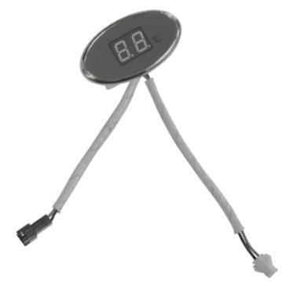
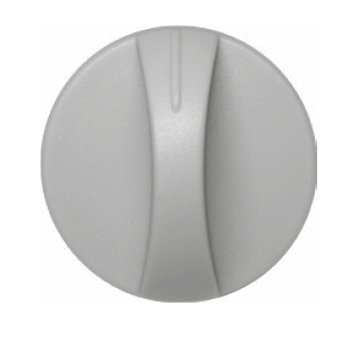
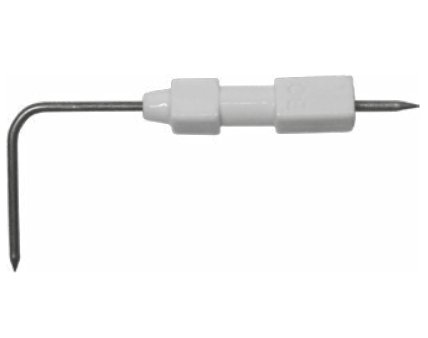
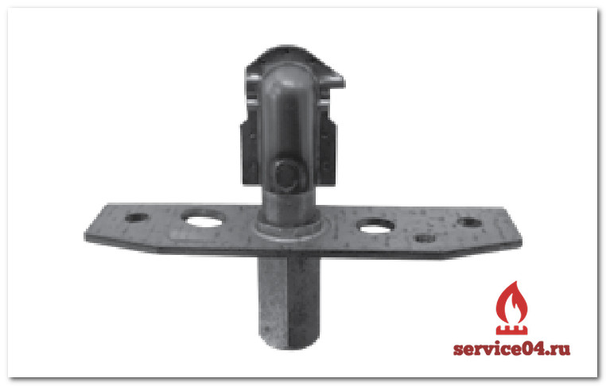
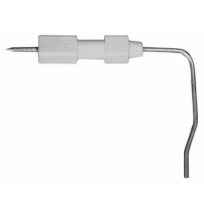
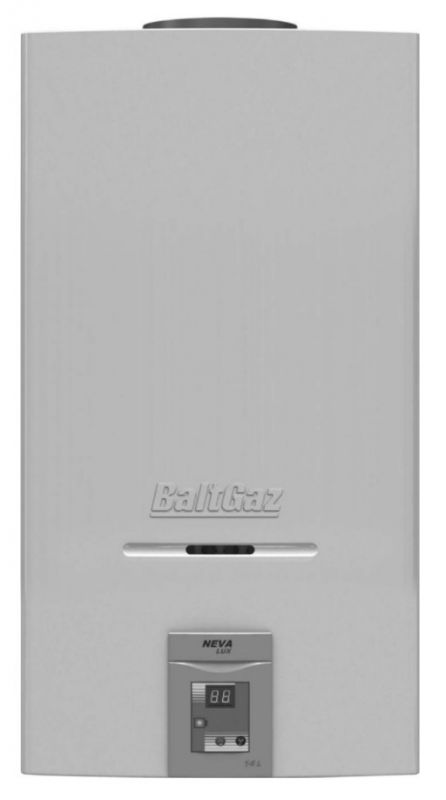
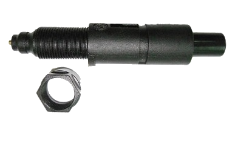
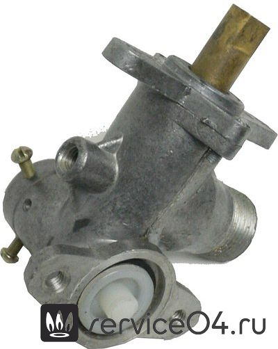
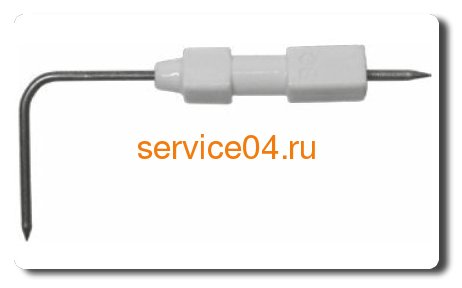

---
title: 'Схемы и запчасти для водонагревателей Neva'
---

<!-- Заголовок -->
<section class="bg-primary text-white fw-bold mb-5">

Визуальное руководство и перечень компонентов Neva Lux 5514

</section>
<!-- Вступление -->

Ниже представлены схемы расположения и перечень основных запасных частей и компонентов <strong>газовых водонагревателей Neva (Нева)</strong>, в частности, модели <strong>Neva Lux 5514</strong>. Используйте эту информацию для идентификации и подбора деталей при ремонте или обслуживании.

<h5 class="h6 mb-1"><i class="fas fa-info-circle me-2"></i>Важно!</h5>

Для точного подбора запчасти сверяйтесь с артикулом на схеме и технической документацией вашего водонагревателя. При сомнениях обратитесь к специалистам.

<!-- Аккордеон: Схемы компонентов -->

<header class="bg-info p-4 mb-4">
<h2 class="h4 display-4 mb-0 text-white"><i class="fas fa-list me-2"></i>Схемы компонентов водонагревателей Neva Lux 5514</h2>
</header><!-- 1. Основные компоненты -->

<i class="fas fa-border-all me-2"></i> 1. Основные компоненты

<table class="table is-bordered is-striped w-100">
<thead>
<tr>
<th>№</th>
<th>Изображение</th>
<th>Описание / Название</th>
</tr>
</thead>
<tbody>
<tr>
<td>8</td>
<td class="text-center">
<figure class="image"></figure>
</td>
<td>Дисплей 4710-03.102</td>
</tr>
<tr>
<td>9</td>
<td class="text-center">
<figure class="image"></figure>
</td>
<td>Ручка 4710-00.006</td>
</tr>
<tr>
<td>16</td>
<td class="text-center">
<figure class="image"></figure>
</td>
<td>Свеча 3227-02.130-01</td>
</tr>
<tr>
<td>14</td>
<td class="text-center">
<figure class="image"></figure>
</td>
<td>Тарелка со штоком 3227-02.300 VST3.4-0</td>
</tr>
<tr>
<td>15</td>
<td class="text-center">
<figure class="image"></figure>
</td>
<td>Горелка запальная 3295.07.30.000</td>
</tr>
<tr>
<td>20</td>
<td class="text-center">
<figure class="image"></figure>
</td>
<td>Свеча D-191</td>
</tr>
<tr>
<td>29</td>
<td class="text-center">
<figure class="image"></figure>
</td>
<td>Датчик наличия пламени 3227-02.140-01</td>
</tr>
<tr>
<td>13</td>
<td class="text-center">
<figure class="image"></figure>
</td>
<td>Датчик наличия пламени 3227-02.140-01</td>
</tr>
<tr>
<td><em>(Номер не указан)</em></td>
<td class="text-center">
<figure class="image"></figure>
</td>
<td>Мембрана</td>
</tr>
<tr>
<td><em>(Номер не указан)</em></td>
<td class="text-center">
<figure class="image"></figure>
</td>
<td>Узел водогазовый</td>
</tr>
<tr>
<td><em>(Номер не указан)</em></td>
<td class="text-center">
<figure class="image"></figure>
</td>
<td>Теплообменник</td>
</tr>
<tr>
<td><em>(Номер не указан)</em></td>
<td class="text-center">
<figure class="image"></figure>
</td>
<td>ЗАПАСНЫЕ ЧАСТИ ДЛЯ ВПГ NEVA-4511</td>
</tr>
<tr>
<td><em>(Номер не указан)</em></td>
<td class="text-center">
<figure class="image"></figure>
</td>
<td>Запчасти для колонки нева 6014</td>
</tr>
<tr>
<td><em>(Номер не указан)</em></td>
<td class="text-center">
<figure class="image"></figure>
</td>
<td>Электронный блок Нева</td>
</tr>
<tr>
<td><em>(Номер не указан)</em></td>
<td class="text-center">
<figure class="image"></figure>
</td>
<td>Ручка регулировки температуры/расхода воды G40-SP041</td>
</tr>
<!-- Пустые изображения без описания можно скрыть или удалить --></tbody>
</table>

<!-- 2. Гидроблок и арматура -->

<i class="fas fa-tint me-2"></i> 2. Гидроблок и арматура

<table class="table is-bordered is-striped w-100">
<thead>
<tr>
<th>№</th>
<th>Изображение</th>
<th>Описание / Название</th>
</tr>
</thead>
<tbody>
<tr>
<td>15</td>
<td class="text-center">
<figure class="image"></figure>
</td>
<td>Водяной клапан Neva Lux 5514</td>
</tr>
<tr>
<td><em>(Номер не указан)</em></td>
<td class="text-center">
<figure class="image"></figure>
</td>
<td>Свеча D-191</td>
</tr>
</tbody>
</table>

<!-- 3. Управление и регулировка -->

<i class="fas fa-sliders-h me-2"></i> 3. Управление и регулировка

<table class="table is-bordered is-striped w-100">
<thead>
<tr>
<th>№</th>
<th>Изображение</th>
<th>Описание / Название</th>
</tr>
</thead>
<tbody>
<tr>
<td><em>(Номер не указан)</em></td>
<td class="text-center">
<figure class="image"></figure>
</td>
<td>Накладка 85х200 (светло-серая, с защитной пленкой) 3227-07.010</td>
</tr>
<tr>
<td><em>(Номер не указан)</em></td>
<td class="text-center">
<figure class="image"></figure>
</td>
<td>Дисплей 3227-07.003</td>
</tr>
<tr>
<td><em>(Номер не указан)</em></td>
<td class="text-center">
<figure class="image"></figure>
</td>
<td>Ручка (D40) 3227-00.004</td>
</tr>
<tr>
<td><em>(Номер не указан)</em></td>
<td class="text-center">
<figure class="image"></figure>
</td>
<td>Блок управления электронный 3272-16.000</td>
</tr>
</tbody>
</table>

<!-- 4. Теплообменник -->

<i class="fas fa-border-all me-2"></i> 4. Теплообменник

<table class="table is-bordered is-striped w-100">
<thead>
<tr>
<th>№</th>
<th>Изображение</th>
<th>Описание / Название</th>
</tr>
</thead>
<tbody>
<tr>
<td><em>(Номер не указан)</em></td>
<td class="text-center">
<figure class="image"></figure>
</td>
<td>Теплообменник Neva Lux 5514</td>
</tr>
</tbody>
</table>

<!-- 5. Свеча и термореле -->

<i class="fas fa-bolt me-2"></i> 5. Свеча и термореле

<table class="table is-bordered is-striped w-100">
<thead>
<tr>
<th>№</th>
<th>Изображение</th>
<th>Описание / Название</th>
</tr>
</thead>
<tbody>
<tr>
<td>18</td>
<td class="text-center">
<figure class="image"></figure>
</td>
<td>Свеча 3227-02.130-01</td>
</tr>
<tr>
<td>18</td>
<td class="text-center">
<figure class="image"></figure>
</td>
<td>Термореле 90 0 С TF01-BLAE90A2</td>
</tr>
</tbody>
</table>

<!-- 6. 4510 М -->

<i class="fas fa-cogs me-2"></i> 6. 4510 М

<table class="table is-bordered is-striped w-100">
<thead>
<tr>
<th>Артикул</th>
<th>Описание / Название</th>
</tr>
</thead>
<tbody>
<tr>
<td>10299</td>
<td>Блок управления электронный (пр/газ) 3226-07.000</td>
</tr>
</tbody>
</table>

<!-- Призыв к действию -->

<h3 class="h4 display-4 mb-3"><i class="fas fa-shopping-cart me-2"></i>Нужна запчасть для водонагревателя Neva?</h3>

Свяжитесь с нами для подбора и заказа оригинальных комплектующих!

<a href="tel:+79262211348" class="btn btn-primary btn-lg w-100"> <i class="fas fa-phone me-2"></i>Позвонить </a>

<a href="https://service04.ru/contact-us/feedback" class="btn btn-primary btn-lg is-warning w-100 text-dark"> <i class="fas fa-envelope me-2"></i>Оставить заявку </a>

