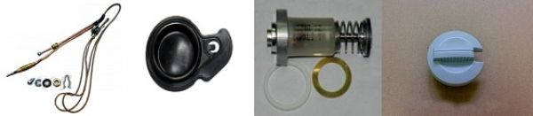

---
title: 'Запчасти для колонок Vaillant'
---

<!-- Заголовок -->

Оригинальные комплектующие для надежной работы вашего оборудования

<!-- Основное описание -->

Оригинальные <strong>запчасти для колонок Vaillant</strong> необходимо использовать в процессе всех ремонтов водогрейного оборудования от ведущего производителя. Применение качественных деталей/комплектующих продлевает срок эксплуатации техники, повышает КПД и значительно удешевляет весь комплекс работ по обслуживанию или ремонту.

<h5 class="alert-heading"><i class="fas fa-info-circle me-2"></i>Важно!</h5>

Заказывать и приобретать все необходимые детали у нас – это выгодно, удобно и полностью безопасно. Мастерам и частным лицам, которыми выбрана надежная и долговечная колонка Vaillant, запчасти мы подберем в считанные минуты, обеспечив гарантией производителя и продавца.

<!-- Преимущества -->

<h2 class="mb-0"><i class="fas fa-thumbs-up me-2"></i>Преимущества оригинальных запчастей Vaillant</h2>

Качественные <strong>запчасти для газовой колонки Vaillant</strong> обладают несколькими важными достоинствами в сравнении с подделками:

<ul>
<li class="mb-2"><i class="fas fa-shield-alt text-primary me-2"></i> <strong>Повышенный ресурс прочности</strong></li>
<li class="mb-2"><i class="fas fa-sync text-success me-2"></i> <strong>Детали/запчасти аналогичны</strong> тем, которые применяются в процессе конвейерной сборки на заводе-производителе</li>
</ul>

<ul>
<li class="mb-2"><i class="fas fa-plug text-warning me-2"></i> <strong>Полная совместимость</strong> с водогрейной техникой</li>
<li class="mb-2"><i class="fas fa-certificate text-danger me-2"></i> <strong>Гарантия производителя</strong> на каждую детали, независимо от размера</li>
</ul>

<h5 class="alert-heading"><i class="fas fa-exclamation-triangle me-2"></i>Рекомендация</h5>

Если выполняется ремонт или эксплуатируется <strong>газовая колонка Vaillant, запчасти купить</strong> рекомендуется исключительно оригинальные. Это не только упрощает и удешевляет процесс ремонта или ТО, но также гарантирует безопасную эксплуатацию водогрейного оборудования.

<!-- Модели -->

<h3 class="mb-0"><i class="fas fa-list me-2"></i>Запчасти для моделей Vaillant</h3>

<h5><i class="fas fa-fire text-danger me-2"></i> <a href="https://service04.ru/admin/edit-content/zapchasti-vaillant-mag-pro-oe-11-0-0-xz-c-h.html" class="text-decoration-none">Запчасти для газовой колонки Vaillant mag pro oe 11-0/0 xz c+ h</a></h5>

Полный каталог оригинальных запчастей для популярной модели

<h5><i class="fas fa-fire text-primary me-2"></i> <a href="https://service04.ru/admin/edit-content/zapchasti-dlja-gazovoj-kolonki-vaillant-atmomag-exclusiv-14-0-rxz.html" class="text-decoration-none" target="_blank" rel="noopener">Запчасти для газовой колонки Vaillant AtmoMAG exclusiv 14-0 RXI</a></h5>

Оригинальные комплектующие для премиальной модели

<!-- Схемы и изображения -->

<h4 class="mb-0"><i class="fas fa-project-diagram me-2"></i>Схемы газовых колонок Vaillant</h4>

Запасные части для газовых колонок Вайлант

Запасные части для газовых колонок Вайлант

<h5 class="alert-heading"><i class="fas fa-file-pdf me-2"></i>Схемы газовых колонок Vaillant</h5>

Подробные схемы устройства и расположения компонентов для точного подбора запчастей

<!-- Заказ -->

<h3 class="card-h3"><i class="fas fa-shopping-cart me-2"></i>Заказать запчасти для колонок Vaillant</h3>

Оригинальные комплектующие с гарантией

<a href="tel:+79262211348" class="btn btn-light btn-lg btn-block"> <i class="fas fa-phone me-2"></i>Позвонить </a>

<a href="https://service04.ru/contact-us/feedback" class="btn btn-warning btn-lg btn-block text-dark"> <i class="fas fa-envelope me-2"></i>Оставить заявку </a>

