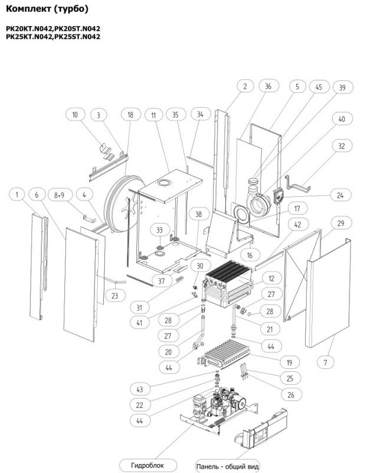
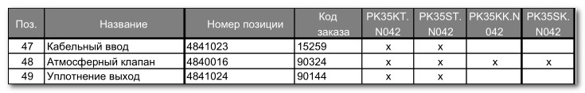

---
title: 'Запчасти для котлов Mora Sirius'
---

<!-- Заголовок -->
<section class="bg-primary text-white btn-sm mb-5">

Надежность и долговечность вашей системы отопления

</section>
<!-- Основное описание + галерея -->

Наша компания продает <strong>запчасти для котлов Mora Sirius в Москве с доставкой</strong>.

<figure class="image is-4by3"></figure>

<figure class="image is-4by3"></figure>

<figure class="image is-4by3"></figure>

<figure class="image is-4by3"></figure>

<figure class="image is-4by3"></figure>

<figure class="image is-4by3"></figure>

<figure class="image is-4by3"></figure>

<figure class="image is-4by3"></figure>

<figure class="image is-4by3"></figure>

<!-- прочие фото без подписей -->

<figure class="image is-4by3"></figure>

<figure class="image is-4by3"></figure>

<figure class="image is-4by3"></figure>

<figure class="image is-4by3"></figure>

<figure class="image is-4by3"></figure>

<figure class="image is-4by3"></figure>

<figure class="image is-4by3"></figure>

<!-- О котлах Mora Sirius -->

<header class="card-header bg-info text-white">

<i class="fas fa-question-circle me-2"></i> Запчасти для котлов Mora Sirius: надежность и долговечность вашей системы отопления

</header>

Котлы Mora Sirius зарекомендовали себя как надежное и эффективное решение для отопления домов и небольших коммерческих объектов, при правильном обслуживании сохраняя стабильную мощность и высокий КПД в течение многих сезонов. [web:296][web:308]

Для поддержания ресурса оборудования важно своевременно заменять изнашиваемые элементы и использовать подходящие по модели и типоразмеру запчасти. [web:296][web:308]

<!-- Какие запчасти чаще всего требуются -->

<header class="card-header bg-success text-white">

<i class="fas fa-list me-2"></i> Какие запчасти чаще всего требуются для котлов Mora Sirius?

</header>

<ol>
<li class="mb-3"><i class="fas fa-thermometer-half text-primary me-2"></i> <strong>Теплообменники</strong> — работают при высоких температурах и подвержены образованию накипи и коррозии, что со временем снижает теплоотдачу и может вызвать течи. [web:295][web:296]</li>
<li class="mb-3"><i class="fas fa-door-closed text-success me-2"></i> <strong>Дверцы и уплотнители</strong> — обеспечивают герметичность топки; уплотнительные шнуры пересыхают, а металл может деформироваться при перегреве. [web:296][web:308]</li>
<li class="mb-3"><i class="fas fa-border-all text-warning me-2"></i> <strong>Колосниковые решётки</strong> — испытывают прямой контакт с топливом и продуктами горения, поэтому постепенно прогорают и требуют замены. [web:296][web:308]</li>
<li class="mb-3"><i class="fas fa-sliders-h text-danger me-2"></i> <strong>Шиберы и заслонки</strong> — регулируют тягу и подачу воздуха; при длительной эксплуатации возможны деформация и заклинивание. [web:296][web:308]</li>
<li class="mb-3"><i class="fas fa-microchip text-info me-2"></i> <strong>Датчики и регуляторы температуры</strong> — отвечают за контроль режимов работы и могут выходить из строя из‑за перегрева или колебаний напряжения. [web:296][web:304]</li>
<li class="mb-3"><i class="fas fa-shield-alt text-muted me-2"></i> <strong>Термостаты и предохранительные клапаны</strong> — ключевые элементы безопасности, предотвращающие перегрев и избыточное давление в системе. [web:296][web:304]</li>
</ol>

<!-- Где купить оригинальные запчасти -->

<header class="card-header bg-warning text-dark">

<i class="fas fa-shopping-cart me-2"></i> Где купить оригинальные запчасти для Mora Sirius?

</header>

Для сохранения эффективности и безопасности котла рекомендуется использовать оригинальные детали или проверенные аналоги, одобренные производителем, поскольку неподходящие запчасти могут привести к перерасходу топлива и повышенному риску поломок. [web:296][web:304]

Приобрести комплектующие можно:

<ul>
<li class="mb-2"><i class="fas fa-check-circle text-success me-2"></i> В авторизованных сервисных центрах и у официальных партнёров бренда.</li>
<li class="mb-2"><i class="fas fa-check-circle text-success me-2"></i> У специализированных дилеров отопительного оборудования, работающих с котлами Mora.</li>
<li class="mb-2"><i class="fas fa-check-circle text-success me-2"></i> В интернет‑магазинах с подтверждённой репутацией и понятными условиями гарантии. [web:292]</li>
</ul>

<!-- Как продлить срок службы котла -->

<header class="card-header bg-secondary-dark">

<i class="fas fa-tools me-2"></i> Как продлить срок службы котла?

</header>

На ресурс котла Mora Sirius влияет качество топлива, режим эксплуатации и регулярность очистки, поэтому важно соблюдать рекомендации производителя по обслуживанию. [web:296][web:308]

<ul>
<li class="mb-2"><i class="fas fa-fire text-danger me-2"></i> Использовать рекомендованные виды топлива и избегать сырого или загрязнённого сырья. [web:296][web:308]</li>
<li class="mb-2"><i class="fas fa-broom text-warning me-2"></i> Регулярно очищать топку, колосники и дымоход от золы и сажи, особенно в интенсивный сезон. [web:296][web:308]</li>
<li class="mb-2"><i class="fas fa-search text-info me-2"></i> Периодически проверять состояние уплотнителей, дверец и регулировочных механизмов. [web:296][web:302]</li>
<li class="mb-2"><i class="fas fa-tachometer-alt text-primary me-2"></i> Контролировать давление и температуру в системе, своевременно устраняя отклонения от нормы. [web:298][web:310]</li>
</ul>

<!-- Заключение -->

<header class="card-header bg-primary text-white">

<i class="fas fa-lightbulb me-2"></i> Заключение

</header>

Котёл Mora Sirius при правильном обслуживании остаётся экономичным и надёжным источником тепла, а своевременная замена износившихся деталей помогает избежать аварийных остановок и дорогостоящего ремонта. [web:296][web:298]

<i class="fas fa-headset me-2"></i> Нужна помощь?

Если требуется подобрать конкретную запчасть или получить консультацию по ремонту, обратитесь к специалистам сервиса — это позволит выбрать оптимальное решение для вашей системы отопления. [web:304][web:310]

<!-- Контакты -->

<h3 class="h4 display-4"><i class="fas fa-phone me-2"></i> Свяжитесь с нами</h3>

Для заказа запчастей или консультации:

<a href="tel:+79262211348" class="btn btn-light btn-lg w-100"> <i class="fas fa-phone me-2"></i> +7 (926) 221‑13‑48 </a>

<a href="https://service04.ru/contact-us/feedback" class="btn btn-warning btn-lg w-100 text-dark"> <i class="fas fa-envelope me-2"></i> Написать нам </a>

