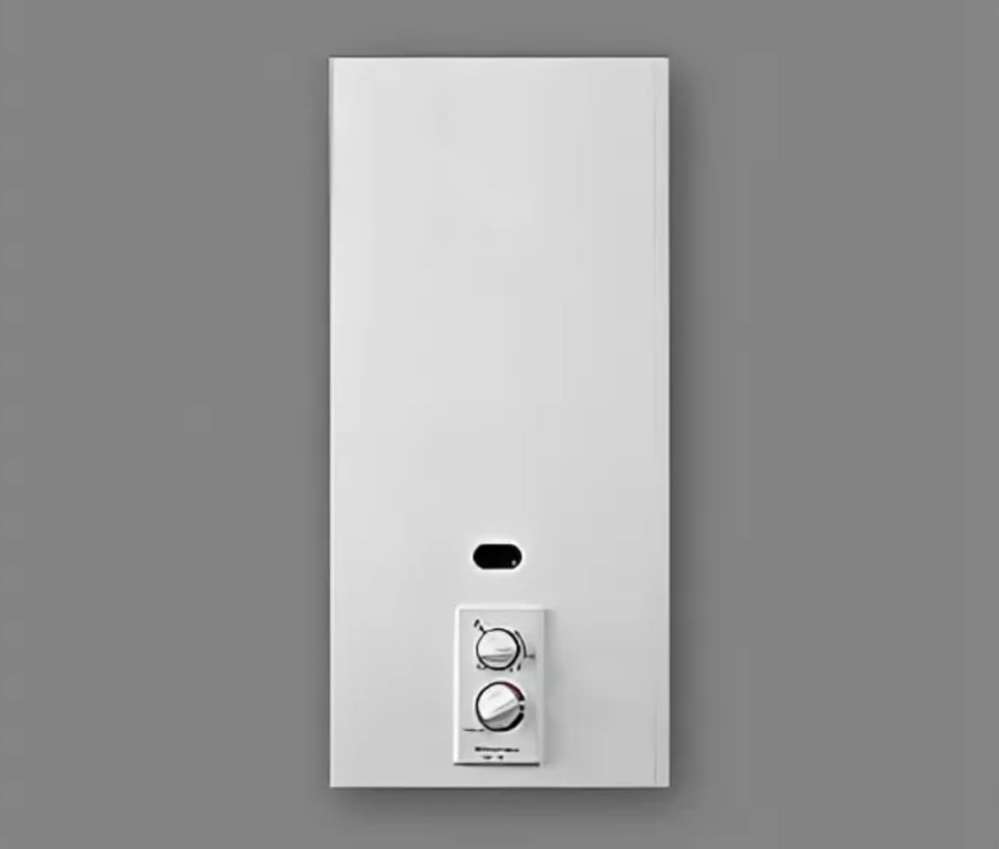

---
title: 'Electrolux GWH 275'
---

Если у вас установлена газовая колонка Electrolux GWH 275 и вам требуется качественная и надежная запчасть, вы попали по адресу. Мы предлагаем широкий ассортимент оригинальных запчастей, которые помогут вам поддерживать оптимальную работу вашей газовой колонки.

<a class="btn btn-primary" href="#">Заказать</a> <a class="btn btn-secondary ms-2" href="#h_8936165422111691572349228">Список запчастей</a>

Наша фирма  предлагает купить запчасти для газовой колонки  Electrolux 275 (Электролюкс). В продаже оригинальные запасные части из Швеции, а так же  детали от альтернативных производителей, чья продукция получила хорошие отзывы специалистов по ремонту бытовой техники. 

Мы гарантируем быструю доставку и профессиональную установку. Кроме того, мы предоставляем гарантию на все наши запчасти. Не рискуйте своим комфортом и безопасностью, обращайтесь к нам за запчастями для вашей газовой колонки Electrolux GWH-275!  Мы всегда готовы помочь вам!

Наличие собственного склада запчастей позволяет организовать отправку деталей в срок от 1 дня. При отсутствии модели или нужного количества товара мы закажем недостающие запчасти у производителя. Средний срок поставки 2-4 дня.

<h3>Почему стоит выбрать оригинальные запчасти для газовой колонки Electrolux ?</h3>

<h2></h2>
<h2>Гарантированное качество:</h2>

Гарантированное качество Оригинальные запчасти, специально разработанные для модели GWH 250-275, обеспечивают надежность и долговечность вашей газовой колонки. Вы можете быть уверены, что каждая запчасть соответствует высоким стандартам качества Electrolux.

<h2></h2>
<h2>Идеальная совместимость:</h2>

Идеальная совместимость: Оригинальные запчасти точно соответствуют техническим требованиям вашей газовой колонки Electrolux GWH 275. Это гарантирует идеальную совместимость и эффективную работу системы.

<h2></h2>
<h2>Простота установки:</h2>

Простота установки: Запчасти Electrolux GWH 275 разработаны с учетом простоты установки и замены. Вы сможете легко установить новую запчасть без необходимости обращаться к специалистам.

<h2></h2>
<h2>Долговечность и надежность:</h2>

Оригинальные запчасти Electrolux обладают высокой надежностью и долговечностью. Они способны выдерживать интенсивное использование и обеспечивать длительный срок службы вашей газовой колонки.

<h2></h2>
<h2>Гарантия производителя:</h2>

При покупке оригинальных запчастей Electrolux GWH 275 вы получаете гарантию от производителя. Это дает вам дополнительное спокойствие и уверенность в качестве приобретенных компонентов.

Приобретая оригинальные запчасти для вашей газовой колонки Electrolux GWH 275, вы обеспечиваете ее оптимальную работу и продлеваете ее срок службы. Уверенность в качестве и надежности вашей системы - вот что вы получаете с оригинальными запчастями Electrolux. Не откладывайте замену неисправных компонентов и обращайтесь к проверенным поставщикам оригинальных запчастей для газовой колонки Electrolux GWH 275.

<h4 id="h_8936165422111691572349228">Список запчастей</h4>

001 001 255903 1 блок Крышка 001 002 255863 1 Поддержка pacellish 001 003 255848 1 Теплообменник 001 005 255850 1 отклонитель тяги 001 006 255928 1 уплотнение шайбы 001 100 255849 1 пружинная крышка 001 108 255847 1 база 001 109 255935 1 винт спереди 001 113 255937 1 запись поддержки 001 115A 255852 1 Поддержка c.калде.р 001 115B 255851 1 c поддержкой. слева 001 116A 255864 1 пружина c.кэлд.р 001 116B 255941 1 пружина c.кэлд.л 001 140 255872 1 винт базы

002 001 255893 1 Винт M5 002 040 255856 1 блок клапанов гидравлический Кнопка 002 043 255909 *диск 2 002 050 255912 *2 Protector upr.ассд. 002 052 255908 *2 мембрана 002 053 255857 *2 Регулятор воды assd 002 054 255904 *2 Весна 002 059 255906 *2 Уплотнительное Кольцо 002 060 255936 *2 селектор Spigot 002 061 255914 *2 рычаг выдвижения 002 067 255925 *2 фильтр для воды 002 122 255910 *2 верхняя часть тела

004 001 255854 1 блок клапанов газ 004 002A 255861 *2 рычаг газа 004 002B 255862 *2 рычаг воды 004 003 255913 *2 рычаг выдвижения 004 004 255915 *2 Шайба 004 030 255933 1 Крышка asspacled 004 031 255926 1 Винт M4x10 004 032 255917 1 печать 004 033 255927 1 регулируемая шайба nat. D: 5 НГ 004 050 255899 1 лоток слева 004 051 255900 1 лоток справа 004 052 255901 1 сцепление 004 060 255853 1 блок конфорок 004 061 255916 1 Винт M4x25 004 070 255876 1 дистрибьютор полный 004 071 255938 1 форсунка горелки D: 1,18 мм

005 068 255920 1 пилот поддержку 005 070 255918 1 Пьезо головка 005 072 255932 1 пьезо ниже 005 076 255905 1 Гайка 005 077 255921 1 контакт с головкой 005 078 255940 1 ограничитель термопары 005 079 255919 1 пилотный инжектор d=0,32 мм 005 080 255922 1 Тефлон Уплотнения 005 081 255934 1 Пробирка 005 082 255911 1 Шайба пластиковая 005 091 255930 1 кабель piezoelect 005 114 255939 1 piezoelect поддержку 005 121 255902 1 Термостат TTB 65°C 005 148 255894 1 Поддержка low. 

<h5>Если вам нужна консультация. Подготовьте информацию о вашей колонке перед звонком</h5>

Модель вашей газовые колонки Электролюкс вы можете узнать в документах который выдавались вам при покупке, если документы на ваш газовый водонагреватель не сохранились. Так же модель можно узнать заглянув под газовую колонку там вы обнаружите наклейку с наименованием модели вашей колонки

