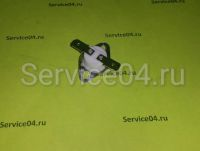
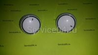
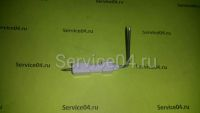
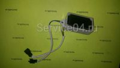
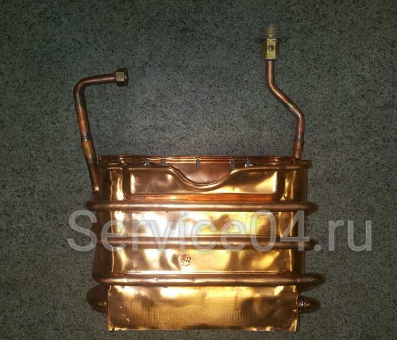
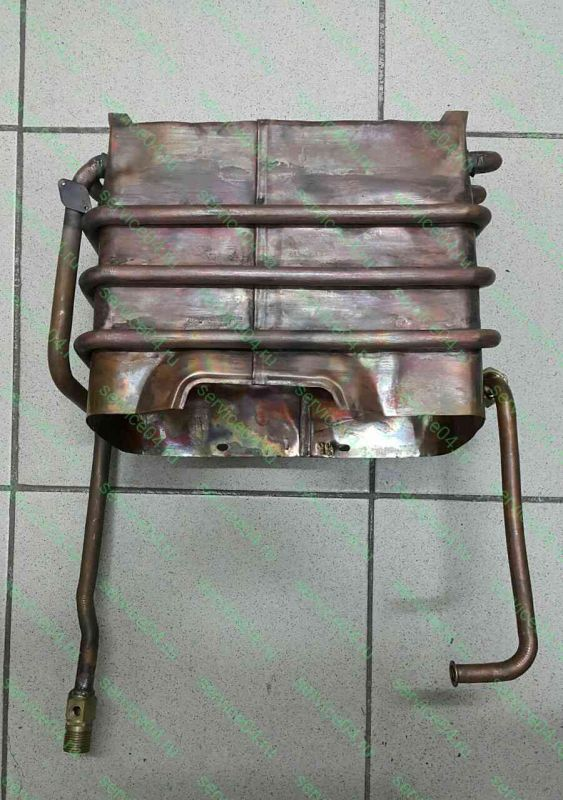
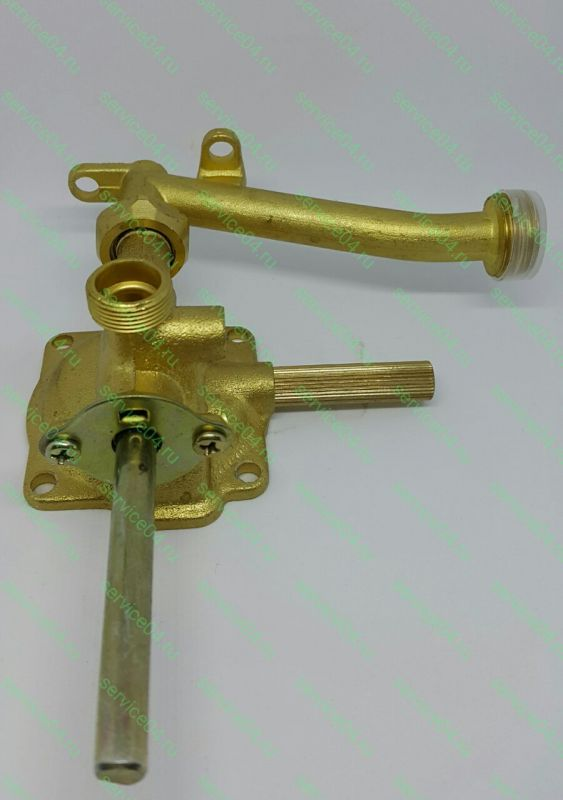

---
title: 'Запчасти, детали и расходные материалы для газовой колонки Electrolux GWH 265 ERN Nano Plus'
---

<!-- Заголовок и введение -->
<section class="bg-light mb-5">

Газовые колонки GWH 265 ERN Nano Plus от шведского концерна «Electrolux» – самое надежное, производительное и безопасное оборудование в своем классе. Но низкое качество воды, резкие скачки напряжения при отсутствии стабилизатора, ошибки пользователей являются причиной ремонта водонагревателя с использованием оригинальных запасных частей.

<figure class="image is-256x256 mx-auto"></figure>

</section>
<!-- Преимущества оригинальных запчастей -->

<h2 class="h4 display-4 has-text-weight-bold has-text-orange" style="border-bottom: 2px solid #e37a25; padding-bottom: 0.5rem;">Преимущества оригинальных запчастей</h2>

Запасные части, детали и узлы для газовой колонки серии GWH 265 ERN NanoPlus пользуются повышенным спросом, так как оборудование активно эксплуатируется в квартирах и частных домах. При необходимости ремонта проточного водонагревателя мастера рекомендуют покупать только оригинальные запчасти/детали, которые имеют массу достоинств перед аналоговой продукцией:

<ul class="mt-3">
<li>Точность размеров запчасти, а также патрубков, шайб, разъемов и иных монтажных элементов;</li>
<li>Полная совместимость – при модернизации колонки производитель адаптирует каждую деталь, которая идеально выполняет свою функцию;</li>
<li>Безопасность – никаких протечек газа и воды с рисками взрыва бытового метана;</li>
<li>Доступность – стоимость оригинальной запчасти немного выше, чем расценки на аналог. Но в результате получается значительная экономия, так как деталь/запчасть обязательно подойдет по размеру и прослужит в несколько раз дольше.</li>
</ul>

При малейших неисправностях или при необходимости планового ТО колонки GWH 265 ERN NanoPlus важно приобрести оригинальные запчасти или сертифицированные и указанные в каталоге производителя аналоги.

<!-- Галерея -->

<figure class="image"></figure>

<figure class="image"></figure>

<figure class="image"></figure>

<figure class="image"></figure>

<figure class="image"></figure>

<figure class="image"></figure>

<!-- Описание категорий запчастей -->

<h3 class="h5 has-text-orange" style="text-transform: uppercase;">ОТ КРЕПЕЖА ДО ТЕПЛООБМЕННИКА – ВСЕ ОРИГИНАЛЬНЫЕ ЗАПЧАСТИ ДЛЯ РЕМОНТА И ТО КОЛОНКИ</h3>

В каталоге нашей компании можно быстро подобрать и купить все запчасти, которые необходимы для ремонта и технического обслуживания газовых колонок GWH 265 ERN NanoPlus от Electrolux. Независимо от состояния оборудования и сложности поломки вы можете купить запчасти, которые идеально подойдут для вашей техники:

<ul class="mt-3">
<li>Газоводяные блоки и водяная система;</li>
<li><a href="https://service04.ru/admin/edit-content/teploobmennik-electrolux-gwh-265-ern-nanoplus.html">Теплообменники/камеры сгорания</a>;</li>
<li>Блоки и электроды розжига, запальники и трубы к ним;</li>
<li>Пресостаты, микровыключатели;</li>
<li>Термопары, ограничители температуры, датчики и контроллеры;</li>
<li>Электромагнитные, газовые клапаны;</li>
<li>Мембраны, крышки водяного блока, элементы корпуса;</li>
<li>Панели/платы управления, защитная автоматика;</li>
<li>Расходные материалы, крепеж, ремкомплекты и др.</li>
</ul>

Подобрать необходимую запчасть, сделать заказ или оформить индивидуальную заявку на доставку редкой/отсутствующей позиции помогут опытные инженеры нашей компании. Каждый клиент оценит выгоду сотрудничества, так как мы:

<ul class="mt-3">
<li>Предлагаем доступные цены розничным покупателям;</li>
<li>Осуществляем быструю доставку и сертифицированный ремонт колонок GWH 265 ERN NanoPlus;</li>
<li>Разработали особые условия сотрудничества для корпоративных и оптовых заказчиков.</li>
</ul>

<!-- Таблица запчастей -->

<h4 class="h5 text-center mb-4">Популярные запчасти для Electrolux GWH 265 ERN Nano Plus</h4>

<table class="table is-bordered is-striped w-100 is-hoverable">
<tbody>
<tr>
<td class="text-center">
<figure class="image is-128x128 mx-auto"></figure>
</td>
<td><a href="https://service04.ru/admin/edit-content/teploobmennik-electrolux-gwh-265-ern-nanoplus.html">Теплообменник Electrolux GWH 265 ERN NanoPlus</a></td>
</tr>
<tr>
<td class="text-center">
<figure class="image is-128x128 mx-auto"></figure>
</td>
<td>Датчик дымовых газов</td>
</tr>
<tr>
<td class="text-center">
<figure class="image is-128x128 mx-auto"></figure>
</td>
<td>Датчик перегрева теплообменника</td>
</tr>
<tr>
<td class="text-center">
<figure class="image is-128x128 mx-auto"></figure>
</td>
<td>Ручка регулировки</td>
</tr>
<tr>
<td class="text-center">
<figure class="image is-128x128 mx-auto"></figure>
</td>
<td>Блок розжига</td>
</tr>
<tr>
<td class="text-center">
<figure class="image is-128x128 mx-auto"></figure>
</td>
<td>Электрод розжига</td>
</tr>
<tr>
<td class="text-center">
<figure class="image is-128x128 mx-auto"></figure>
</td>
<td>Электрод ионизации</td>
</tr>
<tr>
<td class="text-center">
<figure class="image is-128x128 mx-auto"></figure>
</td>
<td>Бокс для батареек</td>
</tr>
<tr>
<td class="text-center">
<figure class="image is-128x128 mx-auto"></figure>
</td>
<td>Датчик температуры</td>
</tr>
<tr>
<td class="text-center">
<figure class="image is-128x128 mx-auto"></figure>
</td>
<td>Дисплей</td>
</tr>
<tr>
<td class="text-center">
<figure class="image is-128x128 mx-auto"></figure>
</td>
<td>

<a href="https://service04.ru/admin/edit-content/shop/zapchasti-dlya-vodonagrevatelej/electrolux6344285/electrolux-gwh-265/shtok-salnik-vodjanogo-uzla-electrolux-gwh-265-ern-nano-plus">Шток (сальник) Водяного узла Electrolux GWH 265 ERN Nano Plus</a>

<a href="https://service04.ru/admin/edit-content/shop/zapchasti-dlya-vodonagrevatelej/electrolux6344285/electrolux-gwh-265/shtok-salnik-vodjanogo-uzla-electrolux-gwh-265-ern-nano-plus" class="btn btn-primary btn-sm is-link">КУПИТЬ</a>

</td>
</tr>
<tr>
<td class="text-center">
<figure class="image is-128x128 mx-auto"></figure>
</td>
<td>

<a href="https://service04.ru/admin/edit-content/shop/zapchasti-dlya-vodonagrevatelej/electrolux6344285/electrolux-gwh-265/pravaja-chast-vodjanogo-uzla-electrolux-gwh-265-ern-nano-plus">Правая часть Водяного узла Electrolux GWH 265 ERN Nano Plus</a>

<a href="https://service04.ru/admin/edit-content/shop/zapchasti-dlya-vodonagrevatelej/electrolux6344285/electrolux-gwh-265/pravaja-chast-vodjanogo-uzla-electrolux-gwh-265-ern-nano-plus" class="btn btn-primary btn-sm is-link">КУПИТЬ</a>

</td>
</tr>
<tr>
<td class="text-center">
<figure class="image is-128x128 mx-auto"></figure>
</td>
<td>

<a href="https://service04.ru/admin/edit-content/shop/zapchasti-dlya-vodonagrevatelej/electrolux6344285/electrolux-gwh-265/levaja-chast-vodjanogo-uzla-electrolux-gwh-265-ern-nano-plus">Левая часть Водяного узла Electrolux GWH 265 ERN Nano Plus</a>

<a href="https://service04.ru/admin/edit-content/shop/zapchasti-dlya-vodonagrevatelej/electrolux6344285/electrolux-gwh-265/levaja-chast-vodjanogo-uzla-electrolux-gwh-265-ern-nano-plus" class="btn btn-primary btn-sm is-link">КУПИТЬ</a>

</td>
</tr>
</tbody>
</table>

