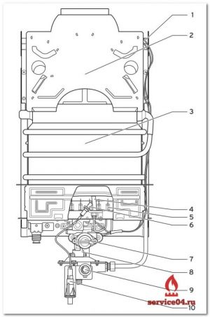
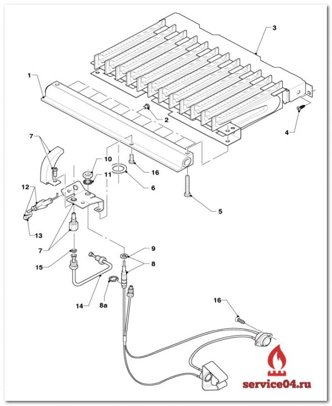
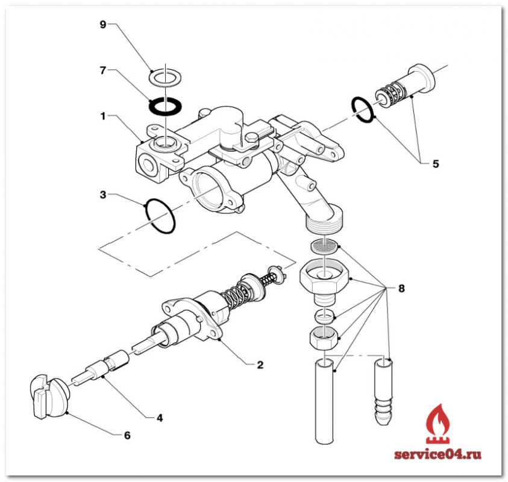
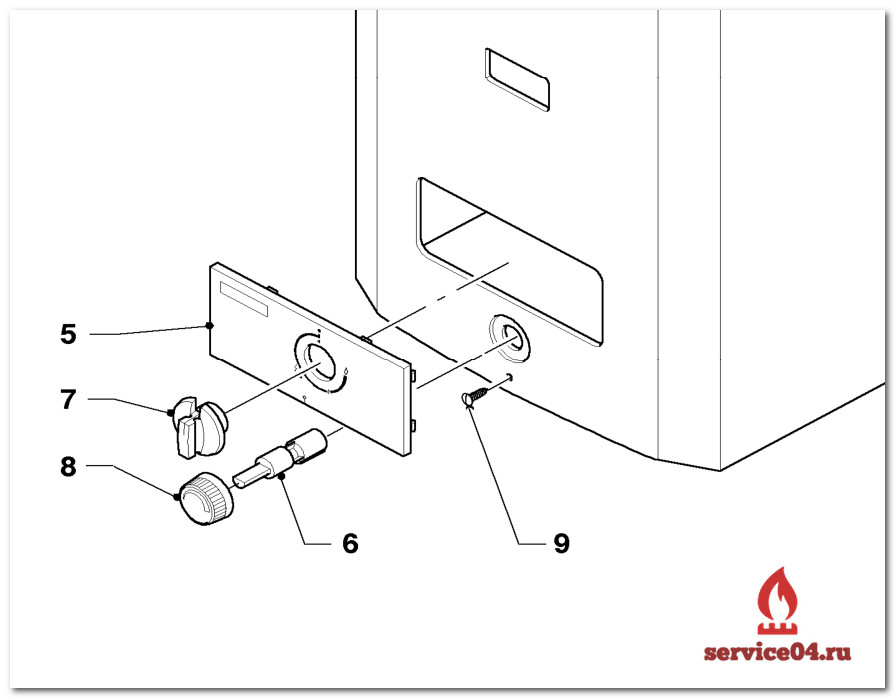
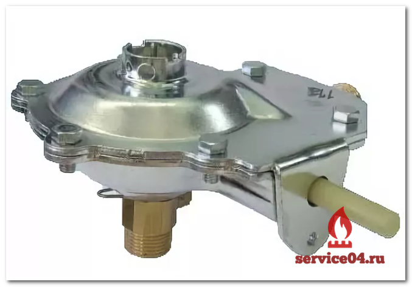
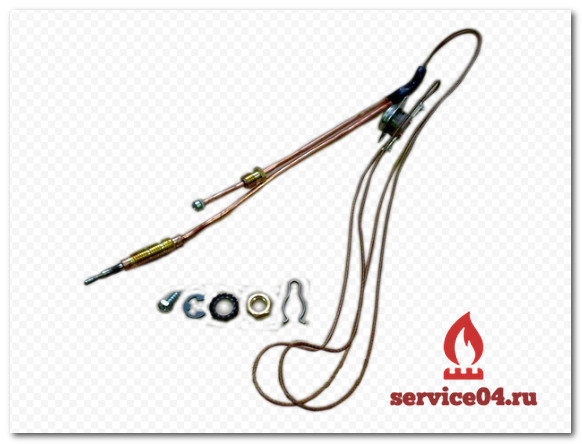
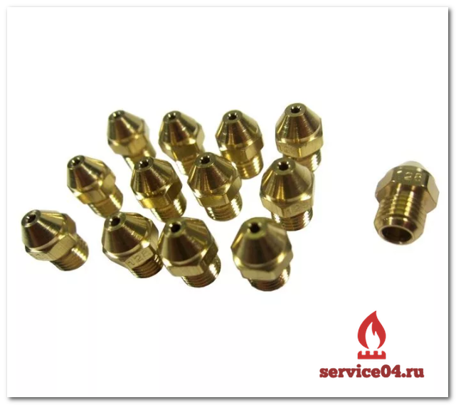

---
title: 'Запчасти для газовой колонки Vaillant Mag Pro OE 11-0/0 XZ C+ H'
---

<!-- Заголовок -->
<section class="bg-primary text-white mb-5">

Оригинальные комплектующие для вашей колонки Vaillant

</section>
<!-- Введение / Изображение колонки -->

<figure class="image is-inline-block mb-4"></figure>

Запчасти vaillant mag pro oe 11-0/0 xz c+ h

<!-- Основные компоненты -->

<h2 class="h4 display-4 mb-0"><i class="fas fa-cogs me-2"></i>Основные компоненты колонки Vaillant Mag Pro</h2>

<figure class="image is-256x256 mx-auto"></figure>

<ol class="d-flex flex-col gap">
<li class="p-3 bg-white">Датчик опрокидывания тяги</li>
<li class="p-3 bg-white">Предохранитель тяги</li>
<li class="p-3 bg-white">Теплообменник</li>
<li class="p-3 bg-white">Запальная горелка</li>
<li class="p-3 bg-white">Горелка</li>
<li class="p-3 bg-white">Электрод розжига</li>
<li class="p-3 bg-white">Регулятор мощности</li>
<li class="p-3 bg-white">Газовая арматура</li>
<li class="p-3 bg-white">Терморегулятор</li>
<li class="p-3 bg-white">Кнопка пьезорозжига</li>
</ol>

<!-- Элементы колонки (доп. изображения) -->

<h3 class="h5 mb-0 text-dark"><i class="fas fa-images me-2"></i>Элементы газовой колонки Vaillant</h3>

<figure class="image is-128x128 mx-auto mb-2"></figure>
<small>Водяная арматура</small>

<figure class="image is-128x128 mx-auto mb-2"></figure>
<small>Горелка</small>

<figure class="image is-128x128 mx-auto mb-2"></figure>
<small>Газовый клапан</small>

<figure class="image is-128x128 mx-auto mb-2"></figure>
<small>Теплообменник</small>

<figure class="image is-128x128 mx-auto mb-2"></figure>
<small>Ручки управления</small>

<!-- Список запчастей -->

<h4 class="h5 mb-0"><i class="fas fa-list me-2"></i>Список запчастей к газовым колонкам Vaillant Mag 11</h4>

Купить или заказать оборудование к колонкам Vaillant Mag 11 в сервисном центре Vaillant вы можете по телефону компании: <strong><a href="tel:+79262211348" class="has-text-link">+79262211348</a></strong>

<table class="table is-bordered is-striped w-100 is-hoverable">
<thead>
<tr class="text-center">
<th>Фото</th>
<th>Наименование и артикул</th>
</tr>
</thead>
<tbody>
<tr>
<td class="text-center">
<figure class="image is-100x100 mx-auto"></figure>
</td>
<td><a href="https://service04.ru/admin/edit-content/shop/zapchasti-dlya-vodonagrevatelej/kolonki-vaillant/vaillant-mag-oe-11-0-0-xz-c-h/011286_vodyanoy_uzel" target="_blank" rel="noopener">Водяной узел MAG11,19/2</a> <strong>Артикул:</strong> 011286 Водяная часть для колонки Vaillant MAG 11 / 19</td>
</tr>
<tr>
<td class="text-center">
<figure class="image is-100x100 mx-auto"></figure>
</td>
<td><a href="https://service04.ru/admin/edit-content/shop/zapchasti-dlya-vodonagrevatelej/kolonki-vaillant/vaillant-mag-oe-11-0-0-xz-c-h/0020008182_termoelement" target="_blank" rel="noopener"><strong>Термоэлемент для MAG 11 C+ 20008182 Vaillant</strong></a></td>
</tr>
<tr>
<td class="text-center">
<figure class="image is-100x100 mx-auto"></figure>
</td>
<td><a href="https://service04.ru/admin/edit-content/shop/zapchasti-dlya-vodonagrevatelej/kolonki-vaillant/vaillant-mag-oe-11-0-0-xz-c-h/053409_gazovaya_armatura" target="_blank" rel="noopener">Газовая арматура, (клапан) компл. MAG19с+</a> <strong>Артикул:</strong> 053409</td>
</tr>
<tr>
<td class="text-center">
<figure class="image is-100x100 mx-auto"></figure>
</td>
<td><a href="https://service04.ru/admin/edit-content/shop/zapchasti-dlya-vodonagrevatelej/kolonki-vaillant/vaillant-mag-oe-11-0-0-xz-c-h/0020006834__komplekt_perenastroyki_dlya_MAG_pr" target="_blank" rel="noopener">Комплект для перехода на сжиженный газ (форсунки) MAG11</a> <strong>Артикул:</strong> 0020006834</td>
</tr>
<tr>
<td class="text-center">
<figure class="image is-100x100 mx-auto"></figure>
</td>
<td><a href="https://service04.ru/admin/edit-content/shop/zapchasti-dlya-vodonagrevatelej/kolonki-vaillant/vaillant-mag-oe-11-0-0-xz-c-h/010366_membrana_10sht" target="_blank" rel="noopener">Мембрана, MAG19с+,11</a> <strong>Артикул:</strong> 010366</td>
</tr>
<tr>
<td class="text-center">
<figure class="image is-100x100 mx-auto"></figure>
</td>
<td><a href="https://service04.ru/admin/edit-content/shop/zapchasti-dlya-vodonagrevatelej/kolonki-vaillant/vaillant-mag-oe-11-0-0-xz-c-h/0020008166_pervichnyy_teploobmennik" target="_blank" rel="noopener">Огневая камера Теплообменник Vaillant MAG11,19/2</a> <strong>Артикул:</strong> 0020008166</td>
</tr>
<tr>
<td class="text-center">
<figure class="image is-100x100 mx-auto"></figure>
</td>
<td><a href="https://service04.ru/admin/edit-content/shop/zapchasti-dlya-vodonagrevatelej/kolonki-vaillant/vaillant-mag-oe-11-0-0-xz-c-h/091081_ustroystvo_pezo-rozjiga" target="_blank" rel="noopener">Пьезорозжиг (Кнопка) MAG19/2, 11</a> <strong>Артикул:</strong> 091081</td>
</tr>
<tr>
<td class="text-center">
<figure class="image is-100x100 mx-auto"></figure>
</td>
<td><a href="https://service04.ru/admin/edit-content/shop/zapchasti-dlya-vodonagrevatelej/kolonki-vaillant/vaillant-mag-oe-11-0-0-xz-c-h/0020008164_ruchka" target="_blank" rel="noopener">Ручка MAG11 (вода)</a> <strong>Артикул:</strong> 0020008164</td>
</tr>
<tr>
<td class="text-center">
<figure class="image is-100x100 mx-auto"></figure>
</td>
<td><a href="https://service04.ru/admin/edit-content/shop/zapchasti-dlya-vodonagrevatelej/kolonki-vaillant/vaillant-mag-oe-11-0-0-xz-c-h/0020008163_ruchka" target="_blank" rel="noopener">Ручка MAG11 (газ)</a> <strong>Артикул:</strong> 0020008163</td>
</tr>
<tr>
<td class="text-center">
<figure class="image is-100x100 mx-auto"></figure>
</td>
<td><a href="https://service04.ru/admin/edit-content/shop/zapchasti-dlya-vodonagrevatelej/kolonki-vaillant/vaillant-mag-oe-11-0-0-xz-c-h/090719_elektrod_rozjiga" target="_blank" rel="noopener">Электрод MAG11, 19с+</a> <strong>Артикул:</strong> 090719</td>
</tr>
</tbody>
</table>

<!-- Неисправности -->

<h2 class="h4 display-4 mb-0"><i class="fas fa-exclamation-triangle me-2"></i>Неисправности (ошибки) газовой колонки Vaillant Mag Pro OE 11-0/0 XZ C+ H</h2>

<strong>Важно:</strong> Приведенные ниже неисправности разрешается устранять только квалифицированному специалисту, аттестованному фирмой Vaillant.

Для ремонтных работ используйте только оригинальные запасные части. Убедитесь в правильном монтаже детали, а также в соблюдении их первоначального положения и направления.

<i class="fas fa-skull-crossbones mr-1"></i> <strong>Опасность отравления угарным газом!</strong> В случае повреждения датчика опрокидывания тяги и частично или полностью засоренной трубе дымохода при длительных неблагоприятных условиях тяги в дымовой трубе отходящие газы бесконтрольно выходят из дымовой трубы в помещение.

<table class="table is-bordered w-100">
<thead>
<tr class="bg-dark text-white">
<th>Неисправность</th>
<th>Причина</th>
<th>Устранение</th>
</tr>
</thead>
<tbody>
<tr>
<td><strong>Невозможно установить готовность к работе. Запальная горелка не включается.</strong></td>
<td>
<ul class="mb-0">
<li>Прервана подача газа.</li>
<li>Воздух в трубопроводе.</li>
<li>Неисправно пьезоэлектрическое устройство розжига.</li>
</ul>
</td>
<td>
<ul class="mb-0">
<li>Восстановите подачу газа.</li>
<li>При использовании сжиженного газа: при необходимости замените пустой газовый баллон полным.</li>
<li>Убедитесь, что открыт запорный вентиль на газопроводе.</li>
</ul>
</td>
</tr>
<tr>
<td><strong>Запальная горелка гаснет при отпускании регулятора мощности.</strong></td>
<td>
<ul class="mb-0">
<li>Неисправен датчик опрокидывания тяги.</li>
<li>Недостаточное значение термо-ЭДС.</li>
</ul>
</td>
<td>
<ul class="mb-0">
<li>При необходимости замените весь термоэлемент.</li>
</ul>
</td>
</tr>
<tr>
<td><strong>Запальная горелка горит, устройство не вводится в работу.</strong></td>
<td>
<ul class="mb-0">
<li>Закрыт вентиль холодной воды.</li>
</ul>
</td>
<td>
<ul class="mb-0">
<li>Убедитесь, что открыт вентиль холодной воды.</li>
<li>При необходимости очистите фильтр в водяном блоке.</li>
</ul>
</td>
</tr>
<tr>
<td><strong>Во время эксплуатации устройство отключается.</strong></td>
<td>
<ul class="mb-0">
<li>Неправильный монтаж газоотводного трубопровода (слишком короткая труба дымохода).</li>
<li>Отвод продуктов сгорания ограничен из-за перегрева.</li>
<li>Обрыв кабеля датчика опрокидывания тяги.</li>
<li>Неисправен датчик опрокидывания тяги.</li>
</ul>
</td>
<td>
<ul class="mb-0">
<li>Проверьте правильность монтажа газоотводного трубопровода и обеспечение беспрепятственного отвода продуктов сгорания.</li>
<li>При необходимости замените весь термоэлемент.</li>
</ul>
</td>
</tr>
</tbody>
</table>

<strong>Номер комплекта переделки с природного на сжиженный газ 30 мбар для MAGpro:</strong>

MAG OE 11-0/0-3 (MAG pro) Art.-Nr. 0020006834

<!-- Заказ -->

<h3 class="h4 display-4"><i class="fas fa-phone me-2"></i>Закажите запчасти прямо сейчас!</h3>

Позвоните по телефону <strong class="text-warning">+7 926 221-13-48</strong>

<a href="tel:+79262211348" class="btn btn-primary btn-lg"> <i class="fas fa-phone me-2"></i>Позвонить </a>

