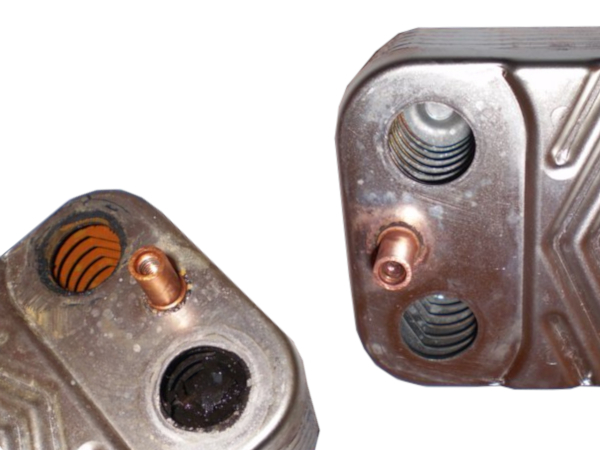

    

        <h1 class="fw-bold h2 text-dark">
            <i class="fas fa-exclamation-triangle text-danger me-3"></i>Ошибки настенных котлов Мора
        </h1>
        
Справочник по диагностике и устранению неисправностей линейки MORA Top

    

    

        

            <h3 class="h5 fw-bold mb-4 text-center text-md-start"><i class="fas fa-book me-2"></i> Быстрая навигация</h3>
            

                <button class="btn btn-primary px-4 shadow-sm" data-target="e0">E0</button>
                <button class="btn btn-outline-primary px-4 shadow-sm" data-target="e1">E1</button>
                <button class="btn btn-outline-primary px-4 shadow-sm" data-target="e2">E2</button>
                <button class="btn btn-outline-primary px-4 shadow-sm" data-target="e3">E3</button>
                <button class="btn btn-outline-primary px-4 shadow-sm" data-target="e4">E4</button>
                <button class="btn btn-outline-primary px-4 shadow-sm" data-target="e5">E5</button>
                <button class="btn btn-outline-secondary px-3 shadow-sm" data-target="no-display">Без дисплея</button>
                <button class="btn btn-outline-success px-4 shadow-sm" data-target="service">ТО</button>
            

        

    

    

        

            

                <h3 class="h4 mb-0"><i class="fas fa-fire me-2"></i> Ошибка E0 — Горелка не запускается</h3>
            

            

                

                    

                        
                    

                    

                        
Основная горелка потухла и не запускается, циркуляционный насос не функционирует. Элементы блока управления повреждены или дефектны.

                        <h4 class="h5 fw-bold mb-3 text-danger">Причины:</h4>
                        <ul class="mb-4 small">
                            <li>Газовый клапан закрыт или неисправен.</li>
                            <li>Насос не циркулирует теплоноситель.</li>
                            <li>Неисправна основная плата управления.</li>
                        </ul>
                        <h4 class="h5 fw-bold mb-3 text-success">Устранение:</h4>
                        <ol class="small">
                            <li>Проверить подачу газа и катушку газового клапана.</li>
                            <li>Продиагностировать плату управления на наличие прогаров.</li>
                            <li>Вызвать мастера для профессиональной настройки.</li>
                        </ol>
                    

                

            

        

    

    

        

            

                <h3 class="h4 mb-0"><i class="fas fa-tint me-2"></i> Ошибка E1 — Нет циркуляции / Давление</h3>
            

            

                

                    

                        
                    

                    

                        <h4 class="h5 fw-bold mb-3 text-primary">Почему возникла:</h4>
                        <ul class="mb-4 small">
                            <li>Низкое давление теплоносителя в системе.</li>
                            <li>Засорение фильтра грубой очистки.</li>
                            <li>Воздушная пробка в теплообменнике или насосе.</li>
                            <li>Заклинивание вала циркуляционного насоса.</li>
                        </ul>
                        <h4 class="h5 fw-bold mb-3 text-success">Как исправить:</h4>
                        <ol class="small">
                            <li>Долить воду в систему до 1.2 – 1.5 бар.</li>
                            <li>Прочистить сетчатый фильтр ("грязевик").</li>
                            <li>Проверить вращение вала насоса (прокрутить отверткой).</li>
                        </ol>
                    

                

            

        

    

    

        

            

                <h3 class="h4 mb-0 fw-bold"><i class="fas fa-bolt me-2"></i> Ошибка E2 — Срыв пламени</h3>
            

            

                

                    

                        
                    

                    

                        
Котел разжигается, но через несколько секунд тухнет. Блок управления не видит ионизацию (пламя).

                        
                        <h4 class="h5 fw-bold mb-3">Возможные причины:</h4>
                        <ul class="small mb-4">
                            <li>Несоблюдение полярности (фаза/ноль) при включении в розетку.</li>
                            <li>Загрязнение электрода ионизации.</li>
                            <li>Проблемы с тягой (засорен дымоход).</li>
                        </ul>
                        <a href="tel:+79262211348" class="btn btn-dark shadow-sm">Нужна диагностика платы</a>
                    

                

            

        

    

    

<h5>Информация по E3 подготавливается...</h5>

    

<h5>Информация по E4 подготавливается...</h5>

    

<h5>Информация по E5 подготавливается...</h5>

    

        

            

                <h3 class="h4 mb-0 fw-bold"><i class="fas fa-display me-2"></i> Котлы без цифрового табло</h3>
            

            

                

                    

                    

                        <h5>Типичная проблема: Падение мощности</h5>
                        
Котел работает, но не может прогреть радиаторы до нужной температуры.

                    

                

                

                    

                        
<i class="fas fa-search me-2 text-primary"></i> Причины падения мощности

                        

                            
Зачастую это дефект модуляционной катушки газового клапана или сбитые настройки давления газа.

                            
                        

                    

                    

                        
<i class="fas fa-water me-2 text-info"></i> Плохо греет горячую воду (ГВС)

                        

                            
Причина в 90% случаев — накипь во вторичном теплообменнике.

                            
                        

                    

                

            

        

    

    

        

            

                

                    

                        
                    

                    

                        <h3 class="h4 fw-bold text-success mb-3">Профилактика и сервис</h3>
                        
Для стабильной работы котлы Mora Top требуют ежегодной чистки горелки и проверки давления в расширительном баке.

                        

                            <i class="fas fa-info-circle me-2"></i> Проводите ТО 1 раз в год перед началом сезона.
                        

                    

                

            

        

    

    

        

            <h4 class="h5 fw-bold mb-4"><i class="fas fa-lightbulb me-2 text-warning"></i> Важные рекомендации</h4>
            

                

                    <i class="fas fa-shield-check text-success fs-3 me-3"></i>
                    

                        <h5 class="h6 fw-bold">Безопасность</h5>
                        
При появлении запаха газа немедленно перекройте вентиль и обесточьте котел.

                    

                

                

                    <i class="fas fa-user-md text-primary fs-3 me-3"></i>
                    

                        <h5 class="h6 fw-bold">Мастер на связи</h5>
                        
Самостоятельный ремонт газового оборудования может быть опасен. Консультация: <a href="tel:+79262211348">+7 (926) 221-13-48</a>

                    

                

            

        

    

