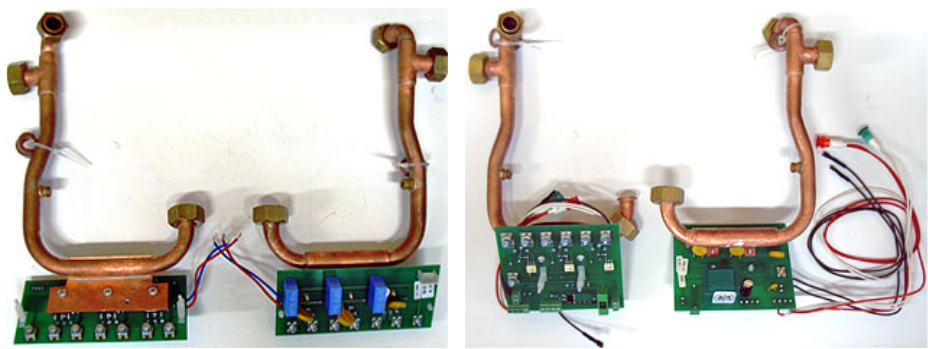

    <header class="bg-primary text-white rounded-3 p-4 p-md-5 mb-5 shadow-lg text-center">
        <h1 class="display-5 fw-bold mb-3"><i class="fas fa-bolt me-3"></i>Запчасти для электрокотлов Kospel</h1>
        
Оптимальная стоимость оригинальных деталей

    </header>

    

        

            

                

                    
                

                

                    <h3 class="h4 fw-bold text-primary mb-3">Оригинальные детали от польского производителя</h3>
                    
Электрические котлы «Kospel» – это самый экономичный вариант для отопления жилых помещений и систем ГВС.

                    
Качественные оригинальные запчасти повышают КПД оборудования и значительно сокращают расходы на обслуживание в долгосрочной перспективе.

                

            

            

                <h4 class="h5 fw-bold mb-0">Низкая цена на весь ассортимент запчастей Kospel</h4>
            

        

    

    

        

            <h4 class="h5 mb-0 fw-bold"><i class="fas fa-list me-2 text-white"></i>Широкий ассортимент запчастей</h4>
        

        

            
Мы предлагаем оригинальные комплектующие для всех модификаций польских котлов:

            

                

                    <ul class="list-unstyled mb-0">
                        <li class="mb-3 d-flex align-items-center"><i class="fas fa-microchip me-3 text-primary fa-fw"></i>Автоматика и платы управления</li>
                        <li class="mb-3 d-flex align-items-center"><i class="fas fa-fire me-3 text-danger fa-fw"></i>Узлы мощности и нагревательные узлы</li>
                        <li class="mb-3 d-flex align-items-center"><i class="fas fa-thermometer-half me-3 text-warning fa-fw"></i>Датчики температуры и манометры</li>
                    </ul>
                

                

                    <ul class="list-unstyled mb-0">
                        <li class="mb-3 d-flex align-items-center"><i class="fas fa-bolt me-3 text-info fa-fw"></i>Реле и коммутаторы</li>
                        <li class="mb-3 d-flex align-items-center"><i class="fas fa-sync me-3 text-primary fa-fw"></i>Циркуляционные насосы WILO / GRUNDFOS</li>
                        <li class="mb-0 d-flex align-items-center"><i class="fas fa-boxes me-3 text-secondary fa-fw"></i>Расходные материалы и уплотнители</li>
                    </ul>
                

            

            
            

                
<i class="fas fa-exclamation-circle me-2"></i>Все детали в каталоге рекомендованы заводом-изготовителем. Это гарантирует 100% совместимость.

            

            

                
<i class="fas fa-star text-warning me-2"></i>Если вы не нашли нужную деталь — свяжитесь с нами для индивидуального заказа!

            

        

    

    

        

            <i class="fas fa-cogs me-2"></i>Внутреннее устройство и спецификации
        

        <h5 class="fw-bold text-primary mb-4 border-bottom pb-2"><i class="fas fa-fire me-2 text-danger"></i>Узлы мощности</h5>
        

            

            

        

        

            <table class="table table-striped table-hover table-bordered small align-middle">
                <thead class="table-dark">
                    <tr><th>Наименование</th><th>Применение</th><th>Заводской код</th></tr>
                </thead>
                <tbody>
                    <tr><td>Узел мощности ZM46</td><td>Все котлы Kospel EKCO L1</td><td>01162</td></tr>
                    <tr><td>Узел мощности</td><td>Все котлы Kospel EKCO L</td><td>00865</td></tr>
                    <tr><td>Узел мощности ZM02R</td><td>Котлы EKCO R / EPCO R</td><td>01059 / 00508</td></tr>
                </tbody>
            </table>
        

        <h5 class="fw-bold text-primary mb-4 border-bottom pb-2"><i class="fas fa-microchip me-2 text-info"></i>Панели и платы управления</h5>
        

            

            

        

        

            <table class="table table-striped table-hover table-bordered small align-middle">
                <thead class="table-dark">
                    <tr><th>Наименование</th><th>Применение</th><th>Заводской код</th></tr>
                </thead>
                <tbody>
                    <tr><td>Панель управления PSK.P4</td><td>Все котлы EKCO L и L1</td><td>00936</td></tr>
                    <tr><td>Плата ZIO21</td><td>Все котлы EKCO L1</td><td>01010</td></tr>
                </tbody>
            </table>
        

        <h5 class="fw-bold text-primary mb-4 border-bottom pb-2"><i class="fas fa-fire-alt me-2 text-danger"></i>Нагревательные элементы (ТЭНы)</h5>
        

            
        

        

            <table class="table table-striped table-hover table-bordered small align-middle text-center">
                <thead class="table-dark">
                    <tr><th>Наименование</th><th>Применение</th><th>Заводской код</th></tr>
                </thead>
                <tbody>
                    <tr><td>Нагревательный узел 4 и 12 кВт</td><td>EKCO L / L1</td><td>00778</td></tr>
                    <tr><td>Нагревательный узел 6 и 18 кВт</td><td>EKCO L / L1</td><td>00780</td></tr>
                    <tr><td>Нагревательный узел 8 и 24 кВт</td><td>EKCO L / L1</td><td>00782</td></tr>
                </tbody>
            </table>
        

        <h5 class="fw-bold text-primary mb-4 border-bottom pb-2"><i class="fas fa-tint me-2 text-info"></i>Насосы и ограничители</h5>
        

            

            

        

        

            <table class="table table-striped table-hover table-bordered small align-middle">
                <thead class="table-dark">
                    <tr><th>Наименование</th><th>Применение</th><th>Заводской код</th></tr>
                </thead>
                <tbody>
                    <tr><td>Насос WILO / GRUNDFOS</td><td>Котлы 4–30 кВт</td><td>00225</td></tr>
                    <tr><td>Ограничитель температуры WT3 (100°)</td><td>Все котлы Kospel</td><td>00516</td></tr>
                </tbody>
            </table>
        

    

    

        <h4 class="h3 fw-bold text-primary mb-3"><i class="fas fa-thumbs-up me-2 text-success"></i>Оригинал Kospel по доступным ценам</h4>
        
Подбор запчастей по артикулу, скидки мастерам и гарантия на всё оборудование.

        

            <a href="tel:+79262211348" class="btn btn-primary btn-lg px-5 shadow-sm">
                <i class="fas fa-phone me-2"></i>Позвонить
            </a>
            <a href="https://service04.ru/contact-us/feedback" class="btn btn-success btn-lg px-5 shadow-sm">
                <i class="fas fa-envelope me-2"></i>Оставить заявку
            </a>
        

    

