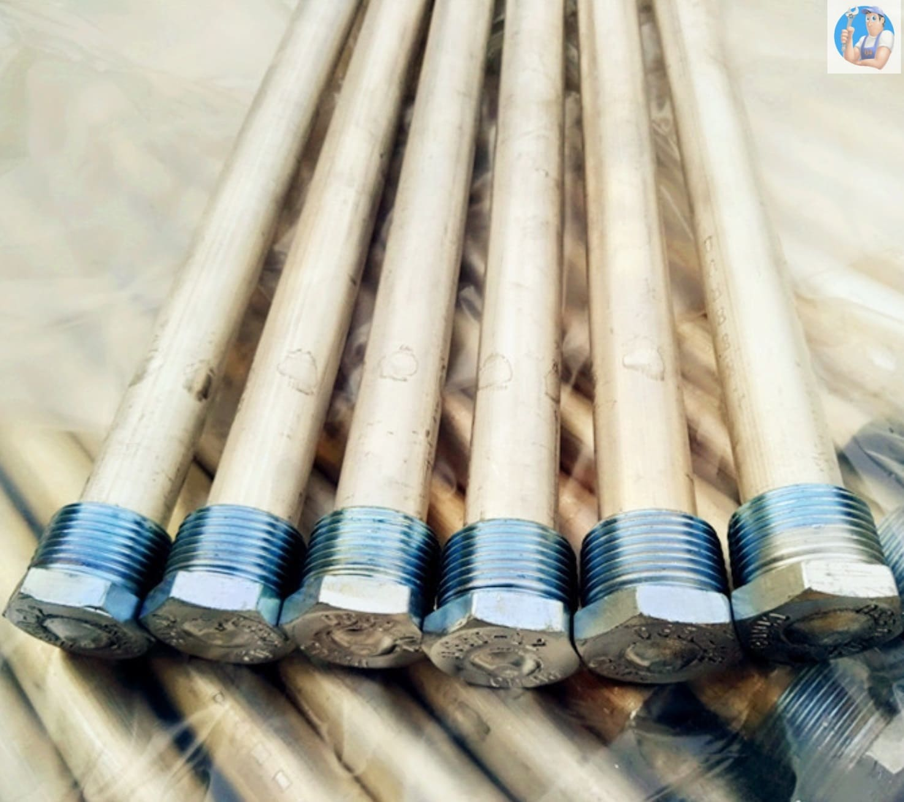

    

        <h1 class="display-4 fw-bold"><i class="fas fa-water me-3"></i>Магниевый анод Mor-Flo</h1>
        
Для American Water Heater, Mor-Flo G61, G62

        
Длина 1000 мм

        
        

            <a href="#buy" class="btn btn-warning btn-lg fw-bold shadow-sm me-3"><i class="fas fa-shopping-cart me-2"></i>КУПИТЬ</a>
            <a href="https://ya.cc/m/u1wz3Q5" class="btn btn-light btn-lg fw-bold shadow-sm"><i class="fab fa-yandex me-2"></i>Купить на Яндекс Маркете</a>
        

    

    
    

        
    

    

        

            <h3 class="h5 mb-0 fw-bold"><i class="fas fa-info-circle me-2"></i>Описание и совместимость</h3>
        

        

            
Анод магниевый G61/G62 нейтрализует воду, собирая примеси и предотвращая образование накипи. Изготовлен из магния и алюминия, обеспечивает надёжную защиту бойлера и продлевает срок его службы.

            <h6 class="fw-bold mt-3">Подходит для моделей Mor-Flo:</h6>
            <ul class="list-unstyled ms-3 row g-1">
                <li class="col-md-4"><i class="fas fa-caret-right me-2 text-info"></i> G61-40T40-3NV</li>
                <li class="col-md-4"><i class="fas fa-caret-right me-2 text-info"></i> G61-50T40-3NV</li>
                <li class="col-md-4"><i class="fas fa-caret-right me-2 text-info"></i> G62-75T75-4NV</li>
            </ul>
        

    

    <h2 class="h4 fw-bold mb-4 text-primary"><i class="fas fa-question-circle me-2"></i>Зачем нужен магниевый анод?</h2>
    
Анод защищает внутренние стенки бойлера от накипи и коррозии, обеспечивая долгосрочную и безопасную работу устройства.

    

        
        

            

                

                    <h3 class="h5 mb-0 fw-bold"><i class="fas fa-cog me-2"></i>Особенности работы</h3>
                

                

                    <ul class="list-unstyled ms-3">
                        <li class="mb-1"><i class="fas fa-check-circle me-2 text-success"></i> Металлический стержень с магниевым покрытием</li>
                        <li class="mb-1"><i class="fas fa-check-circle me-2 text-success"></i> Реакция магния с кислородом и солями жесткости</li>
                        <li><i class="fas fa-check-circle me-2 text-success"></i> Формирование защитного слоя на внутренней поверхности бака</li>
                    </ul>
                

            

        

        
        

            

                

                    <h3 class="h5 mb-0 fw-bold"><i class="fas fa-trophy me-2"></i>Преимущества покупки у нас</h3>
                

                

                    <ol class="mb-0 ms-3">
                        <li class="mb-1 fw-bold">Защита от накипи и коррозии</li>
                        <li class="mb-1 fw-bold">Экономия энергии за счёт тепловой изоляции</li>
                        <li class="mb-1 fw-bold">Лёгкая установка без специнструментов</li>
                        <li>Доступная цена и быстрая доставка</li>
                    </ol>
                

            

        

    

    
    

        

            <h3 class="h4 fw-bold mb-4"><i class="fas fa-shopping-cart me-2"></i>Купить с доставкой и консультацией</h3>
            

                

                    <a href="tel:+79262211348" class="btn btn-light btn-lg w-100 fw-bold shadow-sm"><i class="fas fa-phone-alt me-2"></i>+7 (926) 221-13-48</a>
                

                

                    <a href="https://wa.me/79262211348" class="btn btn-success btn-lg w-100 fw-bold shadow-sm"><i class="fab fa-whatsapp me-2"></i>WhatsApp</a>
                

            

            

                <a href="https://tlgg.ru/GazService04" class="btn btn-info mx-2 fw-bold shadow-sm"><i class="fab fa-telegram-plane me-1"></i>Telegram</a>
                <a href="https://vk.com/service_04" class="btn btn-info mx-2 fw-bold shadow-sm"><i class="fab fa-vk me-1"></i>VK</a>
            

        

    

    

        

            

                
<button type="button" class="btn-close btn-close-white" data-bs-dismiss="modal" aria-label="Close"></button>

                

            

        

    

